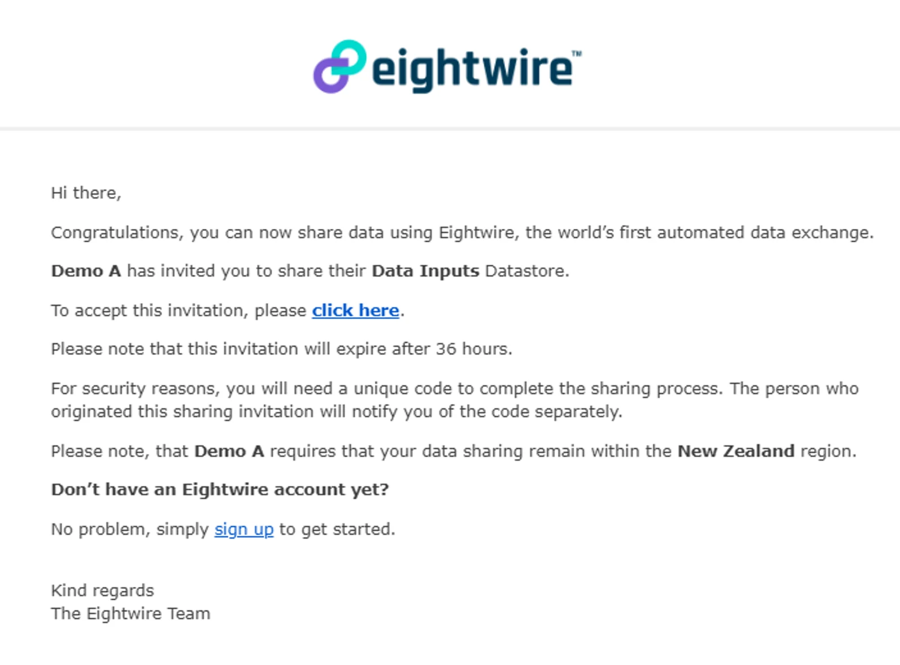
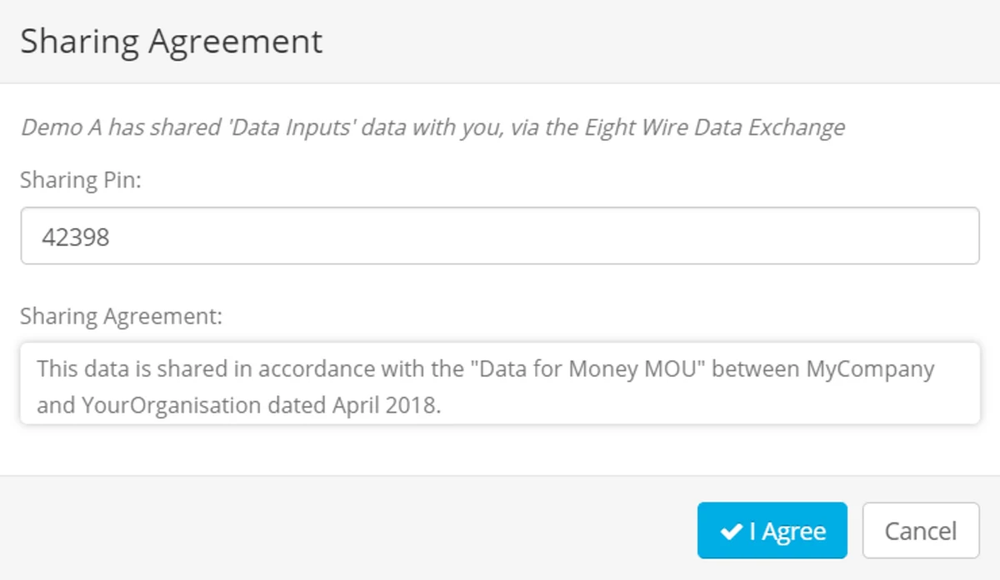
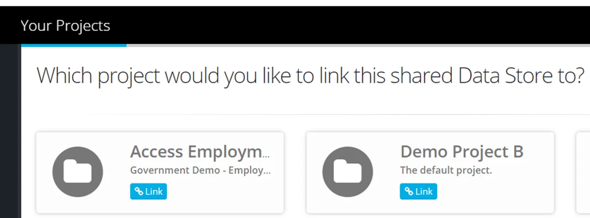
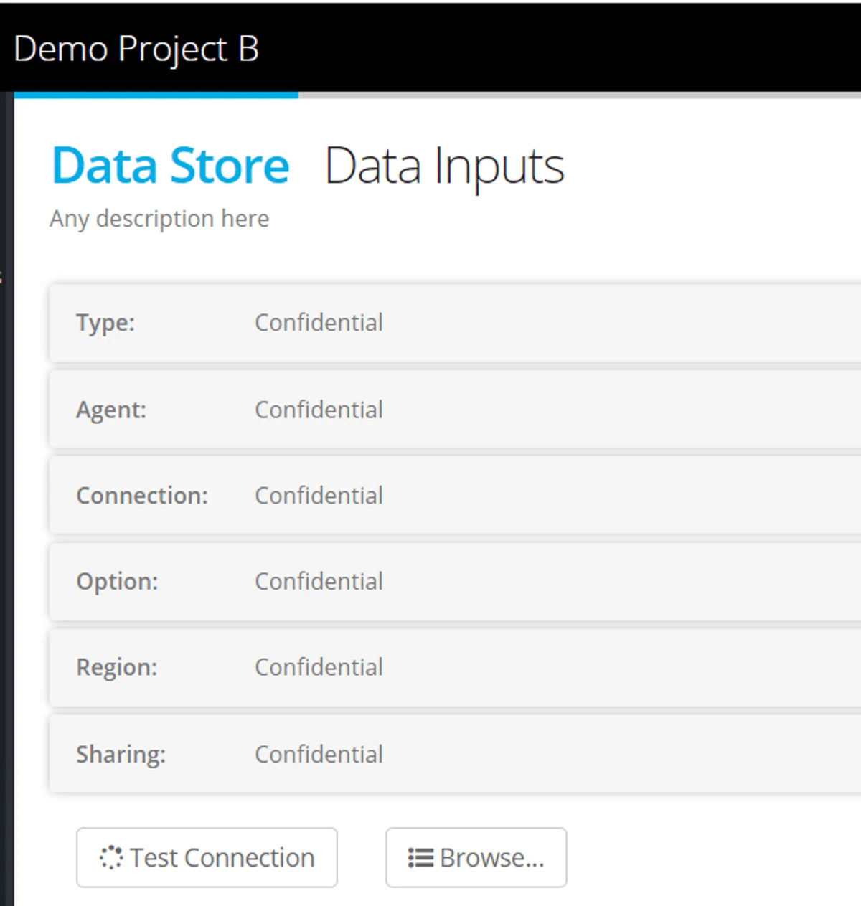

> *If either a source and destination datastore is locked to a specific Region - then the other datastore must choose the same Region, or leave the Region to default for a data transfer process to be successful*.

When you click the link in the email, you will be taken to your web browser.

If you have already logged into Eightwire, you will be asked for the Sharing PIN — this is a five-digit number that you must request from the sharing party.

If you are not logged into Eightwire, the link will take you to the login page. Once logged in you will be asked for the Sharing PIN.

If you have the PIN, enter it now.

You should have been informed of the PIN by the person who shared the Datastore. Click **I Agree** to accept the sharing invitation.

Choose which Project(s) this new shared Data Store will be created in by clicking the relevant **Link** button(s)

> *You can link a Data Share to more than one Project. If you do, one new shared Data Store will be created in each selected Project.*

A shared Data Store appears as 'External' and details are confidential (although you can still browse objects in the datastore to get information on their structure).

> *If a sharing agreement is stopped and the datastore is used in a Process Group then you will receive a notification email and the process will be deleted from the group.*

If it is your own Datastore (and it is not used in a process) then simply delete the Datastore. If it is an external Datastore,  ask the sharing party to delete the sharing invitation (using the sharing tab).

## For the full tutorial on datastore sharing, check out this video...

<iframe src="https://www.youtube.com/embed/g7u1qU5xuEo" title="Eightwire: Share, pause, delete a Datastore" loading="lazy" allowfullscreen=""></iframe>

Once you have Datastores available in your Project, the next steps are to build instructions to move the data — to see the Processes available and set up a Process Group, refer to the page [Process Groups and Types](../process-groups-and-types/)
