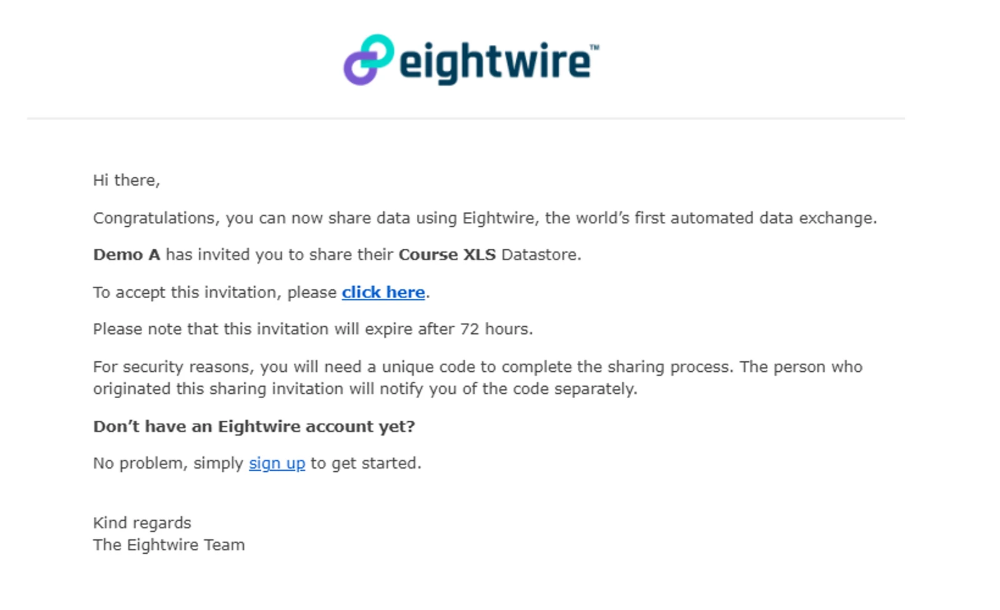
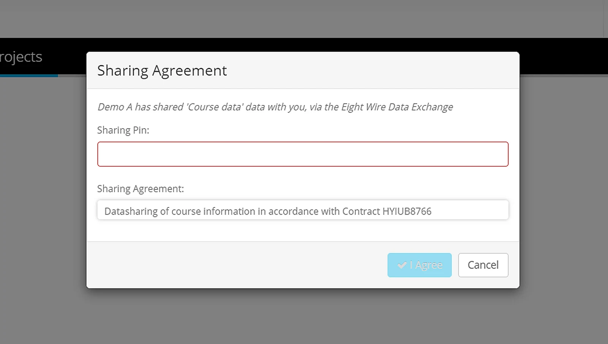
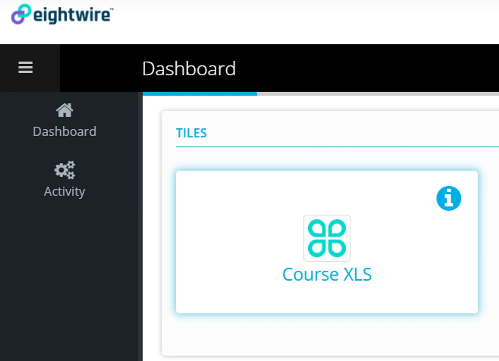

Select **click here** to accept the invitation

You will be taken to the login page -—enter your Email and Password

The sharing link will appear — it requires a 5 digit PIN — which the Company sending the invitation should have provided to you separately.

Enter the Sharing PIN

Click **I Agree**

Refresh the Dashboard to see the Tile appear.

All the Users in your Account will see the Tile on the dashboard when they log in to the Account.

Congratulations — you are all set up and ready to submit data!

Go to [Submit Data using Tile](../submit-data-using-tile/) to see how easy it is to get data securely to the destination.
