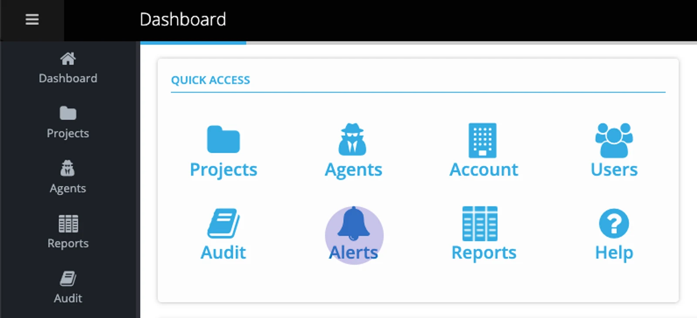
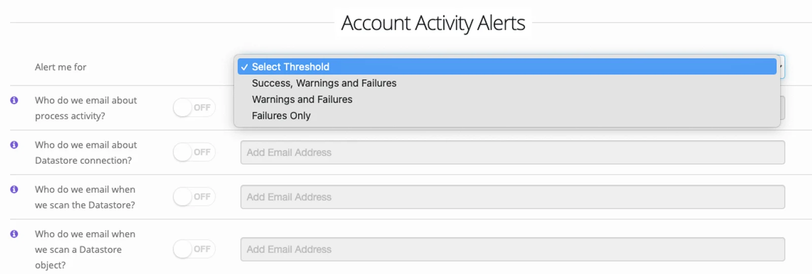
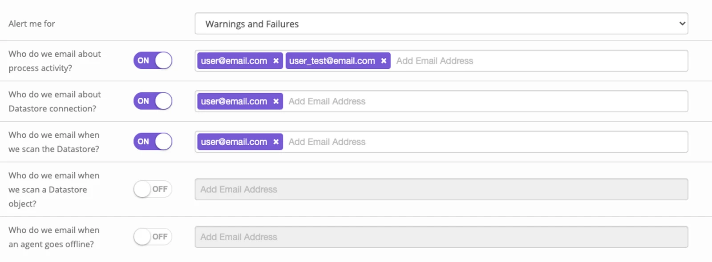
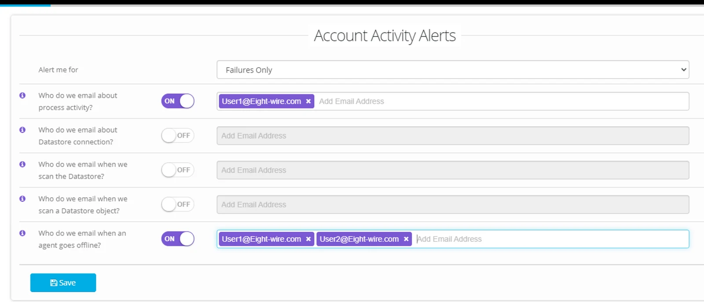
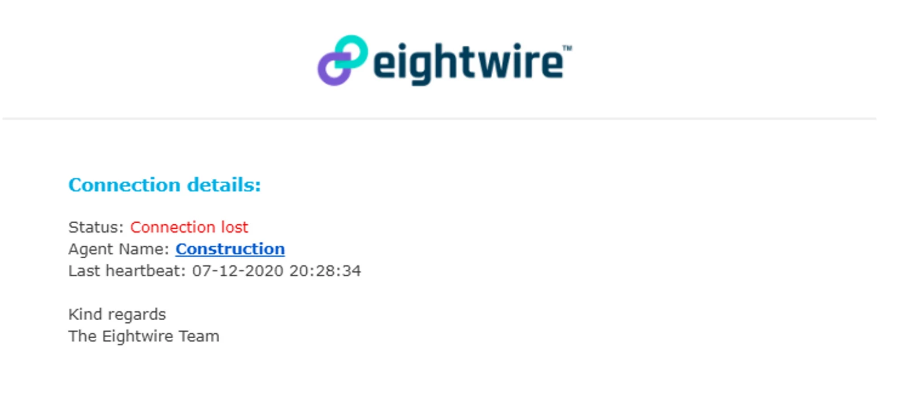
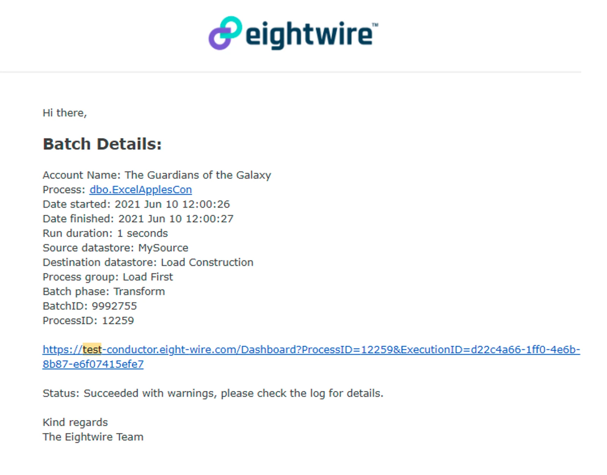
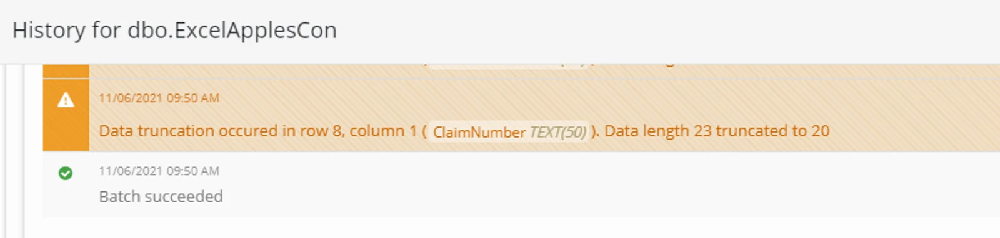

Navigate to **Account Alerts** from the Quick Access menu on the account dashboard.

Select an Alert threshold to apply to the selected Alert options;

For an Alert option, toggle to ON and enter any email addresses for notifications.

Choose as many of the alert options as you require;

-   **Process Activity** The outcome of a data transfer is notified here.

-   ‍**Datastore Connection** The connectivity to the Datastore generates an email (Test Datastore)

-   **Datastore Scan** The automatic scan of objects in your Datastore generates an email (Scan Datastore).

-   **Datastore Object Scan** The results of a deep scan of the objects (Browse Datastore) generates an email.

-   **Agent Connection** Any change in the connectivity of an Agent generates an email.

In the example shown – any failed process within the entire Account or any Agent going offline will generate a separate email.

Automated emails will give a summary description of a failure or that warnings have been generated.

You can use the relevant Batch and ProcessID shown in the email to check the detail of the Project Activity by clicking on the link in the email.

Let us know at support@eight-wire.com if you need help interpreting the warning or error message.

To restrict your Alerts for specific Projects, check out [Project Alerts](../project-alerts/)
