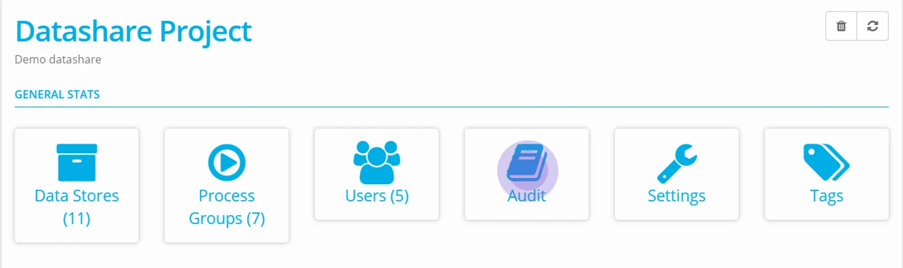
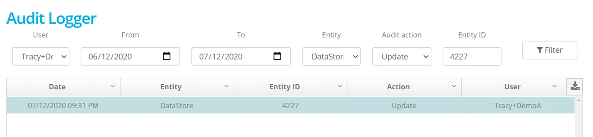
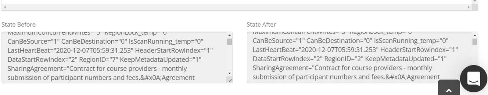
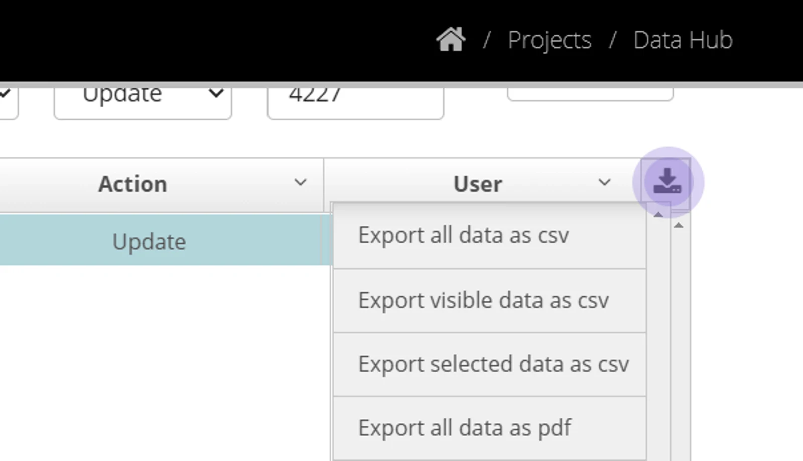

Navigate to Audit from the Account or Project Dashboards.

## The report can be run using these options

Select and click **Filter** to execute the report

**Project**  

Available in Account Audit Page

**User**

Select from Users assigned to a Project or Account

**From**

Start of a date range

**To**

The end of a date range

**Entity**

Choose a specific element within Eightwire to audit (for example Datastore, Mapping, Schedule)

**Audit Action**

Filter for Insert, Update, Delete or All

**EntityID**

A specific Entity can be queried using its ID - the ID appears in the URL when you are on a specific page. For example - click on a Datastore and you will see a 4 digit ID that is its unique identifier.

This example filters for a specific user changing the configuration of a Datastore,

The results are shown as a full description of a State Before and a State After - in the example, the change of RegionID = 7 to RegionID = 2, shows that the Datastore Sovereignty was changed.

The information can be exported by selecting the download icon and choosing an Export setting (all data shows the summary as well as the State Before and State After text).

> *Eightwire retains all Audit data for existing entities.*
