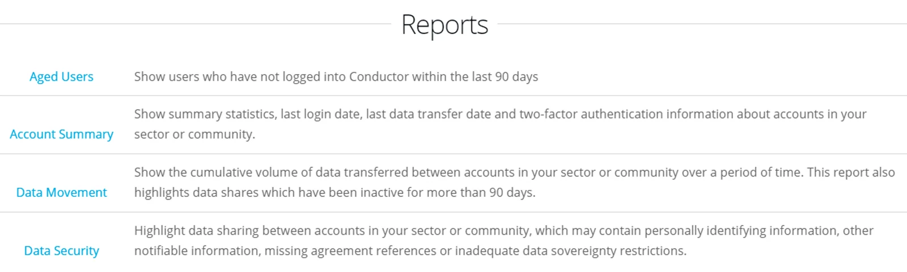

Navigate to Reports via the Account Dashboard

Other Reports — Account Summary, Data Movement, and Data Security can be made available to Accounts that maintain a group of Accounts as a community.

> *For any specific reporting requirements please contact us at support@eight-wire.com*
