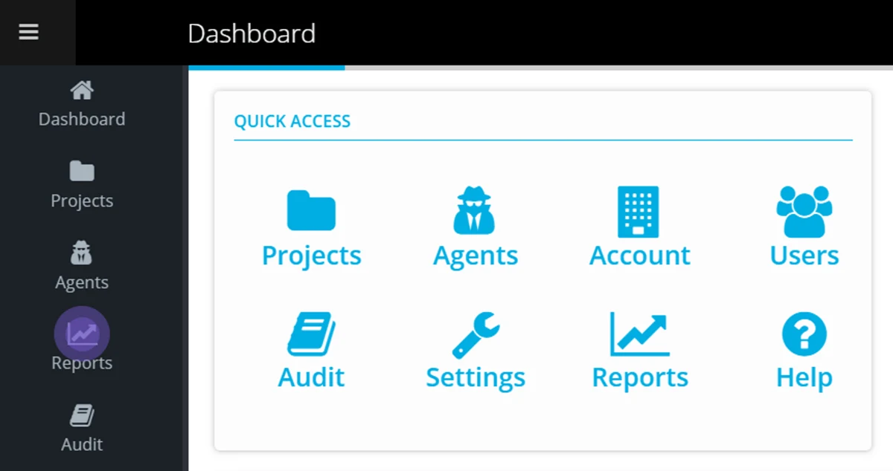

Navigate to Reports via the Account Dashboard

Other Reports — Account Summary, Data Movement, and Data Security can be made available to Accounts that maintain a group of Accounts as a community.

| Report | Description |
| --- | --- |
| Aged Users | Show users who have not logged into Conductor within the last 90 days |
| Account Summary | Show summary statistics, last login date, last data transfer date and two-factor authentication information about accounts in your sector or community. |
| Data Movement | Show the cumulative volume of data transferred between accounts in your sector or community over a period of time. This report also highlights data shares which have been inactive for more than 90 days. |
| Data Security | Highlight data sharing between accounts in your sector or community, which may contain personally identifying information, other notifiable information, missing agreement references or inadequate data sovereignty restrictions. |

> *For any specific reporting requirements please contact us at support@eight-wire.com*
