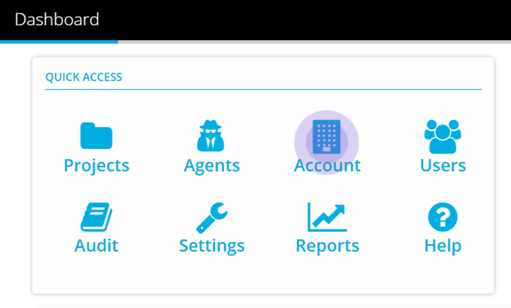
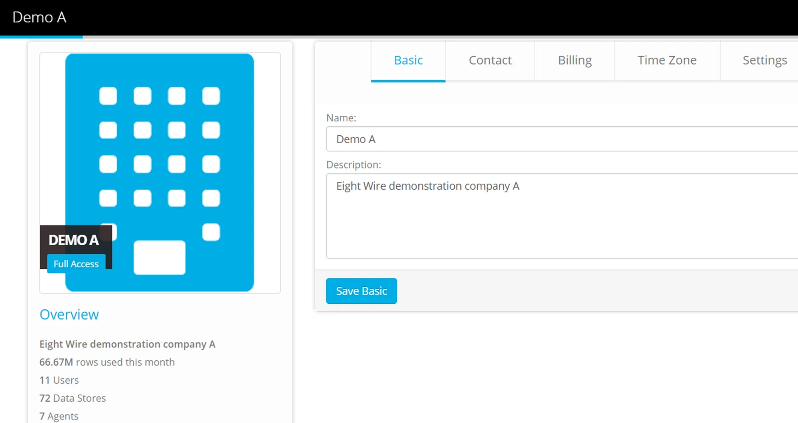

## Navigate from the dashboard to Account.

## See an overview of your account activity and use the tabs to define the following:

**Basic** — Name and Description

**Contact** — The primary contact email and phone for the Account. We will use this email to contact you from time to time with any information regarding any planned changes to Eightwire.  

**Billing** — The billing email and address

**Time Zone** — The time zone that applies to your account. Any schedules you set in your account will use this time zone.

## Settings

**Enable two-factor authentication**

Use this to enforce login using a code texted to a user's mobile phone number in conjunction with username and password.

**Allow Access from Parent Account**

By default the Parent Account is Eight-Wire and this check-box is not ticked.

**Beta Programme**

By default this checkbox is ticked.

> *The role of Account Administrator is required to edit Account Settings - limit assigning this role within your Account to a select user group.*

Settings are complete!

Next steps are to [create Users](../create-users/) within your Account
