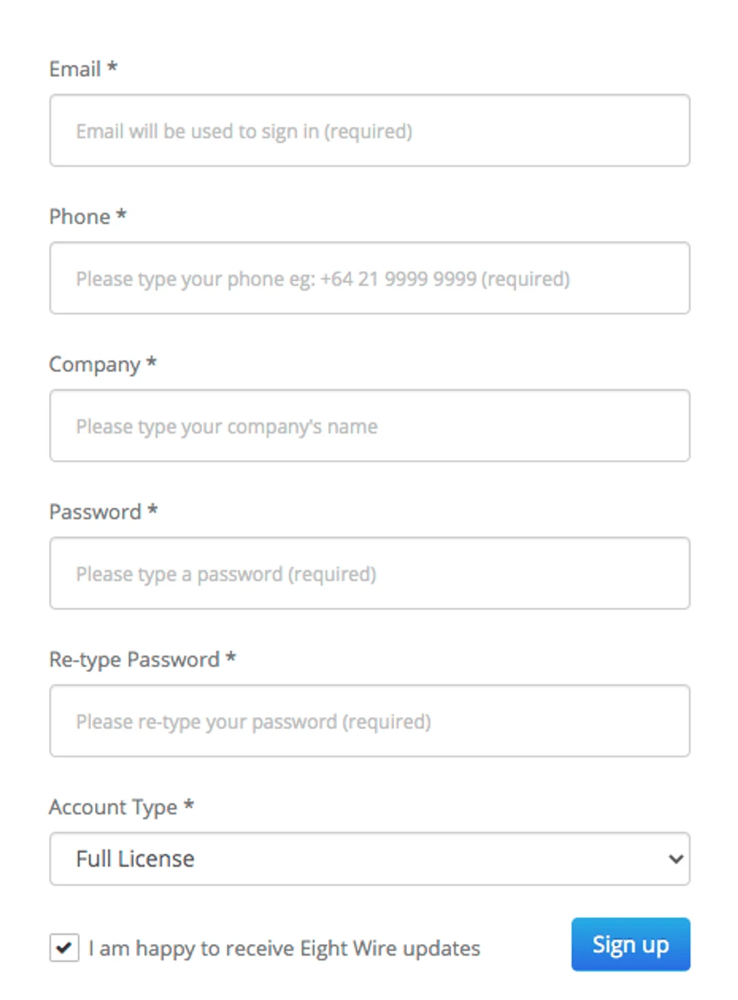
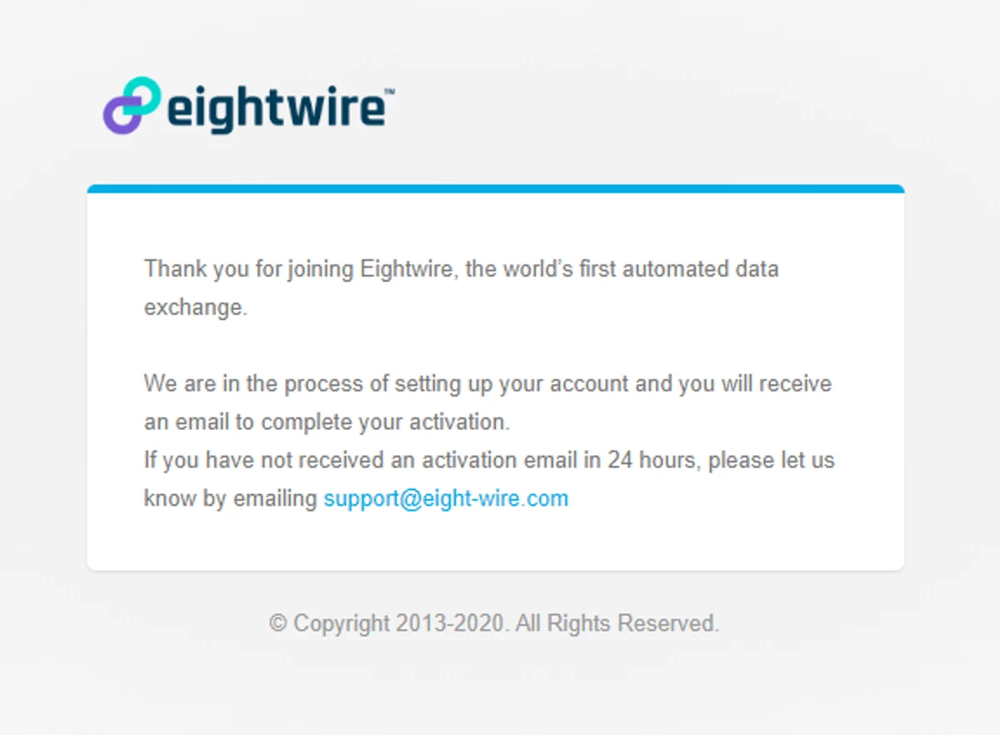
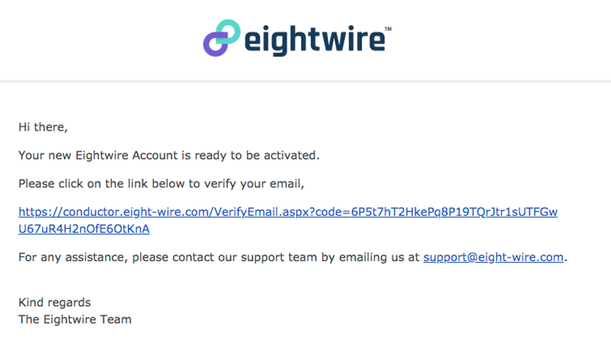

## Click sign up from our login page

> conductor.eight-wire.com

## Complete the form and select sign up

## Once you submit, our administrators will be alerted and prepare your account for verification.

## Once your account has been activated you will receive a verification email. Log in to your account and accept the terms and conditions to complete the process.

Welcome to your new Account!

Next steps : Check out Account configuration options in [Account Settings](../account-settings/)
