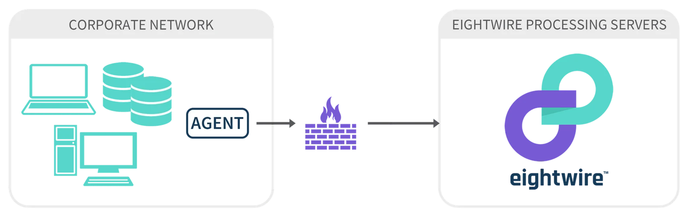
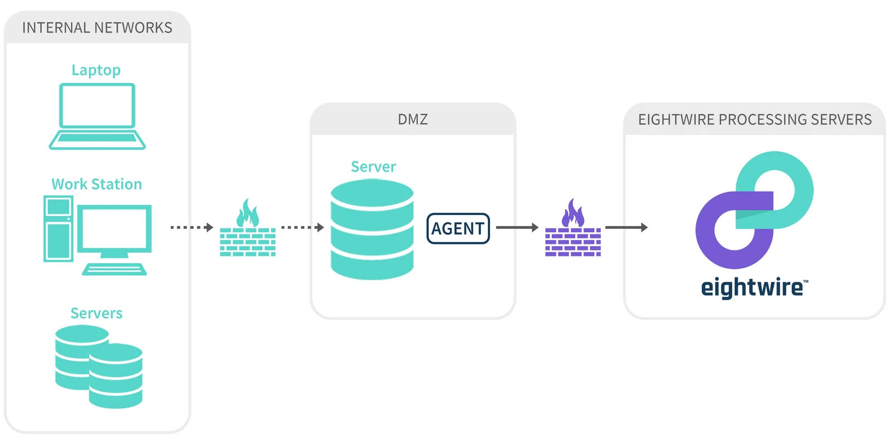

## Install within your network

Installing the Agent on a well-secured computer within your internal network is a simple solution and for most small organisations, will be preferable.

Simply put — if you have internet-facing computers holding data to be shared then install your Agent within your network.                                                                                    

The Agent service account acts as a User on the network - with access to database objects or folder locations where data needs to be read from or written to.

The same locations could also be accessed by Users on your network who need to prepare and maintain data that is being shared.

It is important that Users are aware that any object that is used for data sharing can be visible by another Organisation if the datastore has been shared.

## Install within an existing DMZ

One common approach to installing the Agent within enterprise networks is to install it on a computer within a DMZ.

A DMZ is a 'no-mans-land' sandbox network between the internet and your company's core internal networks. This is seen as a 'safe' place to install the Agent because it is specifically blocked from the internal network. However, the Agent needs access to resources on the internal network. Often there is no domain trust between the internal and DMZ networks, further complicating things. If you must use this approach, you will need to do one of the following to make it work:

1.  Allow the Agent to communicate inwards through the internal firewall to specific resources and either trust it or have it pass credentials through (less secure). This allows for less manual data shipping but requires some care to ensure the internal firewall rules allow only the access required and nothing more.
2.  Create a 'data staging' area inside the DMZ and have data shipped between this staging area and your internal network by some other trusted process. You would then give the Agent access to this data.

> *An account can have multiple Agents installed as required.*

Once you have a planned implementation, take a look at the checklist on the page [Agent System Requirements](../agent-system-requirements/)
