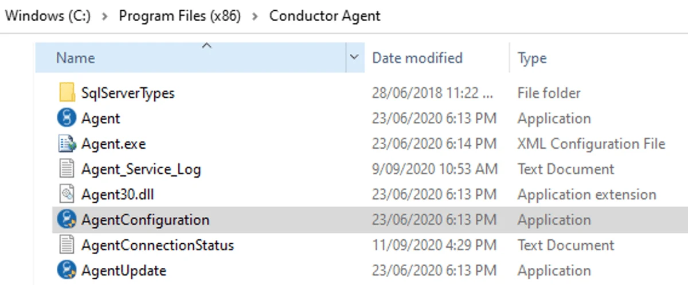
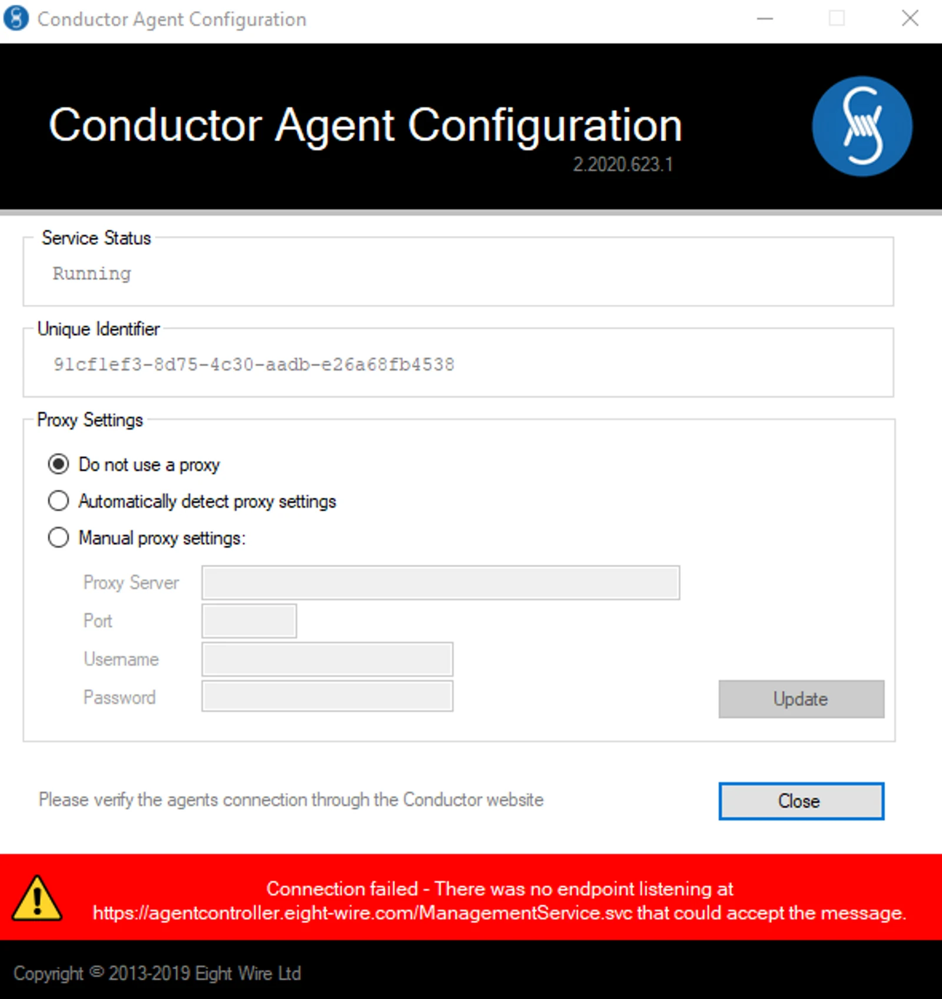
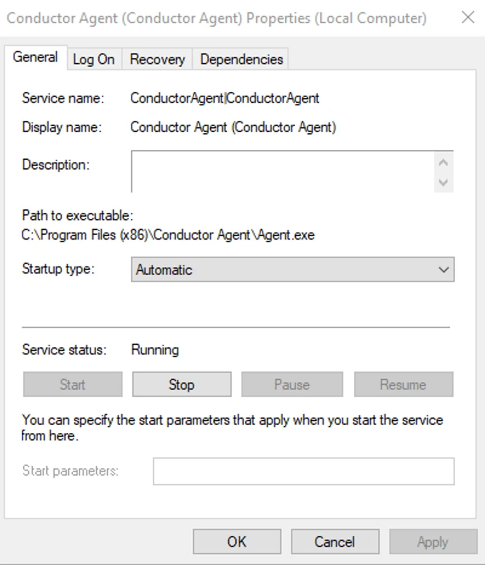
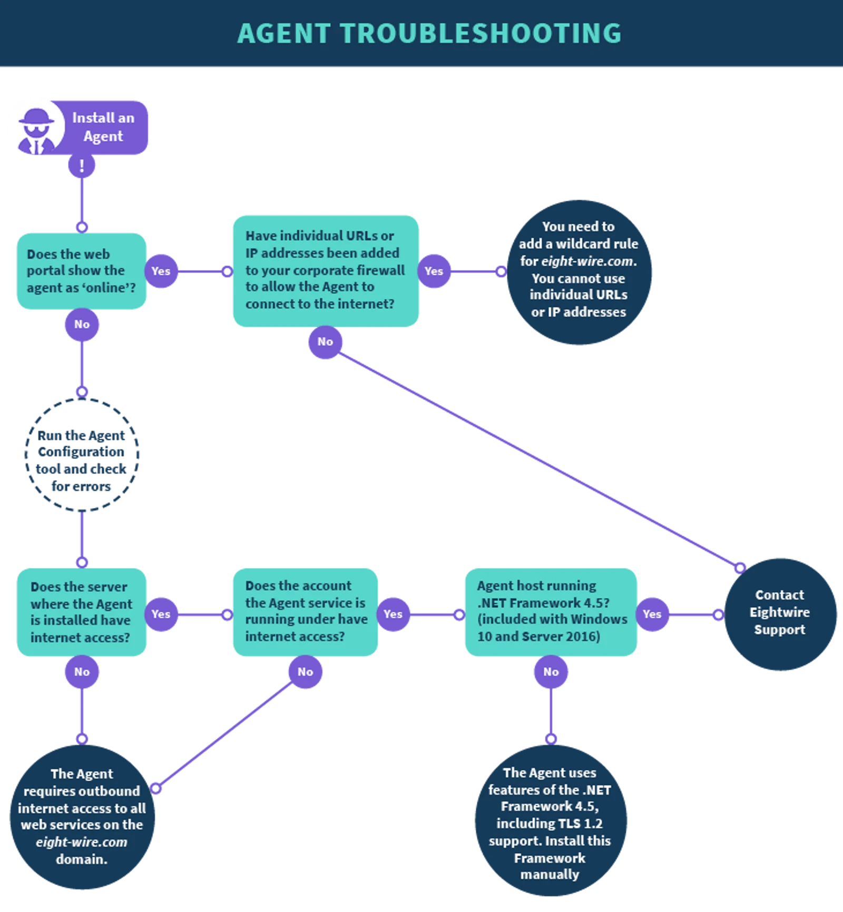

## Connectivity Troubleshooting

To initially diagnose the problem, navigate to the folder where your Agent is installed and click on **Agent Configuration**

**Service Status:** if this shows as stopped, go to Services (Local) and find the Conductor Agent service, to restart.

**Connectivity:**  if the Agent has lost internet connection then an error message will be shown.

Go through the **Check Internet** steps to diagnose issues.

**Version:** if the Agent you have installed shows the error message — Agent is deprecated — this means the Agent needs to be updated. Refer to [**Configure the Agent**](../configure-an-agent/) page for help with that.

## **Check Internet**

The Agent needs to be able to communicate outbound with Eightwire cloud services.

The server where the Agent is installed must have internet access and the service account running the Agent  must also have internet access.

Check connectivity by logging on to the computer using the service account that the Agent is using and check the response when reaching  [https://agentcontroller.eight-wire.com/](https://agentcontroller.eight-wire.com/)

## **Consider Proxy Server and Firewall rules**

In many environments the Agent will be able to detect a proxy server.

However it may be necessary to manually set a proxy server username and password. This method requires that the Agent use basic authentication to communicate with the proxy server. If your proxy server requires NTLM authentication, the Agent won’t be able to authenticate using this method.

Check the page -configure the Agent to see where to apply credentials for a Proxy Server.

The best rule is simply to allow any HTTPS traffic to \*.eight-wire.com on port 443.

However your organisation may require that a rule is added to your network proxy server and / or firewall.

The sites that need to be accessed are:

[api.eight-wire.com](http://api.eight-wire.com/)

conductor.eight-wire.(com|co.nz)

[agentcontroller.eight-wire.com](http://agentcontroller.eight-wire.com/)

[proc-nz005.eight-wire.com](http://proc-nz005.eight-wire.com/)

[proc-nz006.eight-wire.com](http://proc-nz006.eight-wire.com/)

> *If your organisation requires that you whitelist specific ip addresses then please contact us at support@eight-wire.com for specific information.*

## **Check the service**

When you install the Agent software, it runs as a Windows Service on the computer it is installed it on.

It doesn't run under the same credentials as the user installing the Agent, instead, it runs under the Local System Account on that PC as a default or using credentials for a specifically assigned Domain Account.

Ensure that the password for the Domain Account has not expired by checking the credentials in the Service.

Sometimes a service simply needs to be restarted.  

## Frequently Asked Questions

**Can I install the Agent on my laptop?**

Yes, but remember that when you turn it off for the day, the Agent will go offline. If you have scheduled processes that use this Agent they will fail. In a production environment, it is much better to install the Agent on a server that is always on.

**Agent updates:  what happens?**

On the Agent page, you have the option to configure the Agent updates to be automatic or to leave at the default — in which case you will need to manually update the Agent.

We will always contact Customers when a maintenance release includes an update to the Agent, including whether the update is mandatory or not.

Agent updates are usually only made once a year but it is important to remember that the **Agent will not run if versions are not kept to within the latest two updates**.

**How do I know if my Agent goes offline?**

To be notified of an offline Agent, you can configure an email alert in your Account — information on how to do that is in the page **Account Settings**

**My Agent service is running but the Agent is showing as offline in the Agent Page?**

Refresh the page by going to the Performance tab and clicking refresh.

**What do I do with the Agent executable once I have installed it?**

The executable should only be used once to install an Agent and not used on another machine. It is recommended that you delete the file from the downloads folder.

**Where can I check the Agent version?**

In the Agent page the version and the machine name can be seen.

To check for the latest available update, manually update using the Agent Update Application (in the folder where the Agent was installed).
