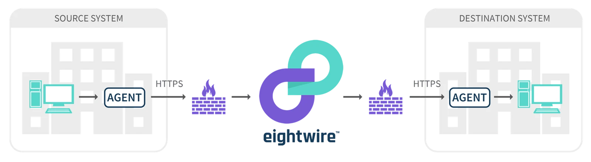
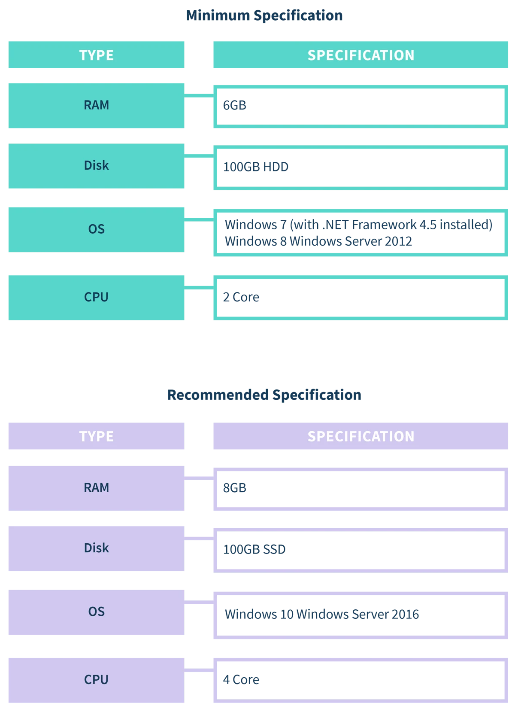

## System Requirements

The following requirements should be considered before installing an Agent.

**Host Computer:**

Agents do not store data on disk and only write the occasional error log and monitoring/update logs, so a small disk is usually adequate.

As Agents become busier, they will consume more CPU and RAM. Increasing CPU and RAM will reduce the chance of the Agent becoming a bottleneck, however, most organisations will encounter internet bandwidth constraints well before they encounter an Agent bottleneck.

## Permissions

The Agent runs as a Windows Service. By default, the service runs under the Local System (NT AUTHORITY/System) user account. You can configure this either during installation or by changing the service settings and restarting it.

Unless you only intend for the Agent to access resources on the same computer as the Agent, it is a good idea to create a new service account in your networks Active Directory, specifically for the purpose of running the Agent. Set the Agent service to run under this new account.

You should then restrict the access this service account has on your network to only allow access to those resources you wish to use with Eightwire. For example, give read access to a folder containing CSV files you want to use as a source, or give write permissions on a SQL Server database you wish to write data into using Eightwire (and use a trusted connection string in Eightwire).

Securing database access (on those platforms that support integrated Windows security) in this way means that you do not need to include a username and password in the connection string given to Eightwire, which is more secure practice.

Creating a new domain account for each Agent means that each Agent's access can be specifically controlled by you or revoked entirely if required.

In addition to file and database access, this service account also needs modify (read/write/create) access to the Windows RSA Key Store (C:\\ProgramData\\Microsoft\\Crypto\\RSA\\MachineKeys). This is required to allow the Agent to encrypt the contents of its own configuration file to ensure a high level of security.

## Internet Access

The Agent requires limited internet access to communicate with Eightwire's cloud services. The Agent will attempt to establish secure HTTPS connections on port 443. These connections are all outbound from the Agent and will always be to services on the *eight-wire.com* domain.

Establishing internet access is often the most difficult part of installing an Agent within an enterprise network. Network administrators need to allow internet access from this service account, which is sometimes overlooked.

The local or domain service account under which the Agent is running requires either direct internet access, or to be able to automatically detect and connect to your corporate proxy server, or have manual proxy settings created during installation or subsequently through the Agent Configuration Utility.

If the service account is created with the correct profile information, the Agent should be able to automatically detect and use your corporate proxy server if you set the Agent to auto-detect a proxy server. If this does not work, you can manually enter proxy credentials during Agent installation or later through the Configuration Utility. If this is unsuccessful, you may need to add proxy bypass rules for this service account or computer, allowing the Agent access to internet services on the *eight-wire.com* domain (e.g.: *.eight-wire.com*).

Another consideration for network administrators is the need for DNS resolution. The Agent connects to Eightwire services based on fully qualified domain names, not IP addresses. This means that DNS resolution is required. If the Agent is installed in a DMZ or other secure area that does not allow DNS resolution, then this poses a challenge to running the Agent there.

> *The Eightwire service maintains data sovereignty and manages its own load-balancing by being able to add or remove services that are internet-facing from the cloud. Therefore, it is necessary that each Agent be able to resolve and connect to any number of Eightwire services as required. Hard-wiring IP addresses in a host’s file to avoid this requirement is not recommended practice.*

Now that all the reading has been done, it is time to get your hands on the Agent installer file and get started, check out the steps in [Install an Agent](../install-an-agent/)
