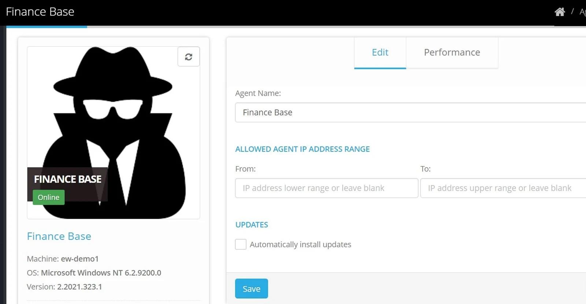
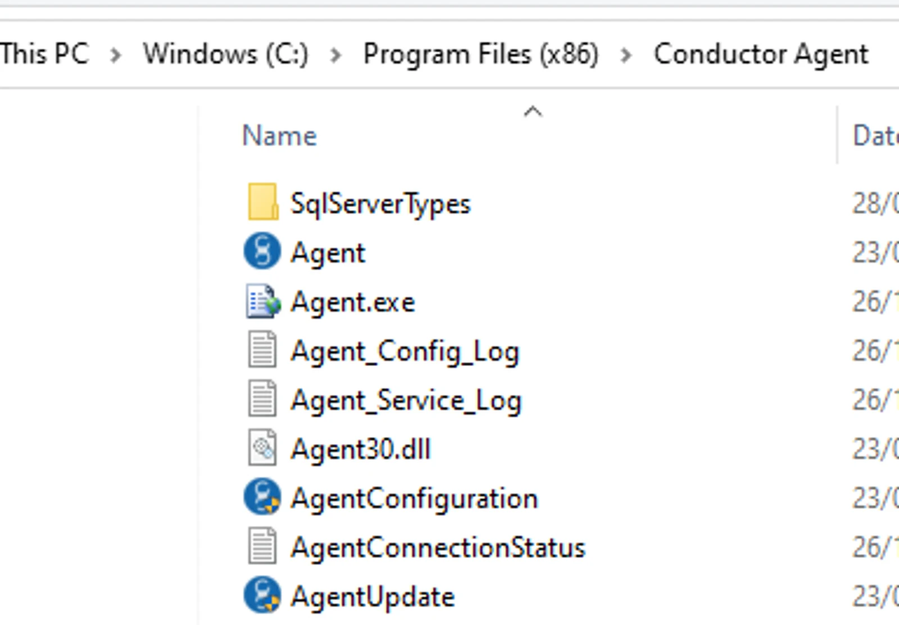
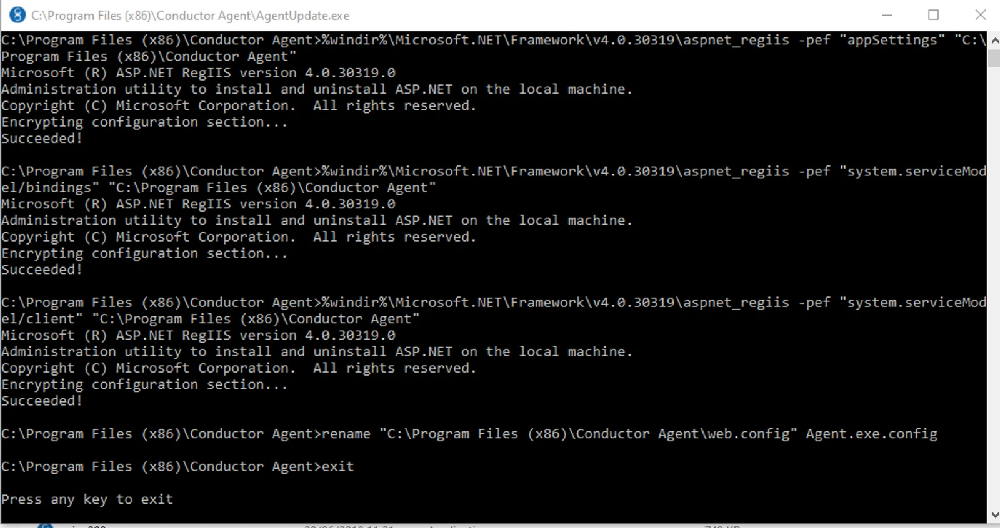

> You must have local administrator privileges on the computer to configure the installed Agent

## Agent - update configuration

Confirm whether your Agent is set to receive automatic updates by checking the update setting in the Eightwire portal on the Agent page.

-   If the Updates checkbox is ticked - then any update will be released to your Agent automatically.
-   If the Updates checkbox is not ticked - then you can apply the update when convenient, using the following steps;

## Manually Update the Agent

Log onto the Windows computer where the Agent is installed.

Locate the folder where the Agent is installed. This will likely be: *C:\\Program Files (x86)\\Eight-wire Agent*

Click on the Agent Update application and click to allow the application to make changes. You will see if the update has succeeded and what the new version is.

Use any key to exit.

Confirm the update has been successful by checking in the Eightwire portal for the new Agent version number and that the Agent is online.

> We recommend that you [Authenticate your Agent](../authenticate-an-agent/) at least annually

> Set up Agent Connectivity Alerts by using [Account Alerts](../account-alerts/)
