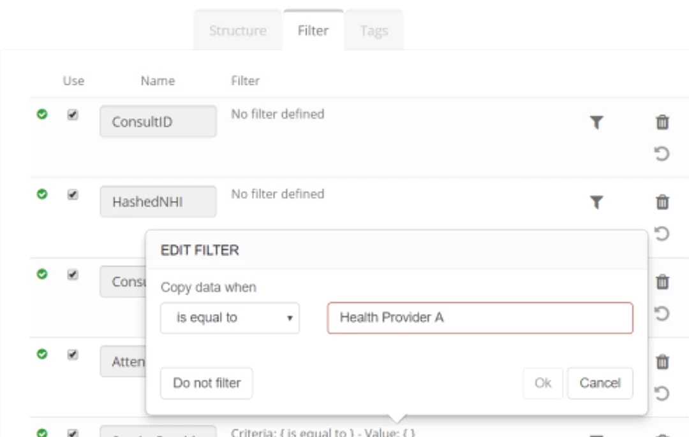
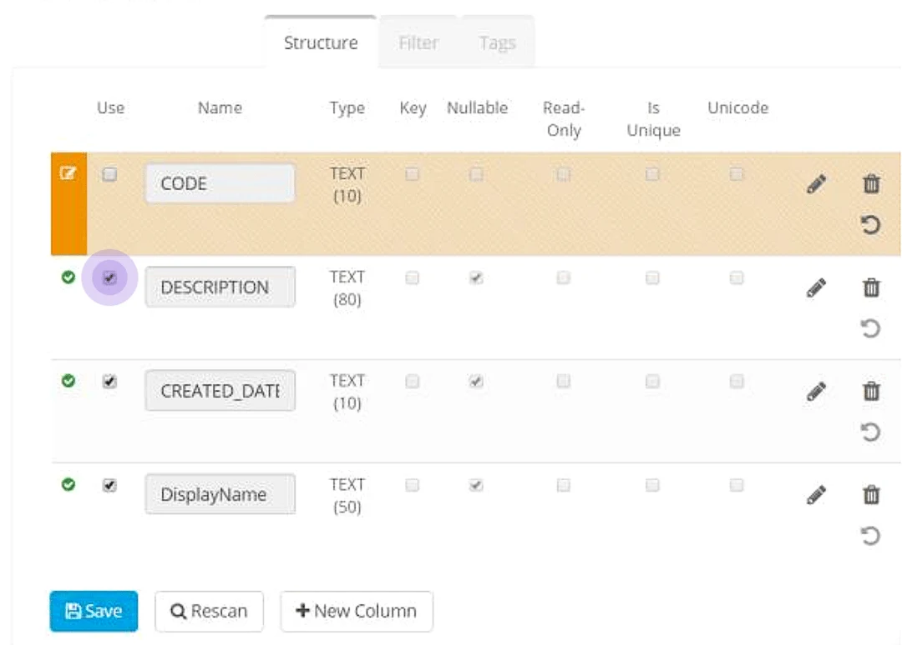
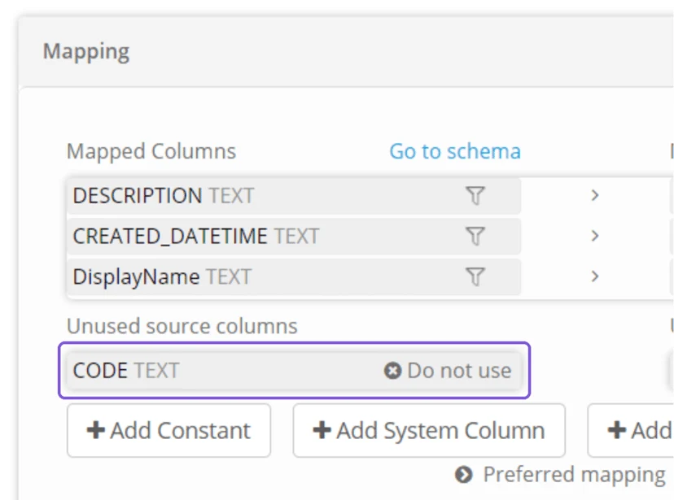
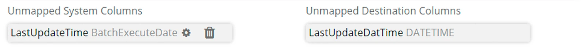
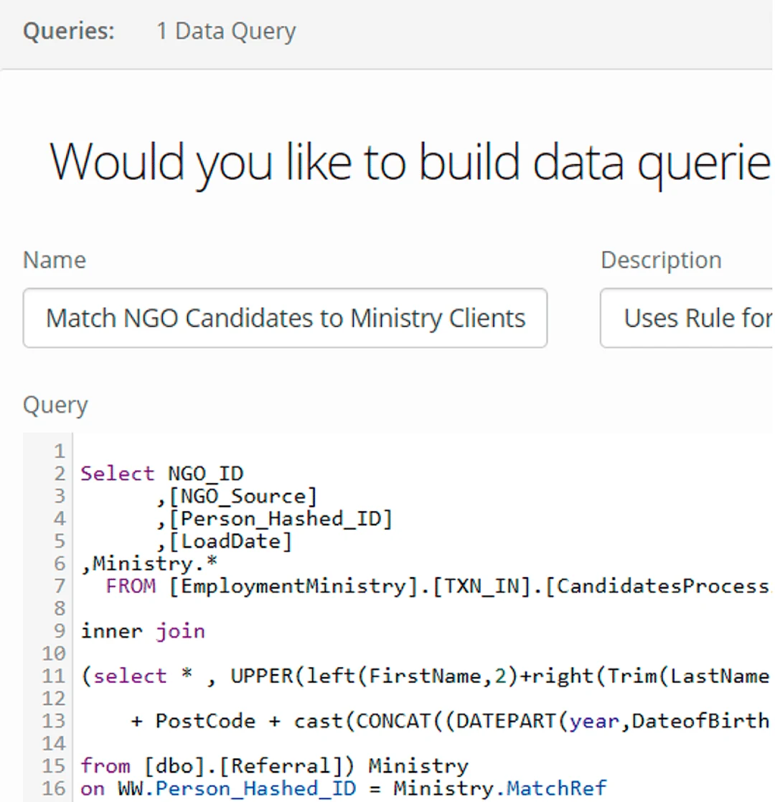
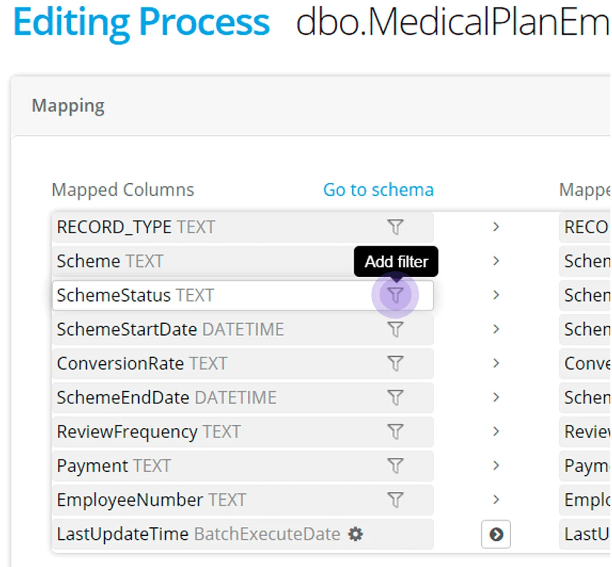

## Datastore options: Row level filters

**Browse a Datastore** to view an object to apply row level filters.

## Datastore options: Column level filters

To restrict a **column** from being used in a process, simply untick the 'Use' checkbox and **Save**.

The restricted column appears unavailable (marked **Do Not Use**) and cannot be mapped to a destination column.

Unmapped columns will not be written to the destination.

A process can be executed successfully - even when source columns are not mapped to a destination.

## Datastore Queries

Source Datastores connecting to relational databases have a Query tab available which allow you to create custom views of the data to share.

This is a way to apply column level filtering to the data presented in a Datastore.

## Process filters

Apply a **filter** within a process to control the rows written to a destination.

> *A column does not have to be mapped for a filter to be applied to a dataset*
