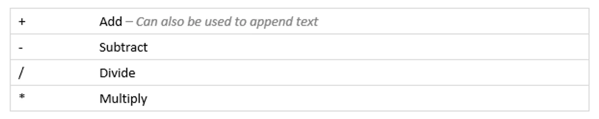

The following operators are supported. Most operators are designed to work with numeric data, but some will also work with other types, such as text.

## Integer and Decimal Arithmetic

Any arithmetic expression will be evaluated as either an integer expression or a decimal expression, depending on the elements.

For example, 10 / 5 will result in 2.

But 10.0 / 5.0 will result in 2.0.

The important difference is the decimal places. If the expression engine thinks you’re using only integer values then it will give you an integer result, discarding any decimal places, otherwise it will try to give a decimal result such as in the second example.
