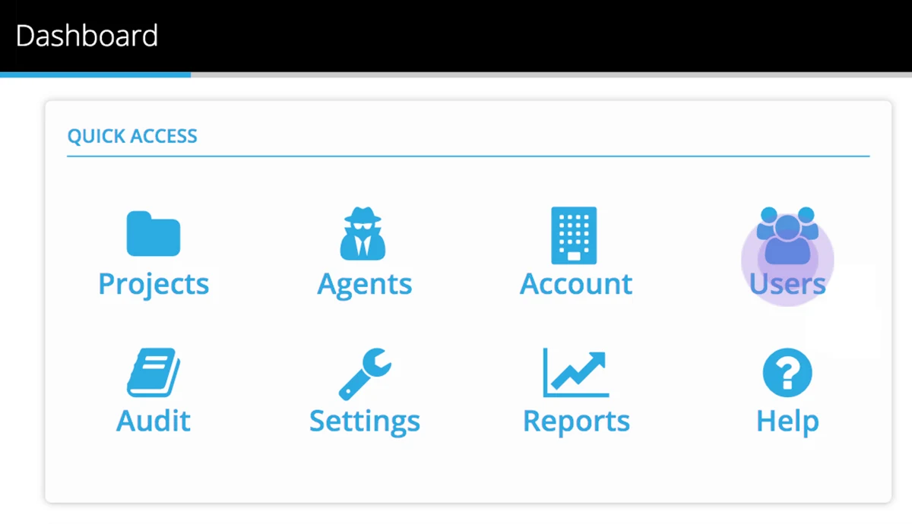
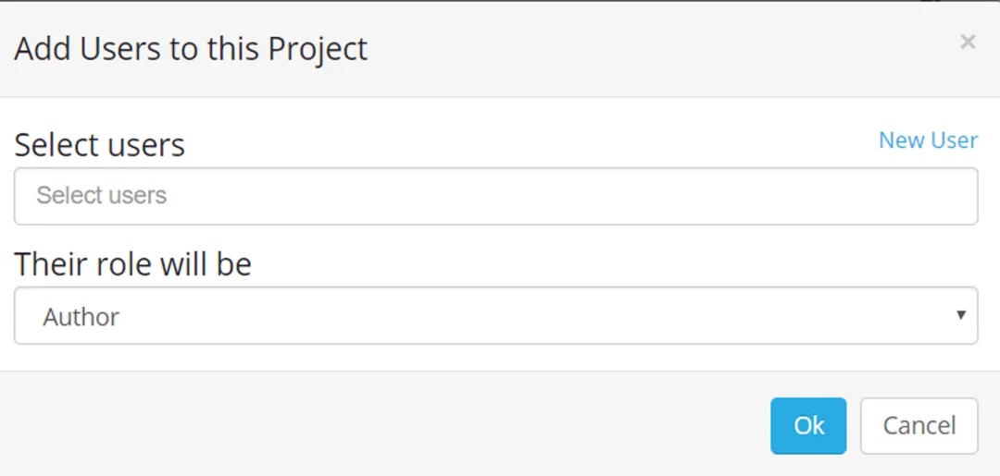

From a Project dashboard, select **Users**

Add a user from the Select Users dropdown, choose a project role (Author, Administrator or User) from the Role dropdown, and click **Ok**.

Use **x** remove to remove a User from a Project.

> *To change a Project role for a User, use the* ***x*** *remove* *button and add them again with the new Project role*

Now consider how you will enable access to data in your Project, there is some background information in the page [Agent - Architecture for Data Access](../agent-architecture-for-data-access/)
