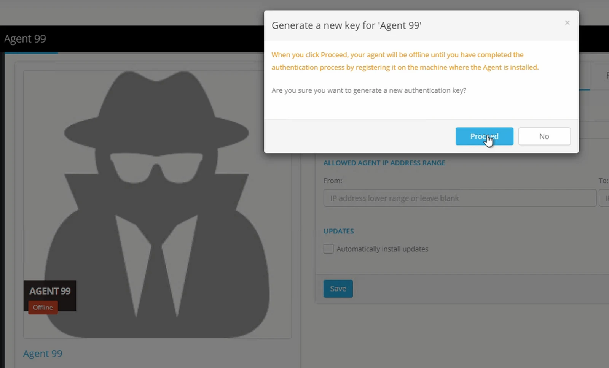
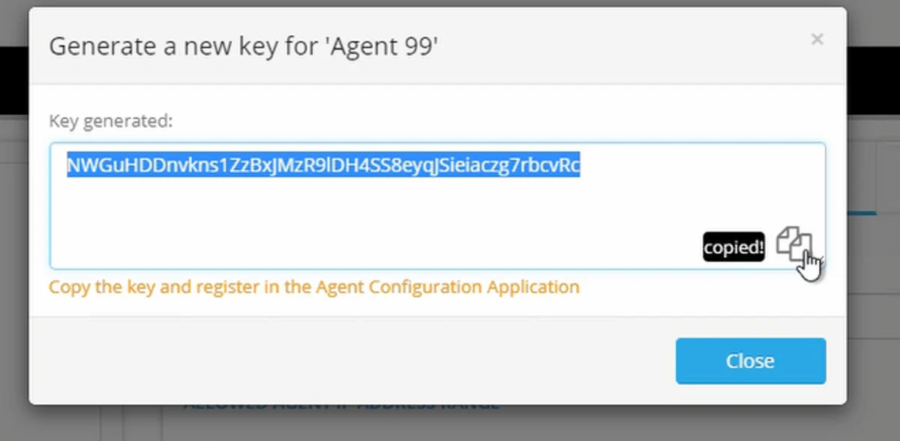
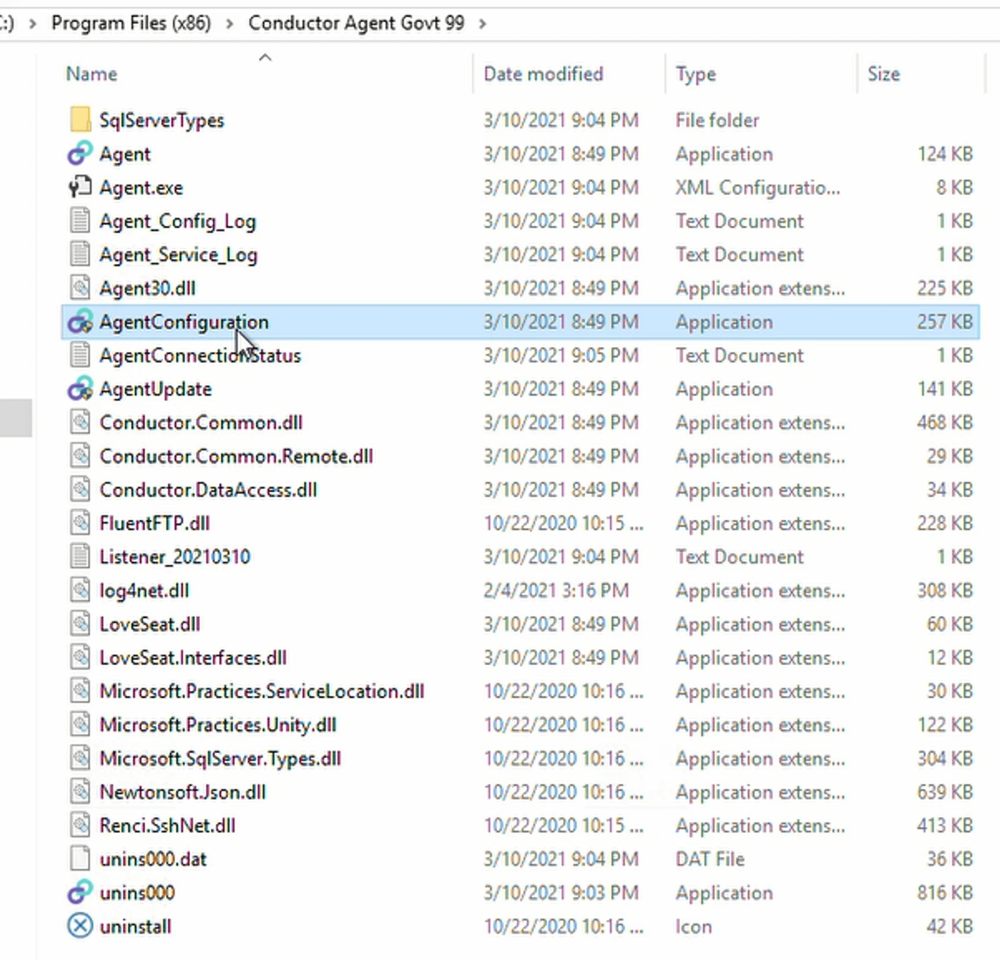
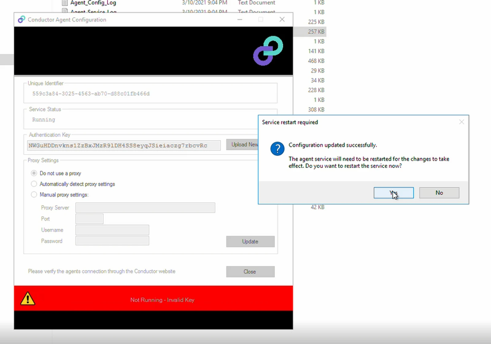
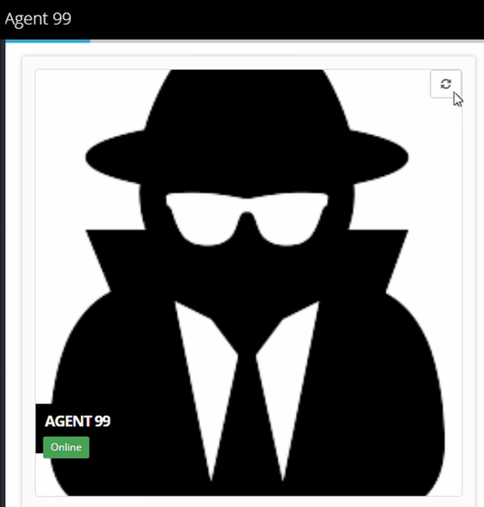

To authenticate an Agent, you need to be an Administrator on the Eightwire Account and have local administrator access to the computer or server where the Agent is installed.

1.  Go to the Agent page and click on an Agent
2.  Click **Authentication Key**
3.  Click **Proceed** to generate the authentication key.

4\. Copy the generated Key

5\. On the computer where the Agent is installed — navigate to the Eightwire Conductor Agent folder.

6\. Click on the AgentConfiguration application

7\.  Click **Upload New Key**

8\.  Paste the Authentication Key into the field.

9\.  Click **Save**

10\. Click **Update**

11\. Click **Yes** to confirm the Service restart

12\. Close the Agent Configuration Application.

13\. On the Eightwire Agent page — click the **refresh icon** on the top right of the Agent .

14\. A message will appear **New Values Updated** and the Agent label will show **Online**

## To see the process for authenticating an existing Agent, check out this video...

<iframe src="https://www.youtube.com/embed/JEW_mpqYxDw" title="Eightwire Agent Authentication" loading="lazy" allowfullscreen=""></iframe>

## To see the complete process from installation to authentication of a new Agent, check out this video...

<iframe src="https://www.youtube.com/embed/1Qqy_NI_Fo4" title="Basic Steps to Install an Agent" loading="lazy" allowfullscreen=""></iframe>

Congratulations! Your Agent is online. To connect to data go to [Create and Connect](../create-and-connect/)
