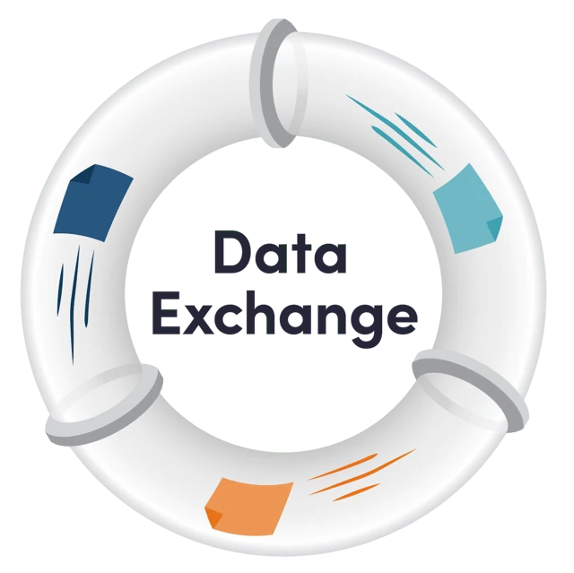
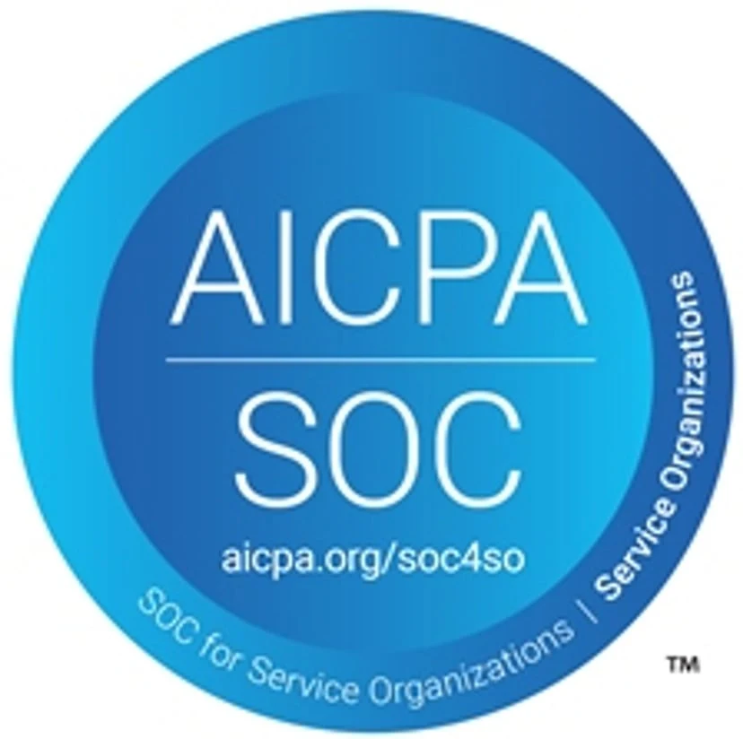

Eightwire worked with the Social Wellbeing Agency (SWA), SWA’s independent security specialists (ZX Security), and SWA’s Chief Information Security Officer (CISO) to complete the 2022 re-certification audit process, which was focused on our replatform to AWS;

·  A full review of the changes to application code and configuration that have been made for Eightwire to be hosted in the AWS environment.

·  A full AWS configuration review against security best practices was completed.

·  Revalidation of all existing controls in association with our NZ Based Processing Servers.

·  A review of Eightwire business processes including Change Control, Business Continuity and Disaster Recovery.

## Service Organisation Control (SOC 2) Type I audit

Eightwire completed SOC2 Certification in August 2022

