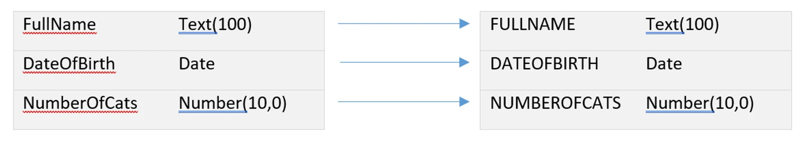
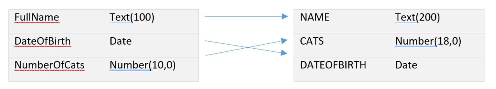
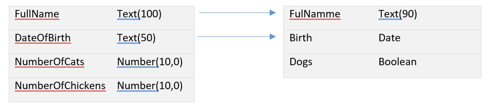
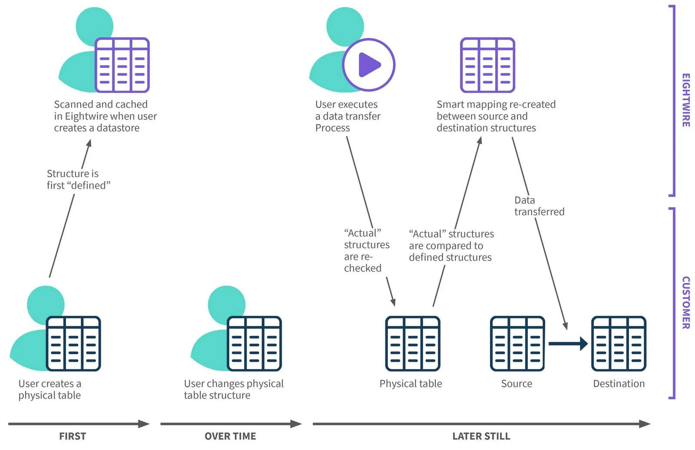

## Column Mapping

Each Data Store you define in Eightwire contains a list of tables (found through *discovery*). Each table contains columns (found through *scanning*). Each Process defines how the data in one of those tables is moved from a source Data Store into a destination Data Store. To accomplish this, a Process needs to know how to map the data structures in the source table to the data structures in the destination table – this is called *Column Mapping*.

In most cases, the columns in the source and destination will be identical — usually because there is no existing destination table so one will be created with an identical structure to that of the source. However, in some cases the columns may be slightly different; in rare cases, substantially different.

When you create a Process, Eightwire will attempt to pre-define the column mappings. If the columns on both sides are identical, they will all be mapped to their counterparts as expected. However, if the structures are different, Eightwire will use *Smart Mapping* to determine the best mapping, while staying within the column mapping threshold set for each Process.

## Smart Mapping

Many traditional data transfer tools and custom-written scripts tend to work on the principle that data structures cannot and should not change. Eightwire works on the principle that data structures will change and often do in the real world. For this reason, Eightwire does not use rigid column mapping but instead uses *smart mapping*.

When the source and destination column structures are different, Eightwire will try to construct a set of column mappings that best fits the data. As the difference between data structures gets greater, the accuracy of this matching is reduced. At some point the best possible accuracy achievable will fall below the *column matching threshold* defined for the Process and a mapping will not be possible.

If the column matching threshold is set at *Minimum*, Eightwire will try everything possible to get a viable match, even seemingly unlikely matches. However, two columns must still be compatible before a mapping can exist. Mappings must not violate the tolerance settings for the Process.

For example, the following mapping has a high accuracy because only the case of the column names has changed. Any column matching threshold will allow this:

The following mapping has a moderate level of accuracy because the column names are not quite identical but are subsets of each other and the types are not quite the same, but are convertible without potential data loss. The fact that their columns are in a different order doesn't matter. This mapping would be possible with a *High* matching threshold or less:

The following mapping has a low accuracy because not only are the column names only similar at best, but some of the data types are only compatible through conversion, and are not guaranteed to always convert. For example, if the *DateOfBirth* column actually contains a textual date value then it will convert to a date at the destination, but if it contains some other text instead, it will fail. This mapping would be possible with a *Low* or *Minimum* matching threshold:

In the above example, the first two columns' names either phonetically sound similar or are subsets of each other and they have compatible or non-guaranteed convertible data types, so they can be mapped, but not with much accuracy. The rest of the columns are just too different and cannot be sensibly mapped, so are left unmapped by Eightwire.

You can override Eightwire's smart mapping to an extent by manually mapping two columns together. When you do this, Eightwire will remap all of the other columns around them. However, this doesn't always guarantee that Eightwire will respect these manually defined mappings – if the real-world data structures change enough to cause these two mappings to become incompatible or their mapping accuracy falls below the mapping threshold, Eightwire will ignore your directions and attempt to do what it can with the data structures it has.

You can choose to not use one or more columns in a table.

To do this, see the page showing [Browse and Edit Datastores](../scan-browse-and-edit-objects/)

Any columns marked 'do not use' will be excluded from smart mapping, even if they are a good match for a destination column. If you then re-allow these columns to be used, you will notice that the column mappings will adjust to accommodate them, and they will be mapped if they can be.

It is this behaviour that forms part of Eightwire's self-healing feature set. The sort of changes you could expect to see in real life include renamed columns, new or removed columns, and altered data types — all of these can usually be accommodated without human intervention.

## Defined vs Actual Column Mapping

The following diagram shows a typical sequence of events over time.

**First**, a physical table is created in a database (or another type of platform). Then, a user logs onto the Eightwire portal and creates a Data Store. At that point, Eightwire scans the Data Store and stores its own copy of the table structure information – what columns and data types are used in the table.

**Over time** changes are made to that table, but Eightwire may not be aware of them.

**Later still**, a user executes a data transfer Process using this Data Store (either as a source or as a destination). At this time, Eightwire re-checks the physical table to see if the *actual* structure is still the same as the previously *defined* structure. It then creates a new smart mapping, based on the actual source and destination structures and the defined source and destination structures — making sure it takes into account any preferential mappings the user has created, but also adjusting for any changes in the structures over time. The resulting mapping is what is actually used to perform the data transfer process.

This diagram does not show a 'Rescan' action, but ideally one should have occurred just after the user changed the physical table structure.

> If you have configured your Eightwire Data Store to allow automatic re-scanning, then Eightwire will periodically rescan your tables and adjust its own copy of the *defined* structure information. It's important to keep this information up-to-date because this is what is used when you are creating and editing Processes — if this information is out-of-date then the Process you think you have built might actually look different when you execute it.You can manually re-scan a Data Store at any time.
