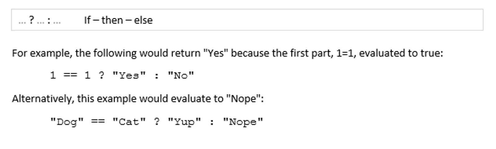

The conditional operator allows an ‘if then else’ type construct and follows the C# and Java convention.

The first part of the expression is the value being checked.

The second part is the value which will be returned if the first value evaluates to true.

The third value is returned if the first value evaluates to false.

