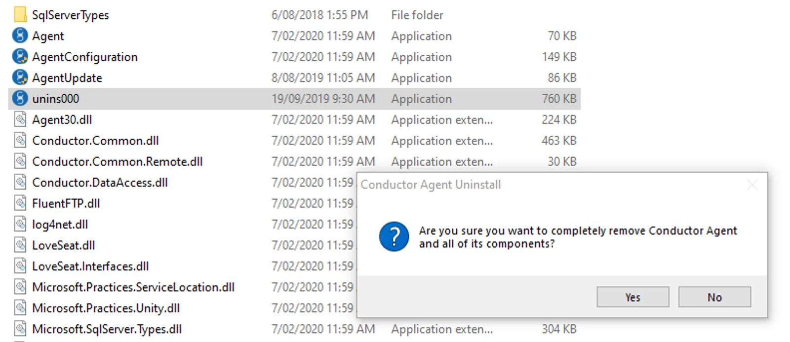
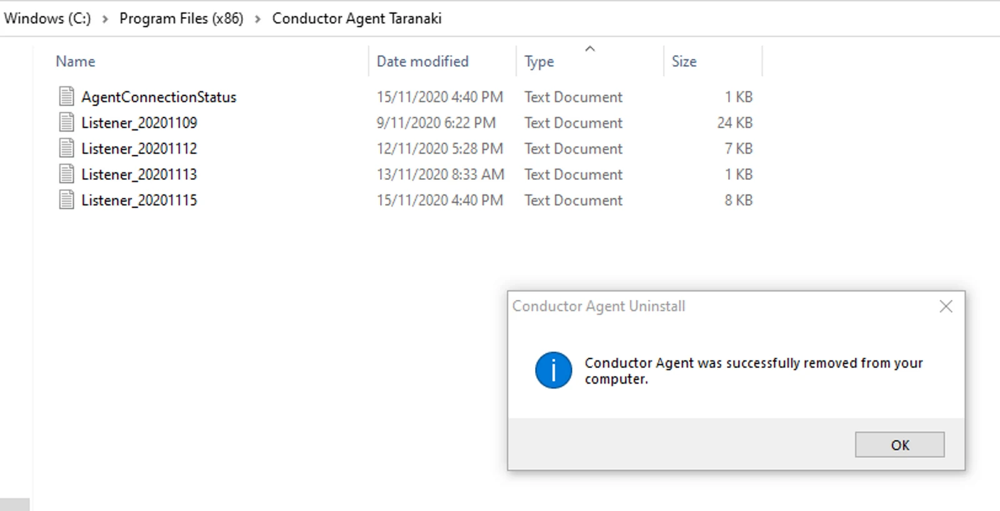
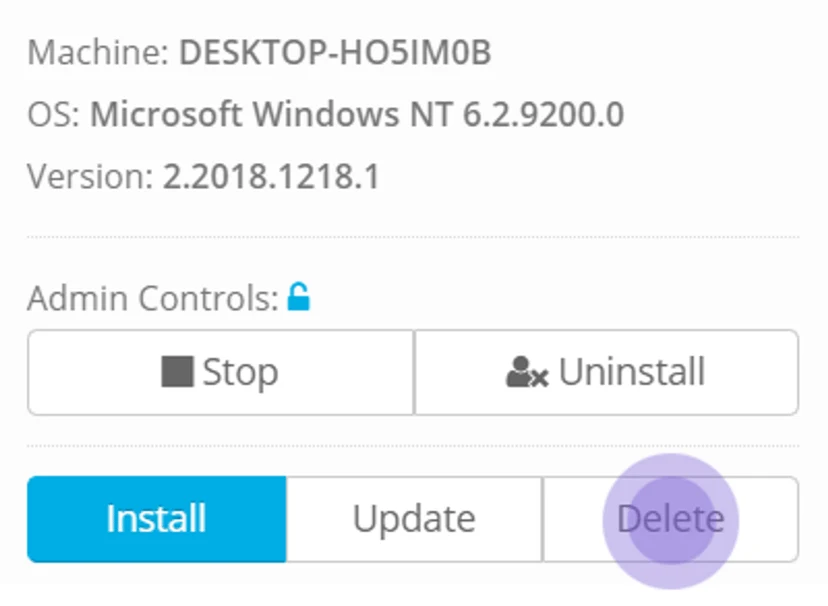
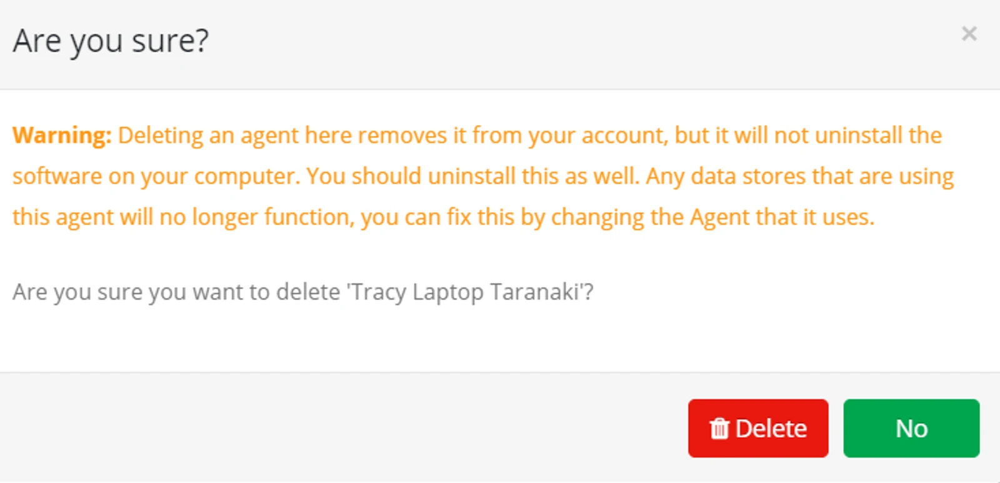

## Access the Agent

Log onto the Windows computer where the Agent is installed.

Locate the folder where the Agent is installed. This will likely be:

*C:\\Program Files (x86)\\Eight-wire Agent*

Run the 'AgentConfiguration.exe' utility.

You will be asked to confirm that you want to allow this app to make changes. Click **Yes** to continue.

This utility will tell you if the Agent service is running or not, what its unique identifier is, and what proxy settings in use.

Click Update to restart the service or make any changes to;

-   Proxy Settings
-   Windows Account credentials.

## Manually Update the Agent

Log onto the Windows computer where the Agent is installed.

Locate the folder where the Agent is installed. This will likely be: *C:\\Program Files (x86)\\Eight-wire Agent*

Click on the Agent Update application and click to allow the application to make changes

You will see if the update has succeeded and what the new version is.

Use any key to exit.

## Uninstall an Agent

If for any reason you need to uninstall - then you need to do this through the Program Files and  through the Eightwire Agents page.

Locate the folder where the Agent is installed.

Click on the **unins000** Application and allow the Application to make changes.

Click **Yes** to confirm the delete.

The Agent is uninstalled. You can delete the remaining text files and the folder.

In the Eightwire portal on the Agent page click **Delete**.

Confirm by clicking **Delete**, the Agent will no longer appear on the Agent page or be available on the datastore page.

As well as the steps to configure your Agent, there are other factors that you can consider when troubleshooting an Agent that is not connecting — check out [Agent FAQs and Connectivity Troubleshooting](../agent-faqs-and-connectivity-troubleshooting/)
