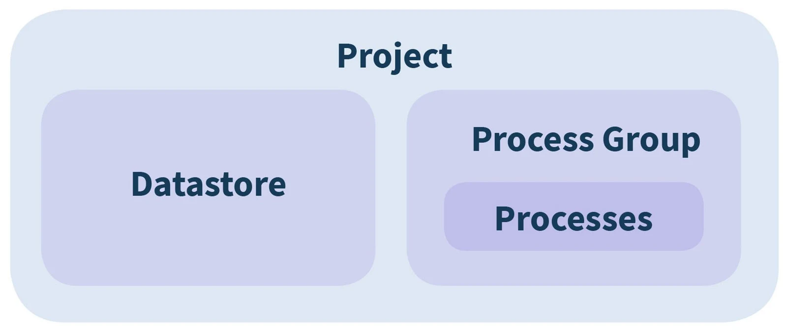
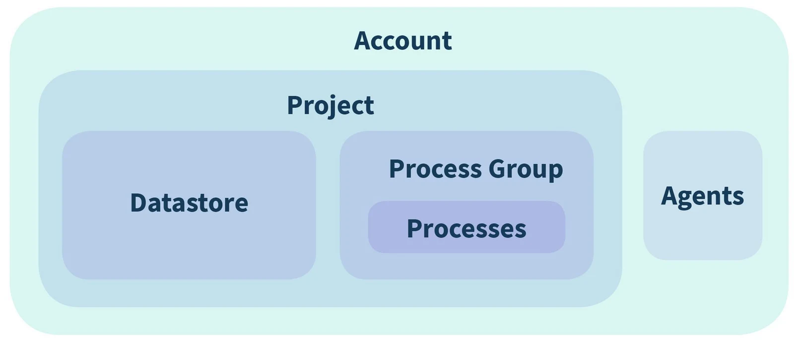

## Copy Project

**Copy an entire Project - either within your Account to a different Account**

-   Users are outside the copy process.
-   During the copy process a new Agent for all Datastore conenctions can be nominated.
-   After the copy, Datastore connections need to be updated and process schedules need to be reviewed.

**We clone following entities**:

Project

DataStore (datastore shares are not included).

Schema

Column

Tag

TagLink

ColumnTag

ProcessGroup

Process

Filter

Mapping

Schedule

ExecutionGroup

ExecutionPlan

## Copy Account

**Copy an entire Account**

(along with all Projects, Datastores, Process Groups, Processes, Agents, within it).

> To engage this service please contact us at [support@eight-wire.com](mailto:support@eight-wire.com)
