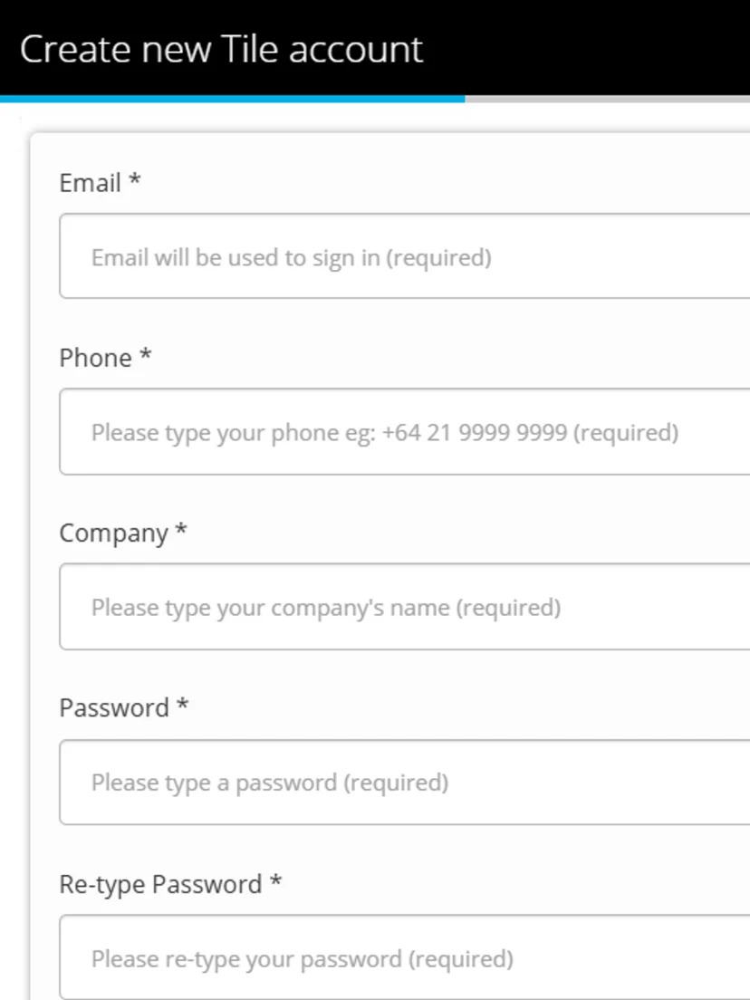
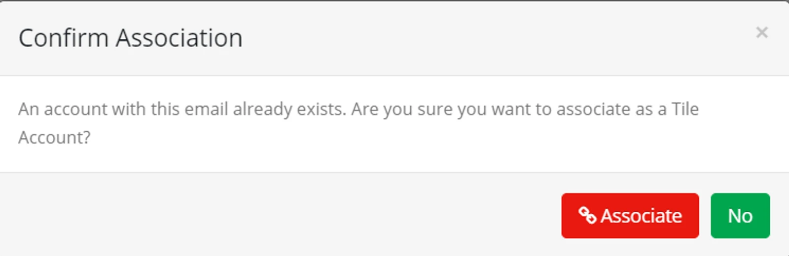
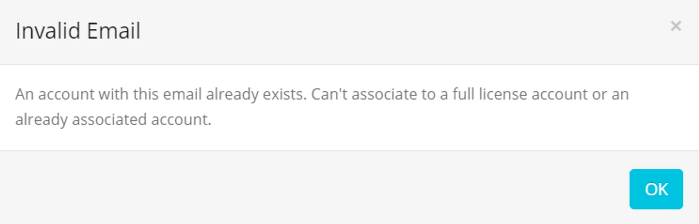
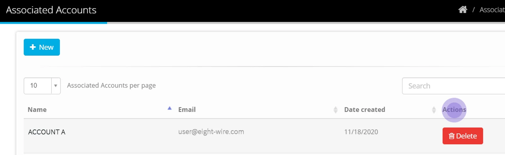
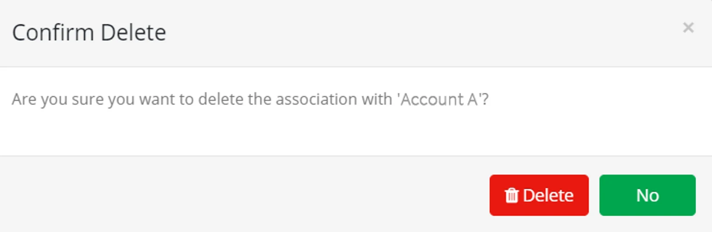

## Create an Associated Account

From the Account Dashboard at the top right, navigate to the the Associated Accounts Menu.

Click **New**

Enter the details on behalf of the Associated Account

Click **Create Account**

> **Email** *— this is the email address of the primary account holder. They will be created as a user with the Tile Account Admin role.*

> **Password** *— You will need to enter twice to confirm the password. Advise it separately to the primary account holder.*

After you create the Account an activation request will be passed through to our support team.

On activation of the Account, an email will be generated to the primary account holder so they can accept Eightwire terms and conditions and verify the Account.

The Associated Accounts menu is only for creating Tile Licence Accounts.

If a Tile Licence Account already exists - you will be advised and invited to associate with it.

If a full license already exists, you will also be advised. In that case, you can share using Tile without creating an Association.

> *Creating Associated Accounts means you are accepting the license cost on behalf of the data provider. They can only apply for Tile Licence Accounts at a monthly cost while associated.*

To see how to invite your Associated Account to share data with you in [Share a Tile Datastore](../share-a-tile-datastore/)

## Delete an Association

Once an Account has been created, only that Account can deactivate or upgrade their licence.

Instead, when a data-sharing relationship has stopped, then a parent Account can delete their Association.

> *You should delete any Datastore shares with an Account before deleting an Association with that Account.*

From the Associated Accounts Menu, find the Account and hover over Actions to highlight the **Delete** button.

Click the **Delete** button, and confirm again to remove your association with that Account.

Ready to work with your Associated Accounts? Go to [Define your Tile Datastores](../define-your-tile-datastores/)
