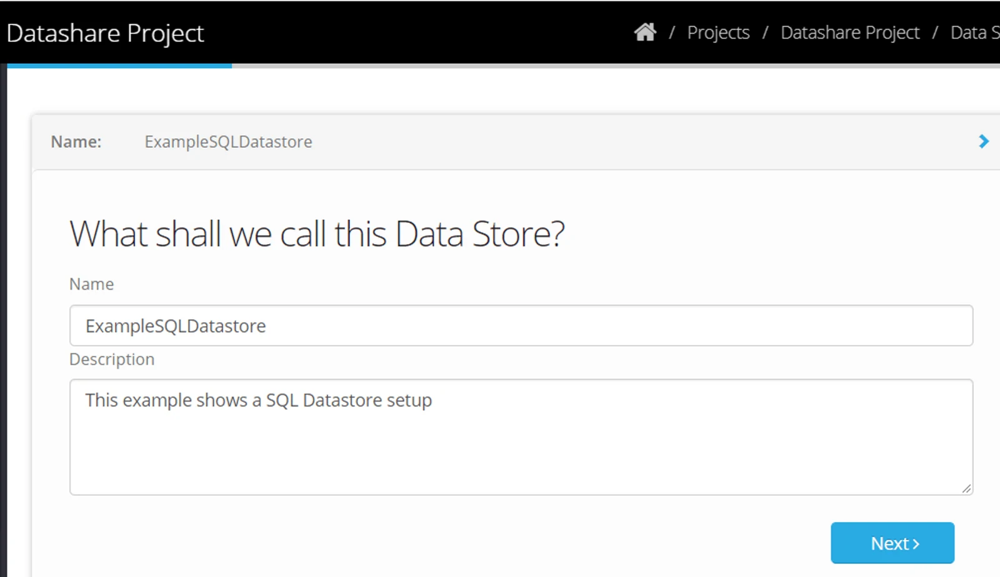
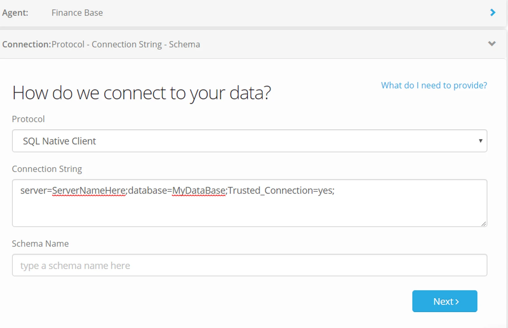
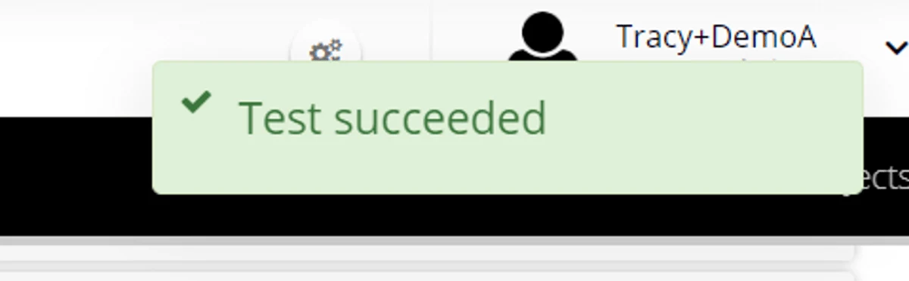

## Create a Datastore

The steps to set up a datastore also include the option of downloading and connecting a new Agent (refer to our section Installing an Agent for detailed information).

1.  Navigate to Datastores and click **+Add**
2.  Name your datastore and provide an optional description.

> *If you plan to share the datastore with another organisation it is good practice to include your organisation name in its title.*

3\. Click **Next**

4\. Select whether the data you are connecting to is on premise or cloud hosted.

5\. Select a connector type and click **Next**

6\. Select an Agent and click **Next**

Don't have an Active Agent?  Check out all you need to know about installing here: [Install an Agent](../install-an-agent/)

7\. **Connection**

Provide the instructions to connect to your data.

The instructions will vary depending on the datastore Type - for example;

-   a database connection string
-   a folder path
-   cloud provider credentials
-   ‍

*The example shown connects to a SQL database*

Click **Next** and the datastore will perform a connection test.

8. **Configure the datastore**

Choose whether the datastore is being used as a **source** or a **destination**.

-   **Maximum concurrent reads**: this defines how many parallel processes can be run using objects in your datastore.
-   Scan process — choose Automatic or Manual
-   A scan looks at the underlying repository and gather information on its tables, columns and data types. This is done first when you create the datastore and theinformation assists with smart mapping and detecting unexpected data structure changes.

**Automatic Scan** periodically allows Eightwire to re-scan and refresh its cached scan of your data structures.

**Manual Scan** only does this when requested - using the scan button on the datastore. If your underlying repository data structures change, you should re-scan the datastore to ensure youare working with accurate data structures.

Click **Next**

> *Eightwire will scan each object used during a data transfer and report a warning if the cached data structure differs from the actual data structure in a way that is incompatible.*

> *The data source you are transferring data to must have the same Region selected, or not lock their datastore to a Region for the process to work.*

9\. **Data Sovereignty**

Selecting an option from the drop-down means that you are restricting any transfer of data to use a Processing Server with data center in a particular Region.

10\. Click **Create**

## Watch the steps to set up an Excel Datastore

<iframe src="https://www.youtube.com/embed/hCOvqwUsQZw" title="Eightwire: Create an Excel Datastore" loading="lazy" allowfullscreen=""></iframe>

> *Always finish the steps to create a datastore and check the scan of the datastore objects* ***before*** *you use the Datastore Sharing tab.*

Nice work!

You have completed your datastore setup.

If your data repository already contains objects, have a look at the options available to confirm the scan has correctly reflected the data structure and work with the data presentation: [Scan, Browse, and Edit Objects](../scan-browse-and-edit-objects/)

Next Steps:

If your datastore uses a relational database, then you have the option of creating datastore queries — check information about that on this page: [Datastore Queries](../datastore-queries/)

If your datastore is a source CSV, then you have the option of creating a wildcard (for applying a naming convention to files that will be read from the source folder). Check out how to apply wildcards: [CSV Datastore Wildcards](../datastore-wildcards/)

If you are creating a Tile Datastore to share with an Associated Account or another full license Account, there are specific Datastore configuration options shown here: [Tile Datastores.](../tile-datastores/)
