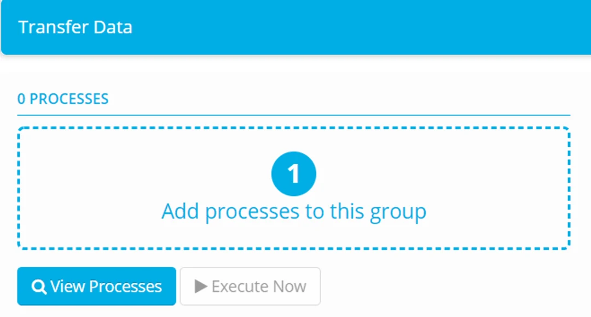
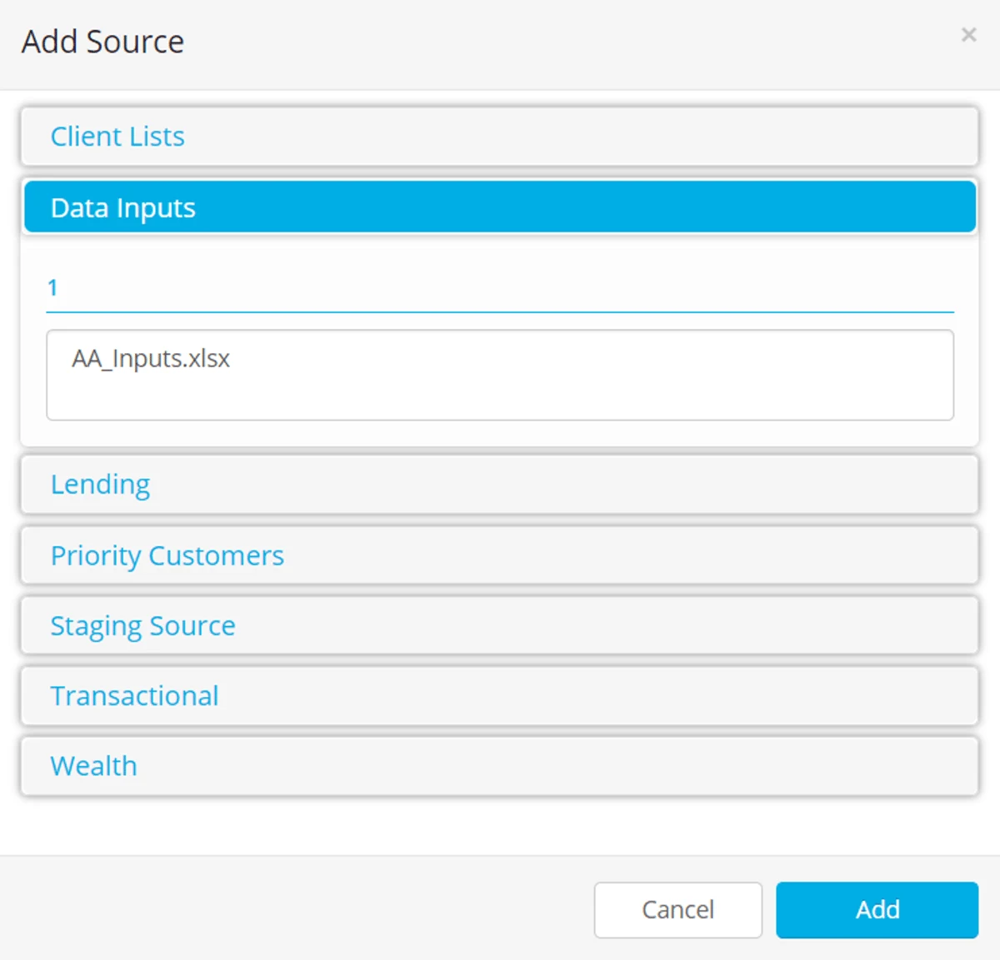
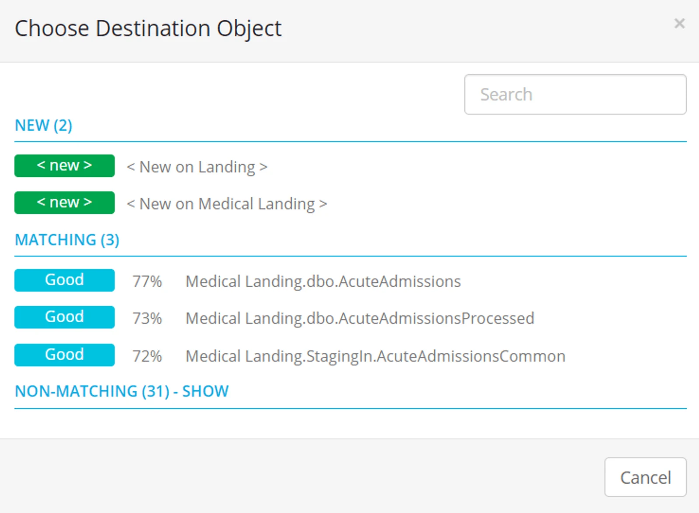
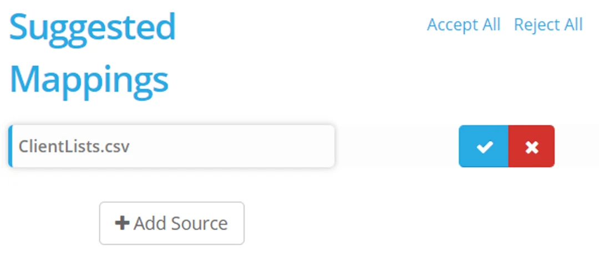
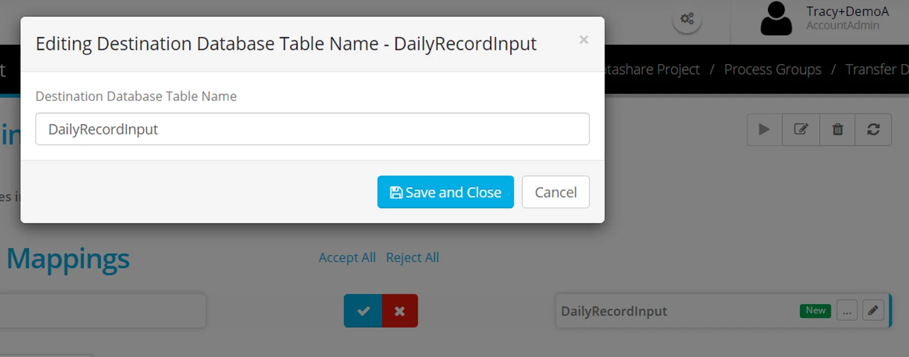
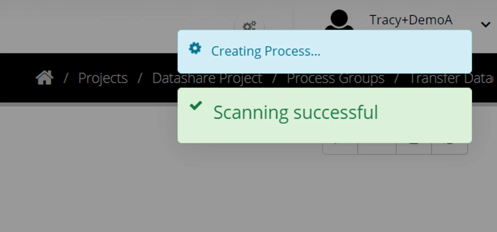
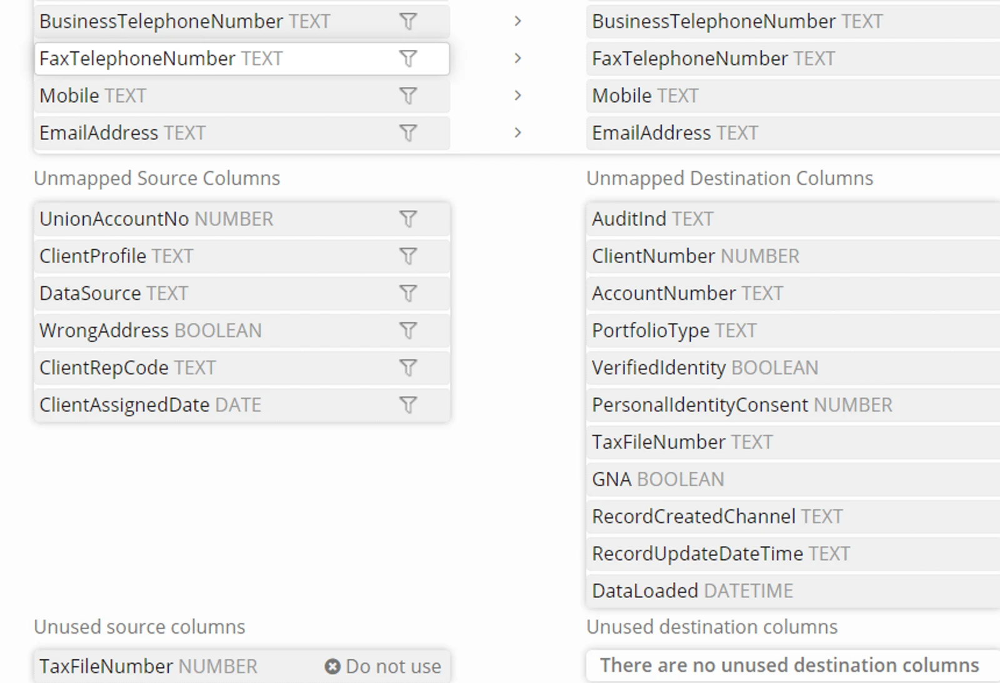
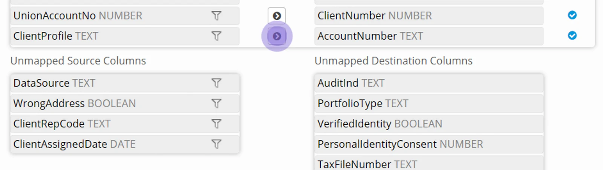
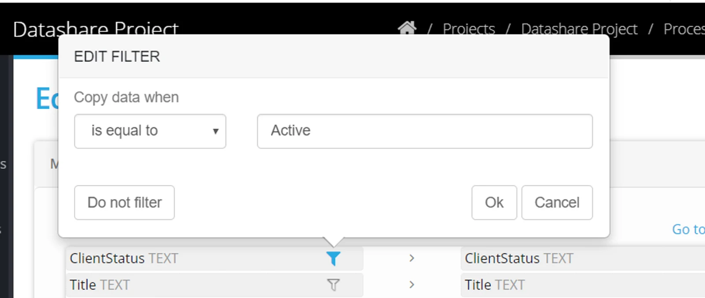

## Create a Process

To create, edit or delete Processes, you need to navigate to a Project, navigate to Process Groups, expand one Process Group panel on that page, then click **View Processes**. Click **Add processes to this group**

Click **Add Source** to select the source data objects you would like to use in the transfer.

Double click on a Datastore name to expand the list

You are shown all the source data stores in the current Project. Select one or more objects and click **Add** (to select multiple objects, hold the Ctrl or Shift key while you click).

Eightwire will compare the structure of the source objects you have selected against all the objects that exist in the project destination Datastores.

Using that comparison it will suggest the best match for each table, and display a percentage. If Eightwire can't find a good match it will instead suggest creating a new object on the destination.

**EITHER**

Choose an existing destination object

Using the suggested options of matching objects, select the one you want to use.

Click the blue tick or **Accept All** to create the process.

**OR**

Create a new destination object.

Click **New** for the appropriate destination datastore.

Click the pencil icon to rename the destination object.

> *The destination object will be created using the object naming convention for the Datastore. For example, a new file Delimited Text in datastore will be named with .csv once created and a database object would start with the schema name or dbo.*

Complete creation of the process by clicking the Blue tick or **Accept All**

## Map a Process

From within a process group, hover the mouse over a process to see the **Edit Refresh Delete** and **Execute** buttons.

Click **Edit process** (the pencil icon).

The mapping from source table to destination table will appear.

Automatically mapped columns have a light grey arrow between them

Unmapped Source and destination columns may also appear.

Any column that appear with **x Do not use** have been restricted in the source data store, and cannot be mapped.

To manually map a column click on the source and destination columns.

A message will confirm manual mapping has been successful and the columns will appear with a dark grey tick between them.

To remove a manual mapping, simply click on the **dark grey arrow** and confirm.

When the mapping is complete, click **Save**

## Filter a Process

A process can have row-level filters applied. Only rows where the filter criteria are met will be processed.

To apply a filter, edit the process.

Click on the **filter icon**.

Enter the criteria.

Click **Ok**

> A *column does* ***not*** *have to mapped to have a filter applied.*

> *A filter* ***cannot*** *be applied on an expression column*

## Check out this video for an example — building processes

<iframe src="https://www.youtube.com/embed/frwgrwmJpWE" title="Eightwire: Create a Process" loading="lazy" allowfullscreen=""></iframe>

More options working with processes are in the following pages;

-   Create [Process Expressions](../create-process-expressions/)
-   Work with [System Expressions and Constants](../use-process-constants-and-system-expressions/)
-   Configure [Process tolerances and Options](../process-options-thresholds-and-toleration/)
-   Test a Process by [manually executing](../execute-a-process/)
-   Apply [a time based schedule](../process-group-time-schedule/) to your Process Groups
-   Apply [an event based schedule](../process-event-execution-schedule/) to your Process Groups
