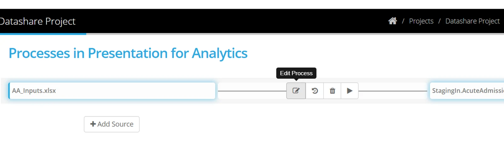
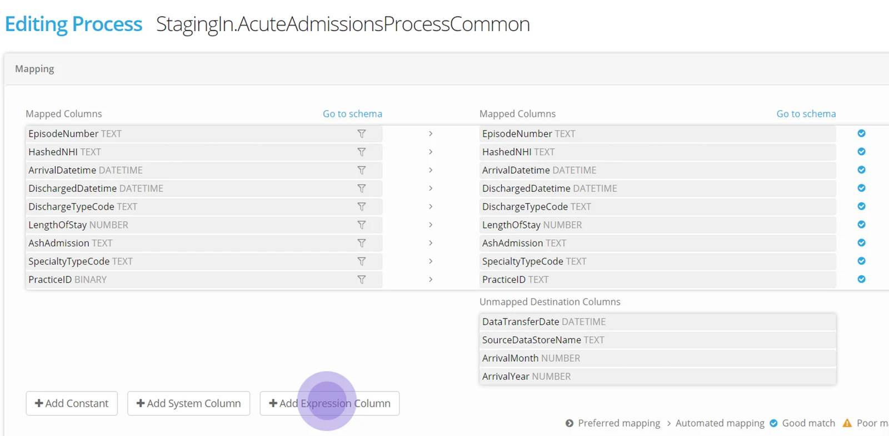
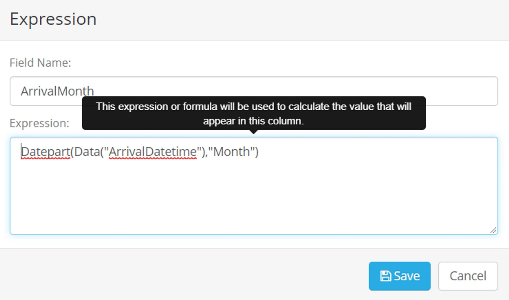
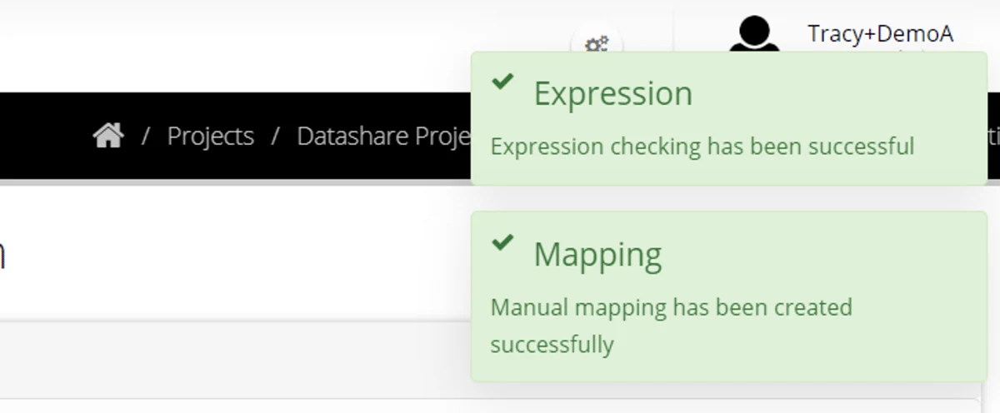
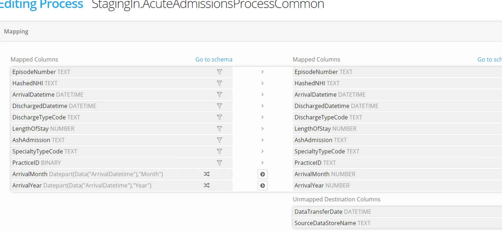

To create a process expression, navigate to a process.

Highlight the process and select **Edit Process**

Select **+Add Expression Column**

Name the column that will be represented by an expression.

Enter the expression and click **Save**

The syntax of the expression will be checked.

The expression can be manually mapped (click on the expression and then the destination column).

**Save** the process.

> *Run the process to check that the expression is successful — for example if your source data contains NULLS or empty strings you may need to handle that in the expression.*

> *A detailed guide to the expression editor syntax can be found in the pages on* [*Process Expressions*](../overview/) *Syntax.*

More options working with processes are in the following pages;

-   Work with [System Expressions and Constants](../use-process-constants-and-system-expressions/)
-   Configure [Process tolerances and Options](../process-options-thresholds-and-toleration/)
-   Test a Process by [manually executing](../execute-a-process/)
-   Apply [a time based schedule](../process-group-time-schedule/) to your Process Groups
-   Apply [an event based schedule](../process-event-execution-schedule/) to your Process Groups
