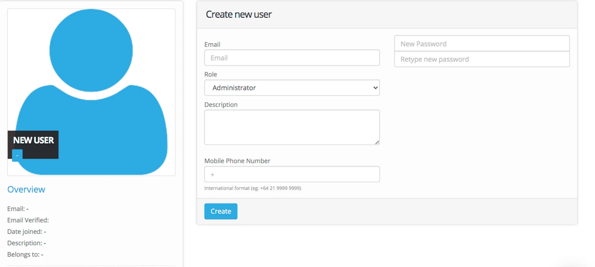
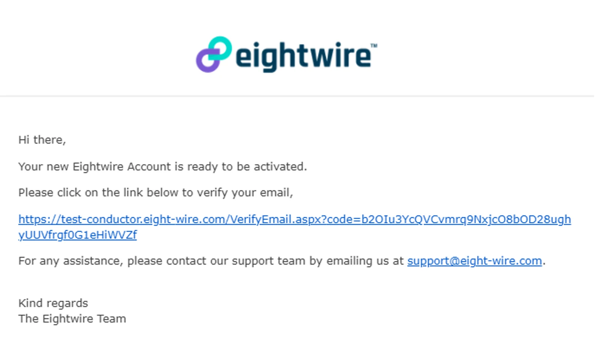
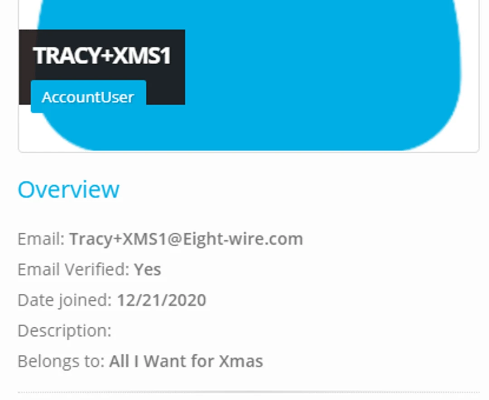

## Creating users

To create a User in your Account, from the Dashboard

Select **Users**

Click **+New**

Complete the Fields: **Email, Role, Description** (optional), **Mobile Phone Number**

Enter and re-enter a password (check password requirements to see rules for creatinga password).

Click **Create**

## Password Requirements

-   16 characters long or 10 characters with 3 uppercase, lowercase, and numeric symbol.
-   Cannot be the same as previous 12 passwords.
-   Must be changed every 90 days.

> *Use account settings to enable Two Factor Authentication for users (recommended)*

## User Verification

Once a user has been created using an email address - then they receive a system email allowing them to verify;

They must click on the link to verify - and then log into their Account.

> *Once the verification link has been clicked once - it cannot be used again - even if the user does not complete the log in action.*

The User  profile shows the Account role and the date verified.

Your User is now active in your Account.

To see how to assign team members to certain Projects, check out the page [Assign Project Users](../assign-project-users/)‍
