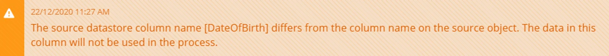
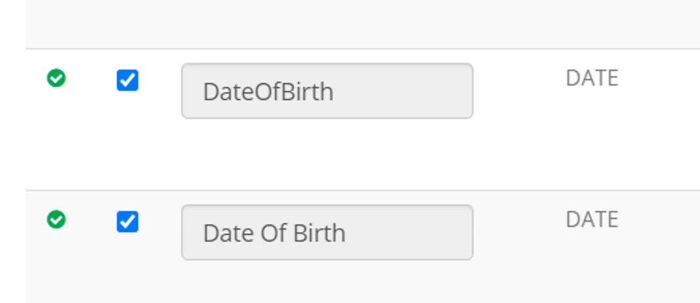
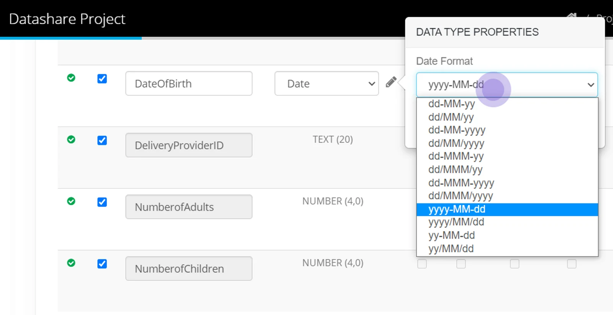

## Using CSV Files as a source

Column headings — **keep consistent heading names between processes** — for example, if a column is named 'DateOfBirth' for one data submission and then changed to 'Date Of Birth' then the process will not see the data in the new column name and will generate a warning.

Be aware in this situation the Datastore scan will show DateOfBirth in the Datastore (as it is used in a process AND Date Of Birth (the new name in the source excel spreadsheet.)

-   You must rescan or adjust a datastore set to **manual scan of metadata** before an account you have shared with can see the changes - such as adding a new file to be shared.
-   If you change the structure of a datastore - that is set to **automatic scan of metadata,** then it is recommended that you also scan the datastore.
-   For a process to run successfully - the file must be closed.
-   For a process to run successfully - the file name must not be changed unless you are using a wildcard convention in the Datastore - for more information, check out [CSV Datastore Wildcards](../datastore-wildcards/)

## Using CSV Files as a destination

**Date and Datetime Formats**

The default format when writing a date in a process is yyyy-MM-dd - and this is used regardless of the format in the source.

If you have a specific format you require, then choose from the dropdown of Formats when you edit datatype properties.

Once you have data prepared and it is being processed - any data conversions  (between source and destination) or any change to the structure of your data is highlighted in the batch history.

Learn more about the detail available in the page [Monitor Process Activity](../monitor-process-activity/)
