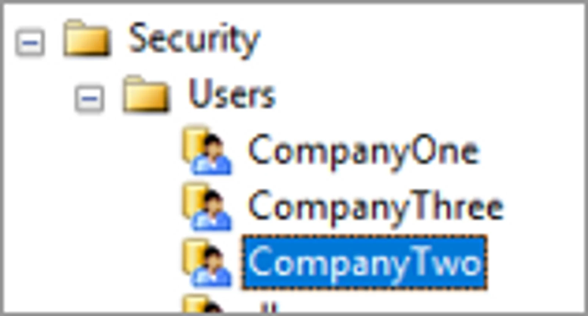
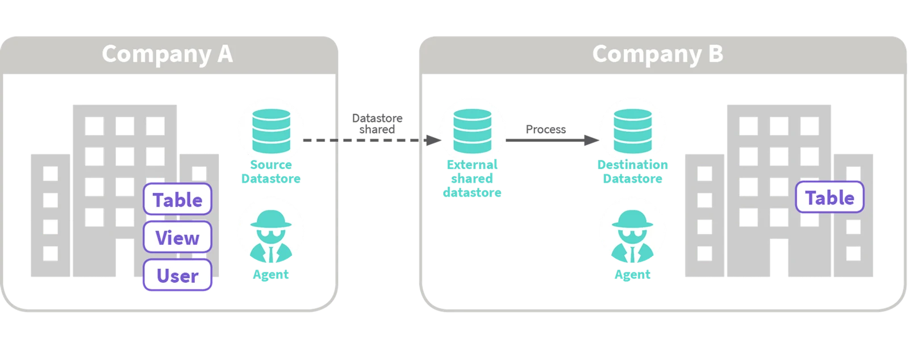
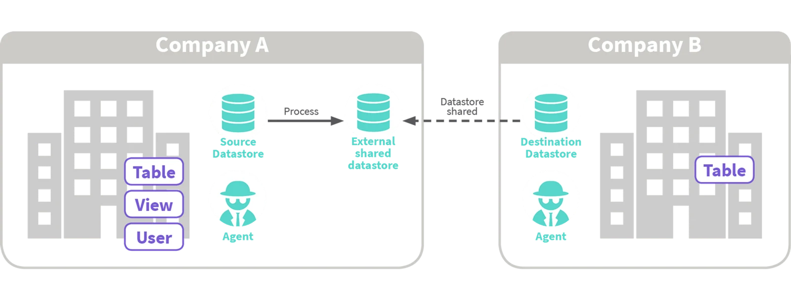
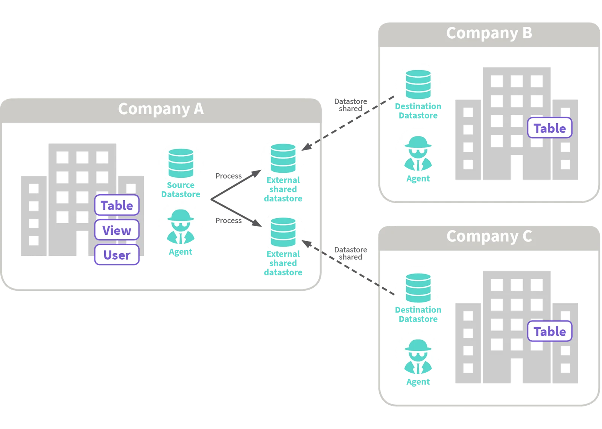
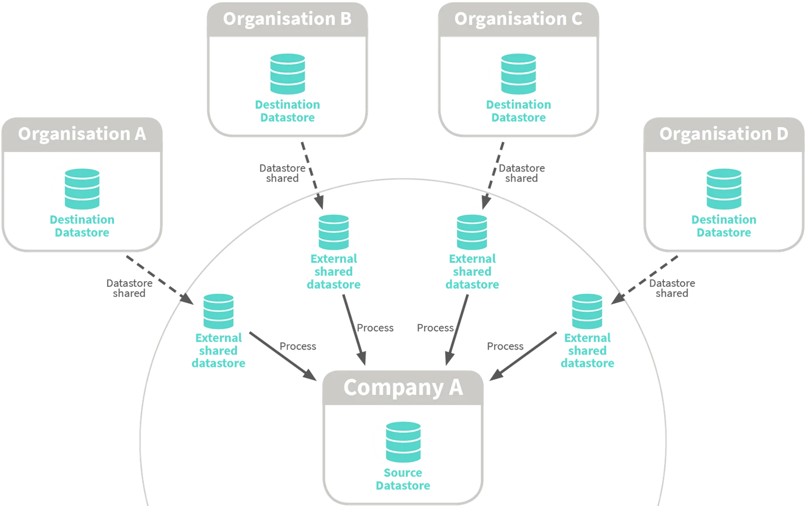
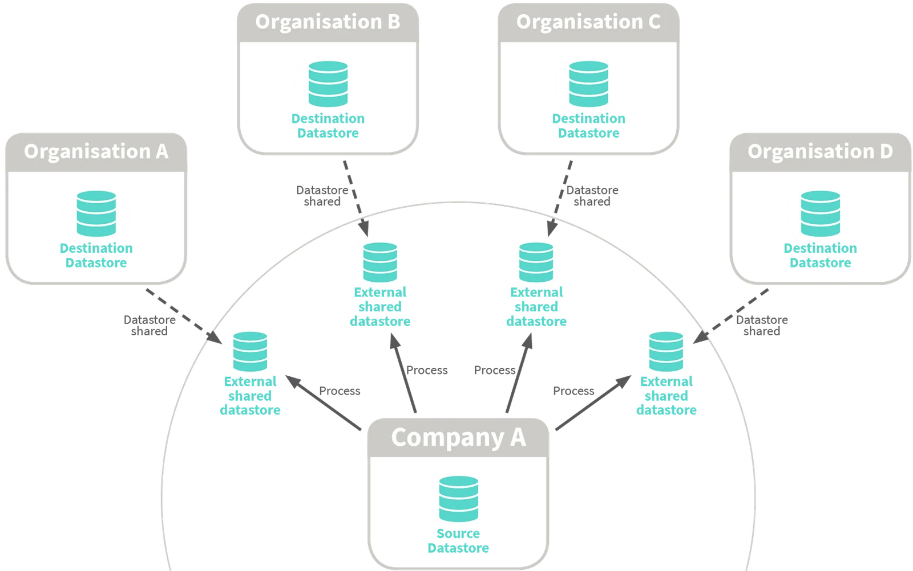

## Data Store Connections and Database security

When you share a Datastore - all the objects in the datastore are visible to the other party.

It is important to make sure you are only exposing objects that you want the other party to read from or write to.

There are several ways to apply the security required for your Datastore;

## Relational Database or Network Folder;

| Method | User | Description |
|---|---|---|
| Agent supplied credentials | nominate a specific Active Directory User or the default `NT AUTHORITY\SYSTEM` | The database objects or folders that you expose in your datastore must be able to be accessed by the nominated User |

| Connection string |
|---|
| `server=SVRName; database=DBName; trusted_connection=yes;` |

| Method | User | Description |
|---|---|---|
| Datastore supplied credentials | enter a specific Active Directory User or use the default `NT AUTHORITY\SYSTEM` | The database objects that you expose in your Datastore must be able to be read by the User quoted in the connection string. or A User must have permissions to a folder in order for the objects within to be visible in the Datastore. |

| Connection string |
|---|
| `server=SVRName; User ID =CompanyTwo; Password=2Company; database=DBName` |

## Share the Source

In this example the Source Data Store is shared by Company A, to Company B.

Company A can only see the objects in their own Source Data Store.

Company B can see the objects in both the Source and Destination Data Stores.

Company B, as the owner of the Process, can select the objects that are to be inserted to its Destination Data Store, and define the characteristics of that Process (mapping, filters, tolerances, system or expression columns and scheduling.

## Share the Destination

The Destination Data Store is shared by Company B, to Company A.

Company A can see the objects in both Source and Destination Data Stores. Company B can only see the objects in the Destination Data Store.

Company A, as the owner of the Process, can select the objects that are to be inserted in the Destination Data Store and define the characteristics of that Process (mapping, tolerances, system or expression columns, and scheduling).

## Share Multiple Destinations

The Destination Data Stores is shared by both Company B and Company C, to Company A. Company A can see the objects in both the Source and each Destination Data Store. Company B and Company C can only see the objects in their own respective Destination Data Store.

Company A, as the owner of the Processes, can select the objects that are to be written to each Destination Data Store, and define the characteristics of those Processes (mapping, tolerances, system or expression columns and scheduling).

## Hub: Receives data from multiple sources

Data can come from several different organisations, with Company A acting as the hub and owning the processes that insert the data from the shared Source Data Stores into its Destination.

**None of the destination object structure is exposed to the source organisations.**

## Hub: Sends data to multiple destinations

Data can go to several different organisations and Data Stores, with Company A acting as the hub and owning the Processes that insert the data into each shared Destination Data Store.  **None of the source object structure is exposed to the destination organisations.**

Applying a structure to your datasharing arrangements can filter the visibility of objects to an Account.

To see how you filter data within an object that is shared in a Datastore check out the section on [applying column and row level filters](../applying-column-row-level-filters/)
