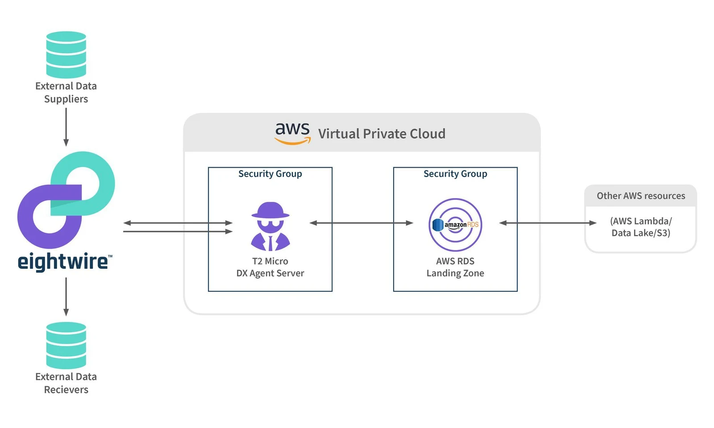

## RDS

To connect to RDS, create a Datastore as follows;

**Type**: SQL Server

**Where is your data**: On an internal network

**Agent**: Select the Agent installed in your EC2 environment

**Connection String**: Server = \[ServerName\],\[Port\];Database=\[DatabaseName\];User Id=\[UserID\];Password=\[Password\];

**Security Groups**

EC2 — Inbound ports 3389  - no outbound rules

RDS — Inbound ports 1433 - no outbound rules

There is also a rule that allows the EC2 group to access the RDS group so the agent on EC2 can connect to RDS via the SQL Native Client (port 1433).

## S3 Buckets

To connect to S3, create a Datastore as follows

Type — S3 Delimited Text

Where is your data? — In the Cloud

Agent — Not required

Bucket Name — Secret Key - Access Key - AWS Region - Path

**Permissions**

Please refer to AWS documentation with regards to [applying security to the AWS S3 Bucket.](https://aws.amazon.com/blogs/security/writing-iam-policies-how-to-grant-access-to-an-amazon-s3-bucket/)

For Eightwire to interact with the AWS bucket the suggested actions required to browse, read, overwrite and insert are;

ListAllMyBuckets

GetBucketLocation

ListBucket

GetObject

PutObject

DeleteObject
