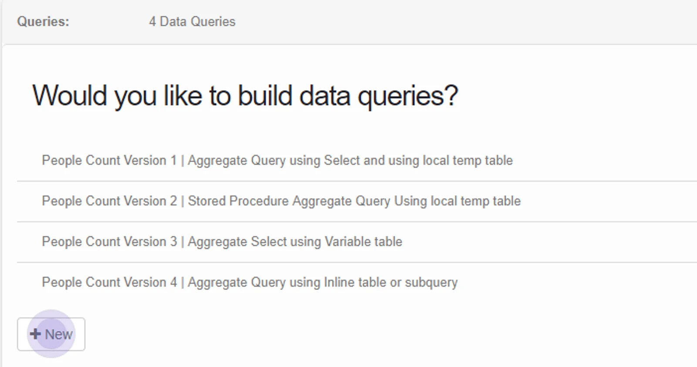
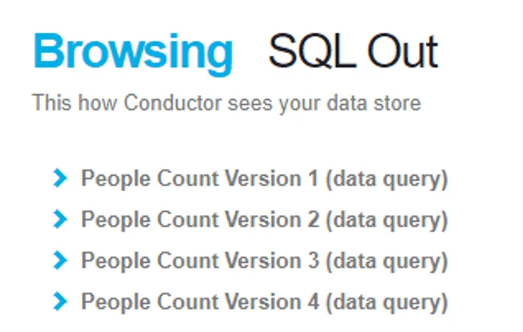
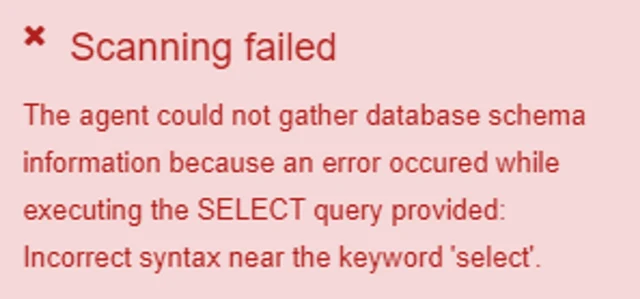
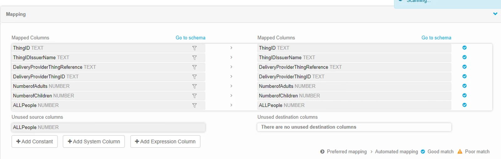

## Create a Datastore Query

Once you have created the datastore, navigate to the Queries tab

Click **+New** to add a new query

Enter the syntax of the query into the query panel (or copy and paste it in).

The syntax to be used should be appropriate for the database type you are querying.

Name the query and add an optional description.

Click **Save**

When browsing the objects appear exactly as you have named them with (data query) at the end, their detail can be browsed in the same way as any other datastore object.

To check whether a query is validated, browse the datastore and scan the object.

Any error related to the statement will appear when the datastore is scanned.

> You can use a select statement or execute a stored procedure in the query pane.

## Points to consider when using a datastore query

**Referencing database objects** — ensure that all the objects referenced are able to be used - as defined by the security context of the Agent and the connection string.

**You can reference temporary tables** — but in that case, you may receive a warning in the read step that means the schema of the temporary tables cannot be inferred during the query execution.

This does not affect the result of the query but relates to the RetainSameConnectionProperty of the OLEDB Connection Manager.

An alternative is to reference a variable table so that the column properties are defined in the query. In that case, no warnings will be shown.

**You can reference an inline table in the SQL statement** — if you do you will see any columns used in the inline query and presented in the main query repeated as unused source columns. This does not affect the process, which will execute without warnings about unmapped columns.

> Always test the datastore query syntax and permissions are correct using [Datastore browse and scan](../scan-browse-and-edit-objects/)
