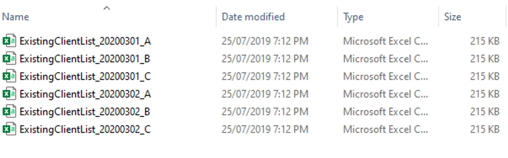
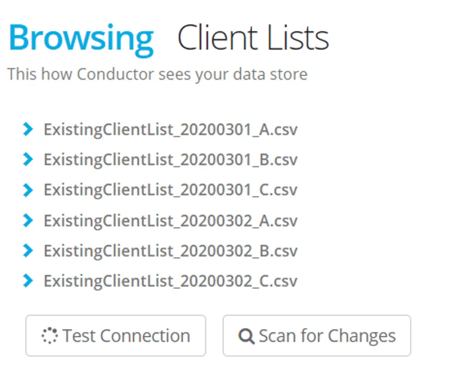
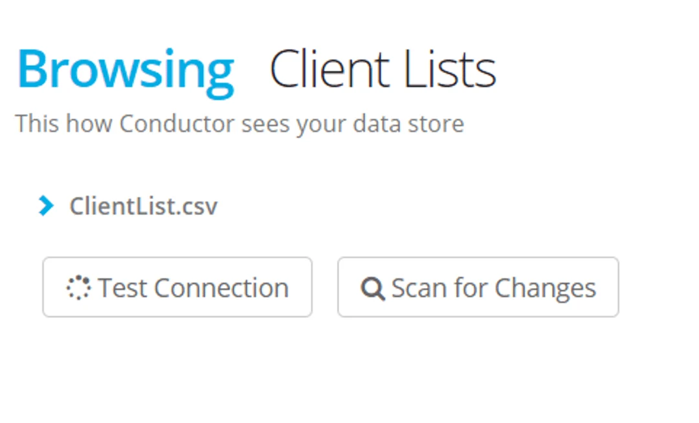

Once a process is run on a file (determined by the LastModifiedDate) it cannot process again, preventing any data loads duplicated to your source.

> *If you need to process a file again, simply edit it so that the LastModifiedDate is changed — then the process will identify the file as new and will transfer the data again.*

## Wildcard Symbols

   **\[ \]** Within the brackets the type of characteristics expected are specified, for example, \[0–9\] means you can see any numbers within that range, \[A–Z\] allows any            alphabetical characters within that range.

   **{ }**  Within the braces, the first number denotes the maximum amount of characters, the second number denotes the maximum number of characters expected.

    **^**   Literal to start or end an expected string.

## Create a Wildcard

1.  Create a CSV Datastore — it must be a source.
2.  Note that in the file path, the files can be seen using their complete filename convention.

3\. In the datastore go to the last tab — Filename Wildcards.

4\. Click **\+ New Wildcard**

5\. Give your filename an alias — this is how the file will appear in the Datastore.

![Filename wildcards tab with alias ClientList.csv, value ^ExistingClientList\_\[0-9\]{8}\_\[A-Z\]{1}.csv, + New Wildcard and Save buttons](./images/datastore-wildcards-4.webp)

6\. In the value field save an expression that allocates variables \[0-9\] for numbers and \[A-Z\] for letters. Any other characters are expressed as they appear.  End the string with the file extension as it appears in windows explorer. Select **Save**.

7\. Click **Scan** > select **Save**

    Your datastore now appears with a constant filename.

> *If a process executes and all the files have already transferred the error message will say "your datastore is empty".*

> *If a process is created using a filename and then subsequently a wildcard is applied - your datastore will scan with an error saying that the file no longer exists but is being used in a process. To fix - just recreate a process using the wildcard filename and delete the previous one.*
