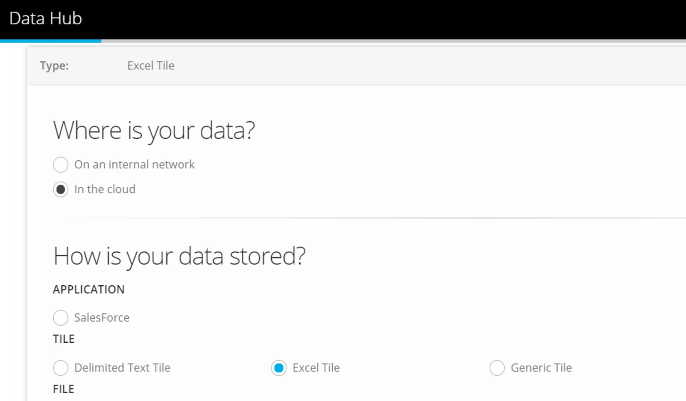
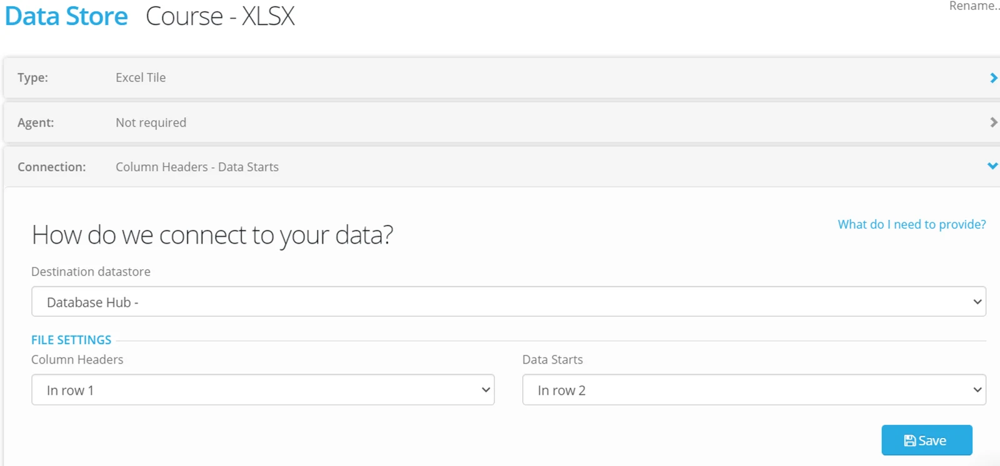
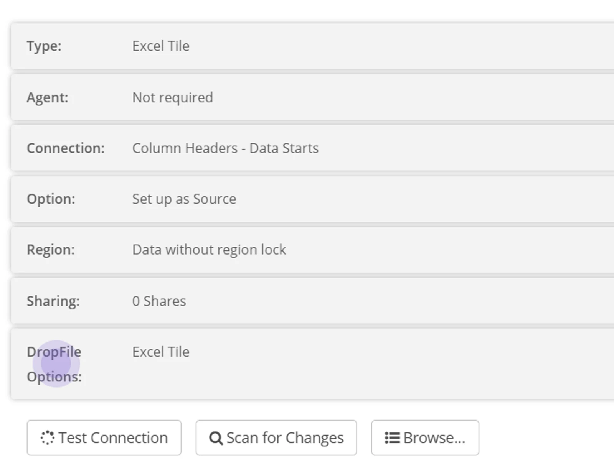
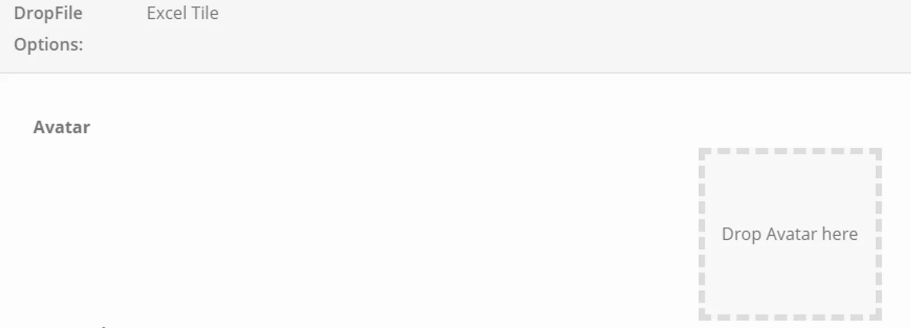
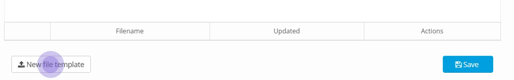

## Define the Destination Datastore

If you plan to receive data from Excel or CSV Tile - then the destination datastore can be any type that can write data to it (for example relational database or file).

If you plan to receive generic files (for example Word, PDF or Images) then the destination needs to be a Folder Datastore.

Create the Datastore that the data will be written to - and remember to mark it as Destination.

## Define the Source — Tile Datastore

On the Datastore page, click **+New**

Where is your data? — select **In the cloud**

Choose a Datastore Type from the Tile section

Connection — use the dropdown available to select a Destination Datastore — for the data.

Note that for Generic Tile, this is greyed out and not required.

Complete the file settings (Column Headers and Data Starts) dropdown options.

Click **Save**

## Configure the Tile

Dropfile Options enable you to configure your Tile so that you can present requirements, help text, templates, and an Avatar.

In the Tile Datastore, click on the tab **Dropfile Options**

## Avatar

Click in the Section 'Drop Avatar here' to upload an image that will be presented on the tile.

If you do not wish to use an Avatar, a default image will be presented.

## Instructions

This is a free text section where you can present any instructions to do with the tile - for example 'only submit excel files' or any data definitions that apply.

## Support

This is a free text section where you can offer support channels - contacts for business or technical support within your organisation - when the data submitter needs help.

## Template

The template section allows you to upload a template that your Data Provider can use for data submission or to upload a detailed specification for their information.

You can save multiple documents in this section, and they are versioned.

Click on **New file template** to upload a file.

When you have completed the Dropfile Options, click **Save**

> *The template section must* ***not*** *be used to share data — it is for communicating instructions and not intended as a secure data exchange.*

The next step is to build the process. Check out [Process CSV and Excel Data using Tile](../process-csv-and-excel-data-using-tile/) or [Process Generic Files using Tile](../process-generic-files-using-tile/)
