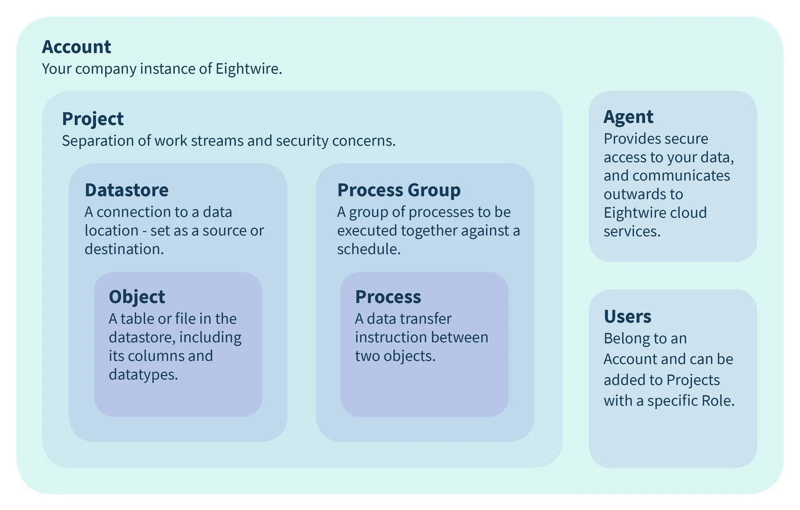

Within your Eightwire Account - the entities relate together in this way;

## **Account**

Your Account contains everything you need.Typically your organisation will have one Account. All other entities sit within your Account.

## **User**

An Account contains any number of Users. Typically each person accessing your Account will be a separate User. Users are assigned roles both at the Account and Project level.

## Project

Workstreams within an Account are divided into one or more Projects. A project allows you to group the Users, Data Stores, and Processes that relate to a particular piece of work. It is also a security boundary – only those Users with an assigned role in a given Project will have access to the entities within it.

**Security**: Role-based.

## Data Store

The definition of a data repository. This could be a file system folder containing CSV or Excel files, a relational database containing tables, or a NoSQL database containing documents. You are providing Eightwire with the information it needs to locate and connect to the data repository.

**Security**: Role-based. Secure access to data using an Agent and/or connection credentials.

## Agent

An Agent is a small piece of software that runs inside a customer's own network and provides both data access capability and a secure communications channel to Eightwire's cloud services.If a Data Store uses an Agent, the connection information given should be relative to that Agent, because it is acting on Eightwire's behalf.

**Security**: A service acting as an Active Directory account.

## Process Group

A group of related data transfer processes. Process Groups can be scheduled to run at certain times. If the objects (tables) contained within the Processes in the group relate to each other, these relationships will be respected during data transfer when the Process Group itself is executed (e.g. with relational database referential integrity constraints).

## Process

An individual data transfer definition. This defines how one object (table) is read from the source Data Store, remapped, and then written to the destination Data Store.There is no restriction on what type of source and destination Data Stores are used, provided they have been defined within the same Project. Eightwire will transfer data between any of the data platforms it supports.

## Entity Security

Security within your Account can be applied to specific entities as follows

**Project** - apply role based security for Users.

**Datastores** - apply role based security for Users so that only approved personnel can edit connection credentials. Secure access to data using Agent and connection credentials.

**Agent** - apply the appropriate security to the service acting as an Active Directory Account.

Once your Account is ready to share data - then consider how you would like to present your Datastores to other organisations in the section [Sharing Data Principles](../data-sharing-arrangements/)
