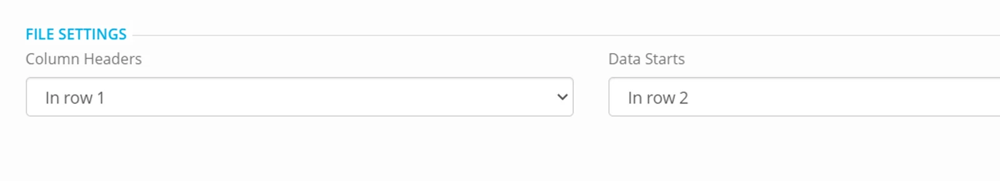
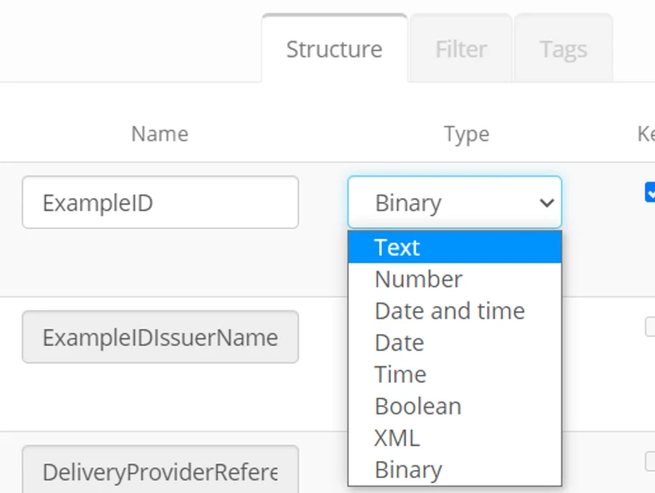
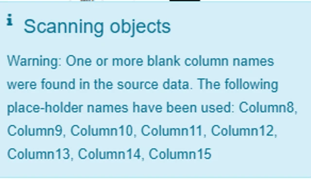

## Using Excel files as a Source

-   Column headings - do not merge cells.
-   Do not have any blank rows between rows of data in the spreadsheet.
-   Cells can have formulas in them (the displayed result of a formula will be transferred).
-   An Excel Datastore scan discovers and reads the first tab of a worksheet - make sure the data you need to exchange is on the first tab and there are no hidden tabs.
-   When defining the datastore make sure you have the correct setting reflecting the header row and the row that the data starts on.

-   The more data in a file to scan improves the accuracy of the profiling of the data (inferred schema) - you should check the scan and if the incorrect interpretation is returned then override by editing the datastore columns. For example TEXT columns can sometimes return the BINARY datatype in a scan - this can be changed by editing the column definition in the datastore if necessary

-   Column headings - **keep consistent heading names** the same between processes - for example if a column is named 'DateOfBirth' for one data submission and then changed to 'Date Of Birth' then the process will not see the data in the new column name, and will generate a warning).

![Warning: source datastore column name \[DateOfBirth\] differs from the column name on the source object; data will not be used](./images/excel-data-share-3.webp)

Be aware in this situation the Datastore scan will show DateOfBirth in the Datastore (as it is used in a process AND Date Of Birth (the new name in the source excel spreadsheet.)

-   In an excel spreadsheet — a carriage return in a cell — where there is no column header will produce a warning in the scan and a warning in a process. Fix by searching for the cell and deleting it.

-   You must rescan or adjust a datastore set to **manual scan of metadata** before an account you have shared with can see the changes — such as adding a new file to be shared.
-   If you change the structure of a datastore — that is set to **automatic scan of metadata,** then it is recommended that you also scan the datastore.
-   For a process to run successfully — the file must be closed.
-   For a process to run successfully — the file name must not be changed.
-   For a process to run successfully — the excel file must NOT be password protected.

## Using Excel files as a Destination

**Excel Default Formats**

An Excel destination can be affected by system defaults  and regional settings so data written to the cells from a process may not appear in the same format as the source.

For example with the default format of General;

General is the default format for any cell. When you enter a number into the cell, Excel will guess the number format that is most appropriate. For example, if you enter 1-5, the cell will display the number as a Short Date, 1/5/2010.

Similarly a Date in source can sometime be written as NUMBER in the Destination (which is the date serial number).

To absolutely guarantee consistency in the data written - we recommend that the Datastore in the destination is set to **manual scan of metadata** and that you enforce the desired format (datatype and presentation) by editing the datastore object;

**Booleans**

For example - the default presentation of Boolean fields in Excel is 'True' or 'False'.

Edit the destination column to NUMBER if you want the data to be written as 1,0 or empty.

**Date and Datetime Formats**

The default format Eightwire applies when writing a date in a process is yyyy-MM-dd.

If you have a specific format you require - then choose from the dropdown of Formats when you edit datatype properties.

Once you have data prepared and it is being processed - any data conversions  (between source and destination) or any change to the structure of your data is highlighted in the batch history.

Learn more about the detail available in the page [Monitor Process Activity](../monitor-process-activity/)
