## Run a Process

To manually execute an individual Process, hover your mouse over the Process in the Process list. You will see four buttons under your mouse cursor. Click the right-most **execute** icon.

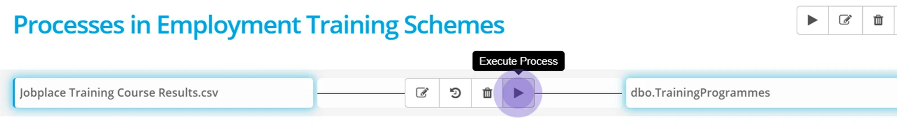

As the process executes this page will show you the progress of the data transfer.

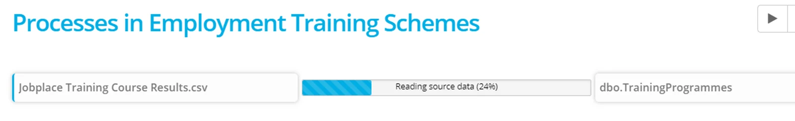

When the data transfer completes, you will see a green or red indicator, showing success, or failure for the process.

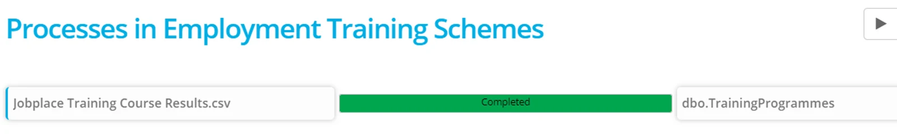

You can check the detail of the process by clicking on **View History.**

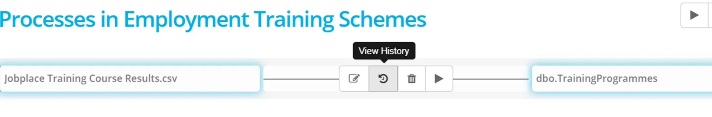

You can confirm the row counts for each phase of the process and double click on a bar to drill down to any messages or warnings — including the potential for truncation and the reason why rows were excluded.

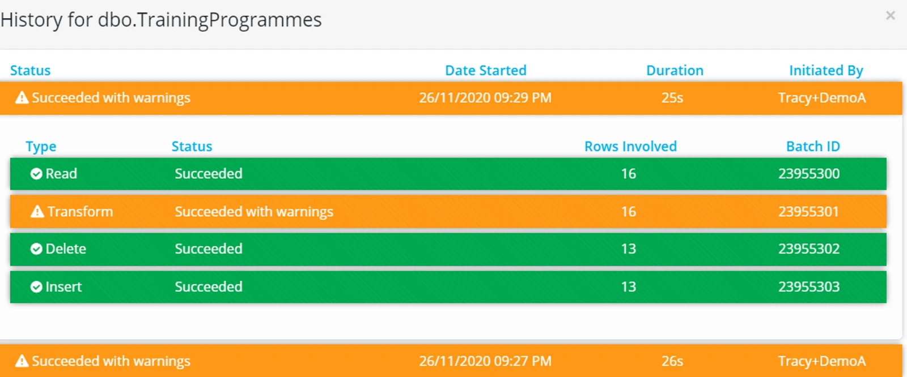

> *To see the history of all Processes in the Project, go to the Activity page.*

## Stop a Process execution

To stop a process while it is executing, click on the red wheel at the top right of the screen. This will be visible with the count of processes executing.

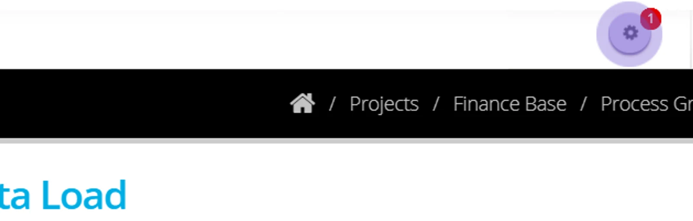

Double click on the process — a running process will be blue.

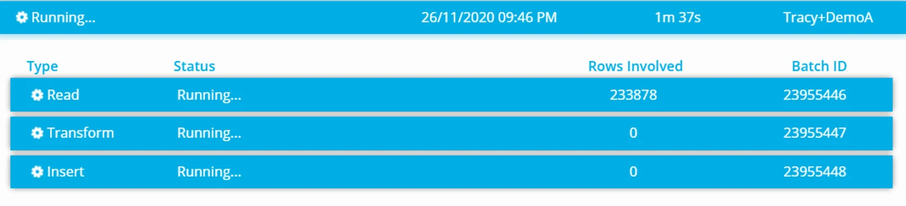

Click the **Stop** button.

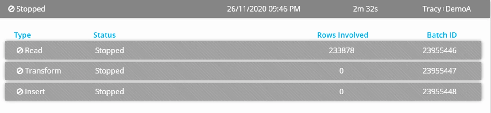

In the activity page the process that has been stopped will appear with the red icon.

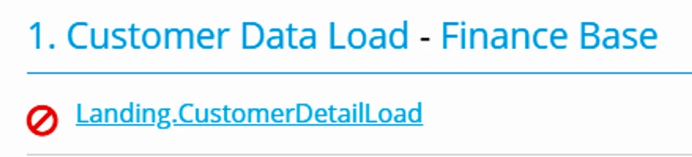

> *In the case of a stopped process regardless of when you click STOP, no data will be written to the destination - then the entire batch is aborted.*

## Run a Process Group

A process group can be executed manually and the order that each process runs is determined by the destination relational data integrity constraints or in parallel (when there are no constraints).

A Process Group can be run from the Process Group page — click **Execute Now**

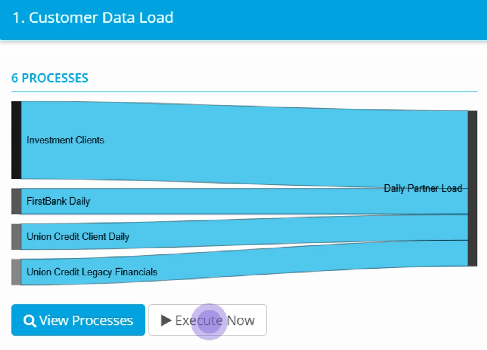

Or it can be executed from within the detail of the process group — click **Execute Group Now** at the top right hand of the page.

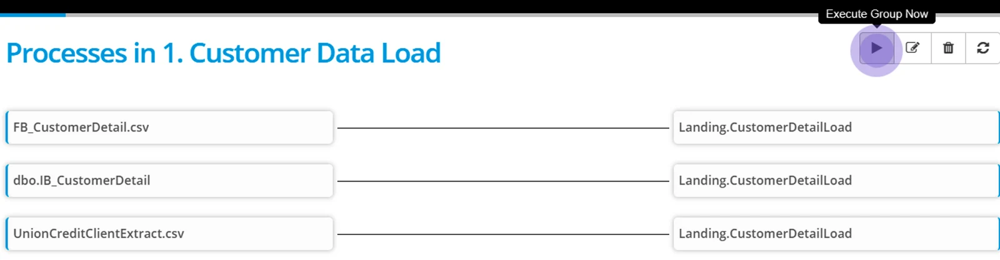

More options working with processes are in the following pages;

-   Create [Process Expressions](../create-process-expressions/)
-   Work with [System Expressions and Constants](../use-process-constants-and-system-expressions/)
-   Configure [Process tolerances and Options](../process-options-thresholds-and-toleration/)
-   Apply [a time based schedule](../process-group-time-schedule/) to your Process Groups
-   Apply [an event based schedule](../process-event-execution-schedule/) to your Process Groups
