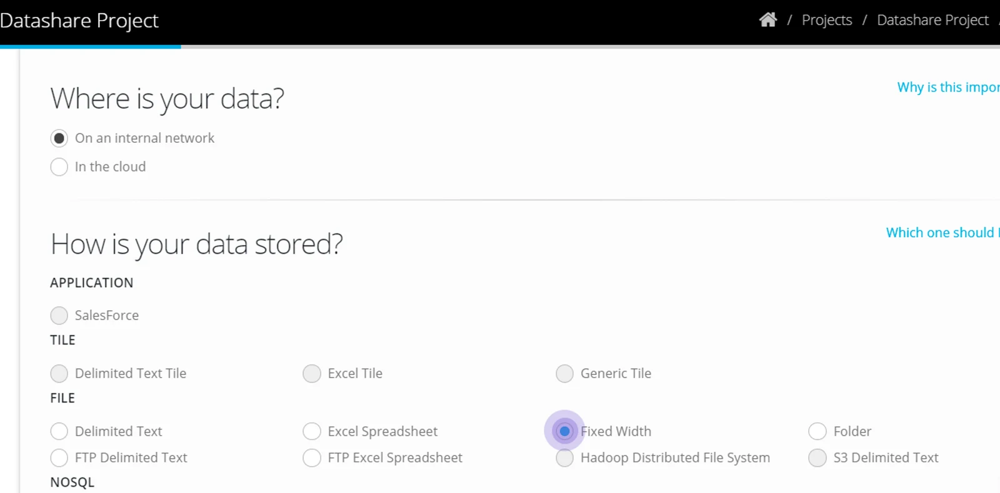
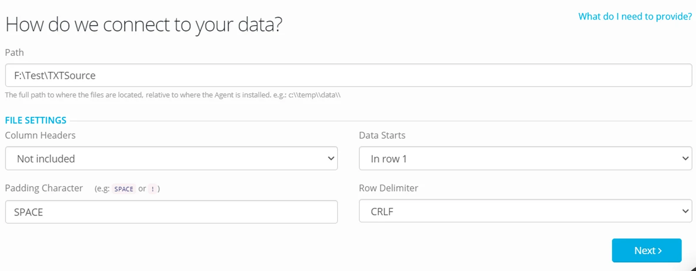
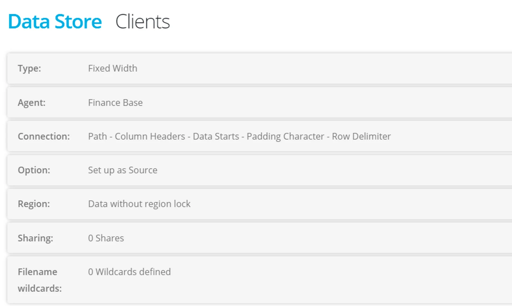
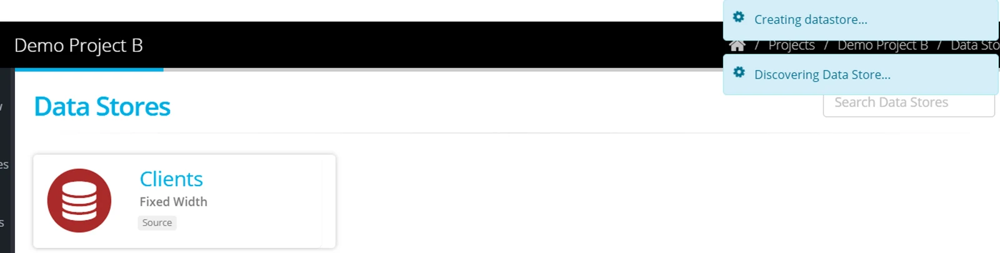
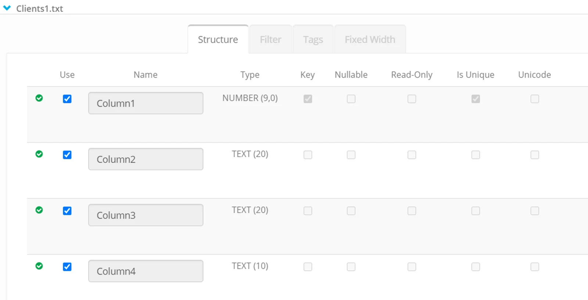
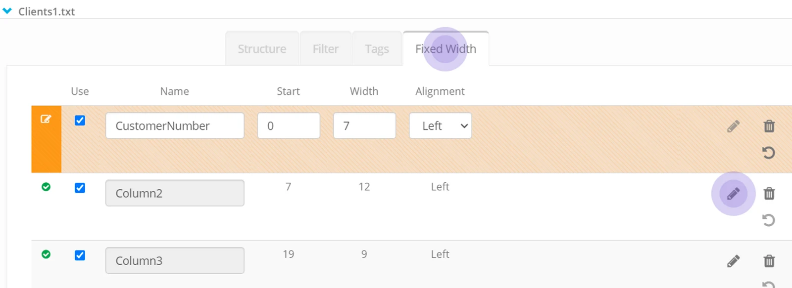
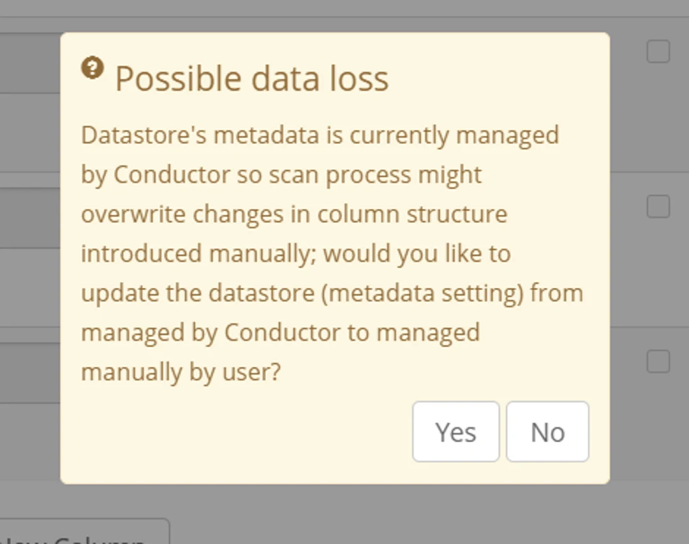

From the Datastore page click **+New**

Name your Datastore and choose **Fixed Width**

Choose a path that the files are located in

In File Settings — select whether Column Headers are included and where Data starts

Select Padding character and row delimiter or leave at the defaults.

Complete the other tabs of the Datastore setup and click **Create**

Once the Datastore has been created, **browse** to check how the objects have been discovered and scanned.

In this example, default column names have been applied, and potential column width has been detected.

You may have data that needs to have the column width defined (that differs to what has been detected in the scan).

Click on the tab  **Fixed Width**

For each column —click on the pencil to edit the column name and define the start position and text length — for left or right alignment.

When you have defined the columns enter **Save**

Your datastore has been saved with the required definition.

This switched the scan process over to **Manual**.

Be aware that any scan of the data may result in losing the manually applied definition.

Making any change to the Datastore or running a scan will therefore generate this warning.

