Create and name a new Datastore

Choose where your data is stored, select Folder

Select an Agent for the Datastore

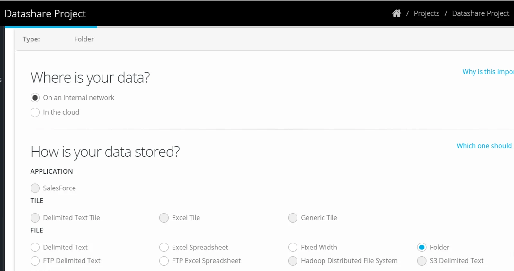

Select the Path — in the example, the folder called 'DocumentMove' has been nominated as the source.

All the contents within 'DocumentMove' will be available to be copied to a destination.

This includes sub folders as well as files.

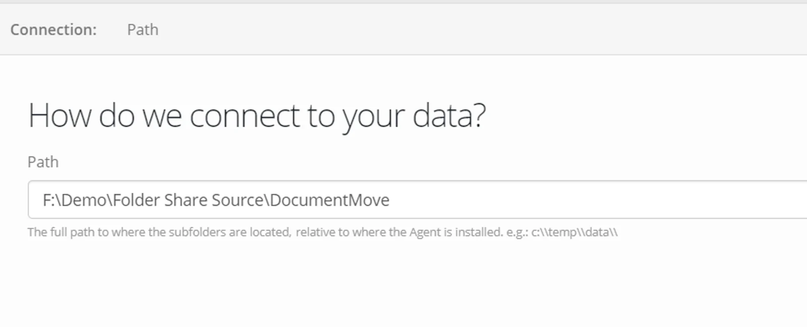

Select — Source and Scan Process

Select Region if required

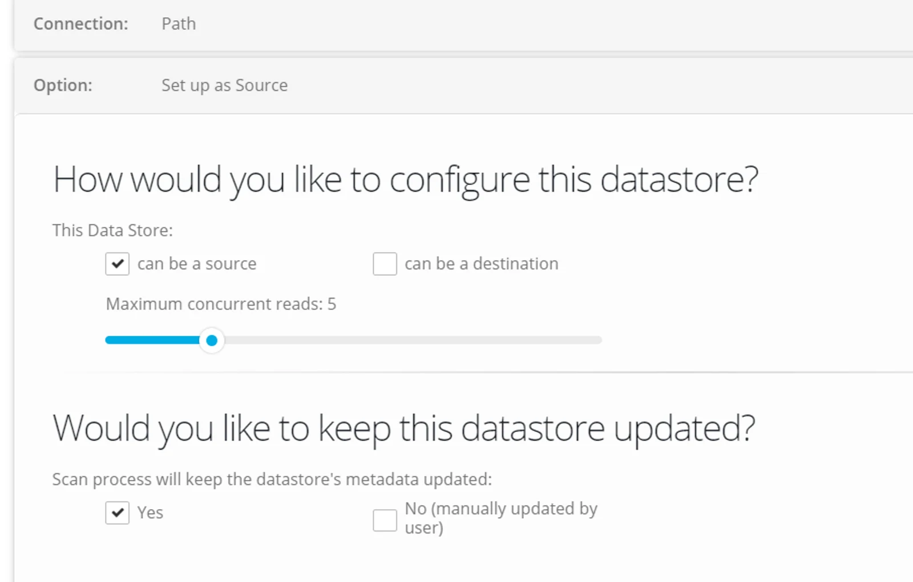

Click **SAVE**

The Datastore has been created, browse the datastore to check the results.

In the example, all the folders in 'DocumentMove' folder are visible in the Datastore

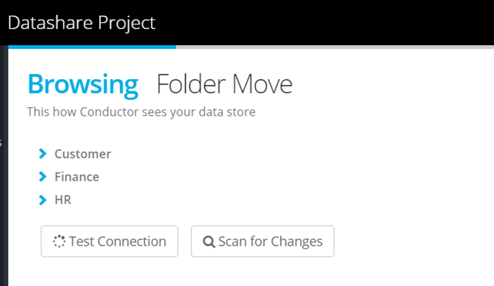

The individual folders or files appear only with attributes — Filename, SubFolderPath, Size, DateCreated, DateModified, Data

> The folder objects are as you would see in Windows File Explorer when looking at one of those child folders. The columns are represented here as columns in a table. The *Data* column has a *binary* type and contains the binary content of each file in that child folder. Each row of data in the table comes from each file in the folder. It is important to note that Eightwire operates on a folder containing other folders, not simply on a folder containing files.

> This enforced two-level hierarchy of folders is to provide the same *database-table-row* structure that Eight-wire is designed to work with.

> ‍**Any number and level of sub-directory folders are able to be transferred.**

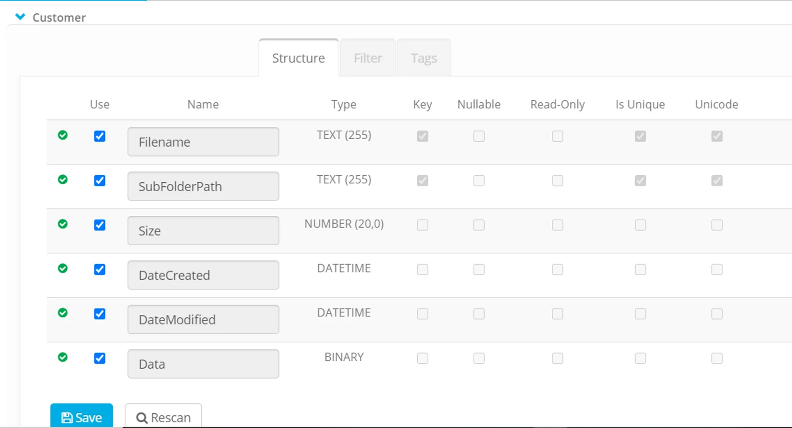

All first level of sub folders will be available as objects to select in a process;

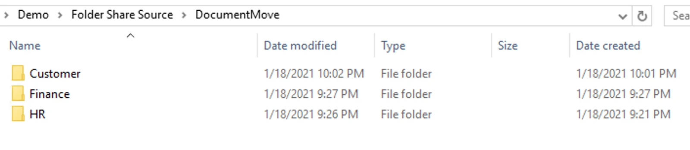

And any folders and files within those folders will be copied.

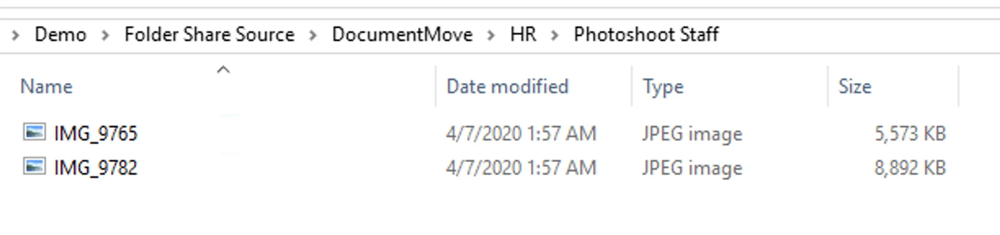

Once the Datastore is complete — you can share it with a destination account — or create a process to transfer the folder(s) and files.

## Using Folder Datastores in a Process

A process (to a Folder Destination) can be created using any of these process types;

-   append to exisiting data (adds new files and folders - does not overwrite existing files or folders in the destination)

-   merge new and changed data (updates existing content where required and adds new files and folders)

-   overwrite existing data (deletes all files and folders in the destination and writes all from the source.

Create a process and add a source (choosing any number of level one folders in the directory).

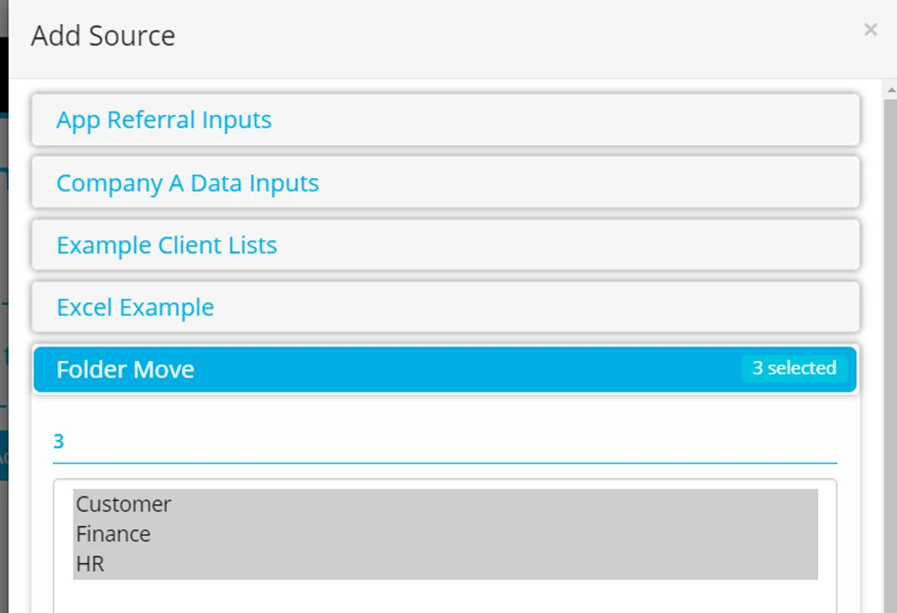

Define the destination datastore and object for each level one folder.

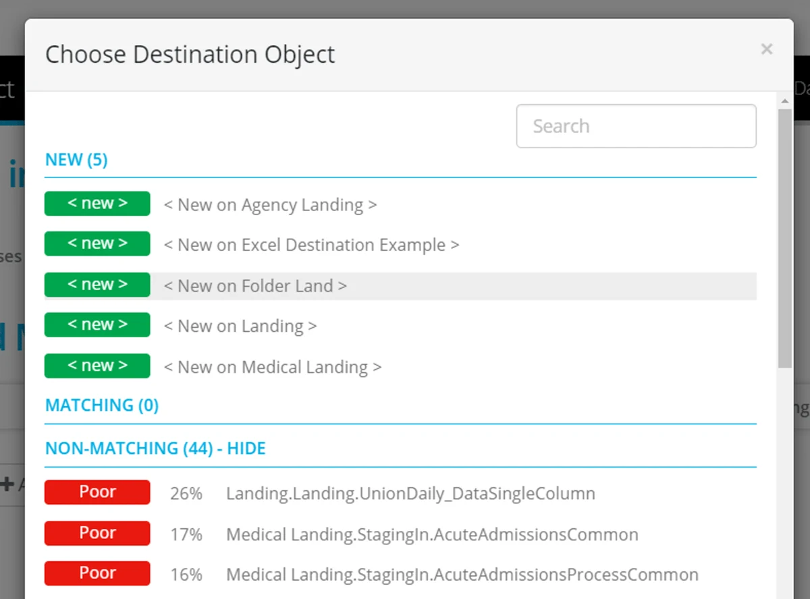

Rename the destination to create a folder in the destination.

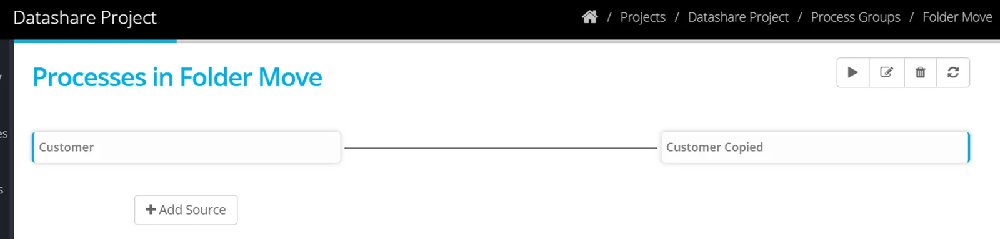

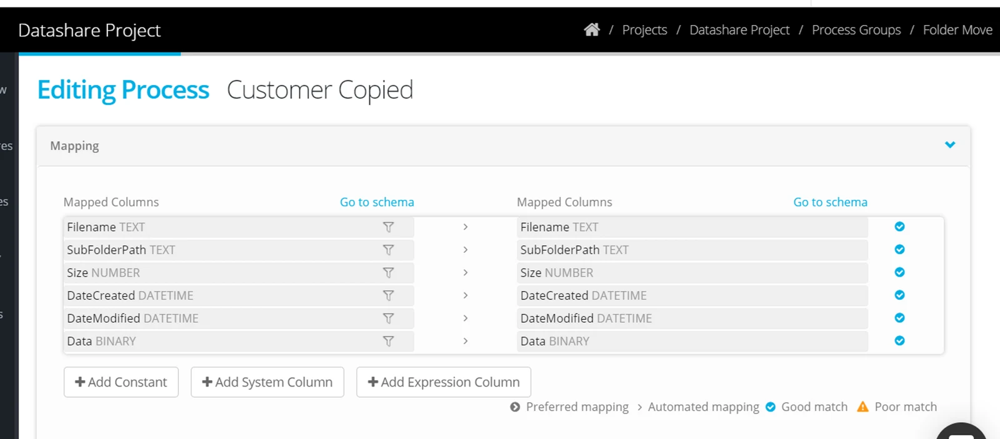

Like any other data sharing process - the process can be executed manually or scheduled.

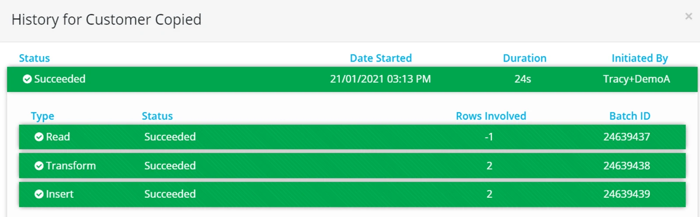

> ***Malware***

> ***‍Eightwire scans every file transferred for malware. Infected files will be rejected and not transferred. Eightwire will scan inside ZIP and RAR files.* ***It is your responsibility to ensure that your files are not infected with viruses or other malware.***

This type of connector is not automatically made available to all accounts.

If you wish to have it activated, please contact Eightwire support — [support@eight-wire.com](mailto:support@eight-wire.com)
