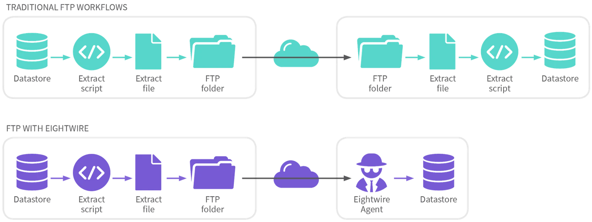

## FTP/SFTP CSV and Excel

The connector allows Delimited Text or Excel format - and SFTP or FTP protocols.

To connect an FTP or SFTP server, the following details are required in the Datastore:

**Type —** Choose FTP Delimited Text or FTP Excel Spreadsheet

**Agent** — Select an Agent (this Agent acts to call the FTP Server)

**Protocol** — Choose SFTP or FTP

**Credentials** — Supply the Server Name, Port, Username, Password, Private Key File Path, Passphrase, and Path

**Option** — Choose Source (Eightwire pulls from the FTP folder) or Destination (Eightwire pushes to the FTP folder)

Save the Datastore and ensure the Test Connection is successful.

The Scan will show Files and drill down to their schemas.

This Datastore can be used with Filename Wildcards

> *Data processed using this connector is transformed by Eightwire as usual - it can be loaded or extracted from any Datastore type.*

## FTP / SFTP Generic

The connector allows the copy of any file format, including Encrypted Files - using SFTP or FTP protocols.

The following details are required in the Datastore

**Type —** Choose FTP Generic

**Agent** — Select an Agent (this Agent acts to call the FTP Server)

**Protocol** — Choose SFTP or FTP

**Credentials** — Supply the Server Name, Port, Username, Password, Private Key File Path, Passphrase (optional), and Path

**Option** — Choose Source (Eightwire pulls from the FTP folder) or Destination (Eightwire pushes to the FTP folder)

Save the Datastore and ensure the Test Connection is successful.

The Scan shows Folder Names and drills down to folder properties.

> *Whether sending or receiving data, the Eightwire Agent initiates the transfer, the process cannot be initiated by the other party.*
