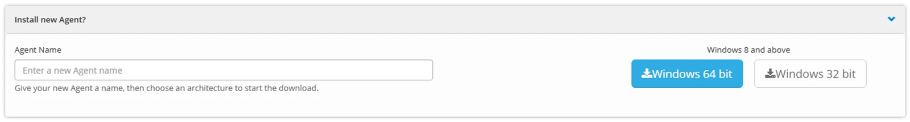
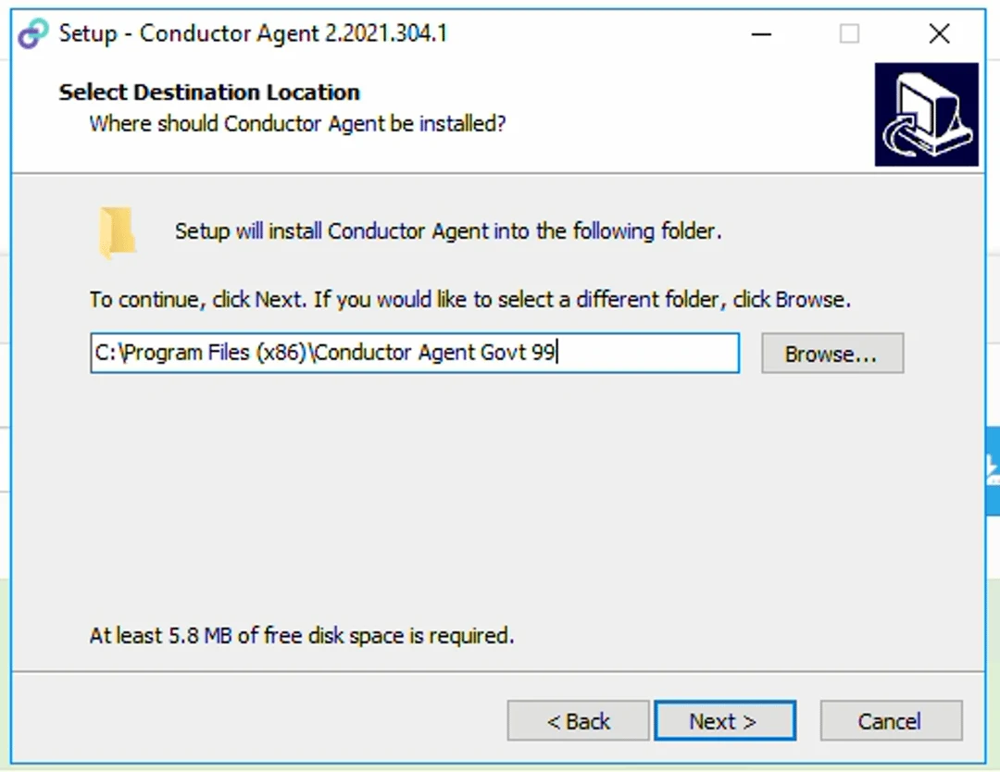
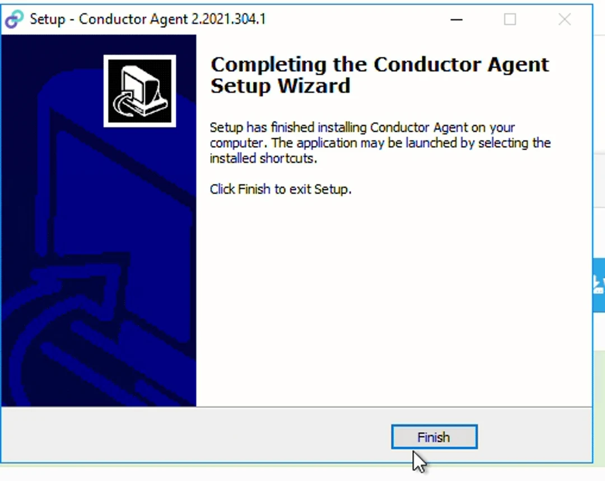
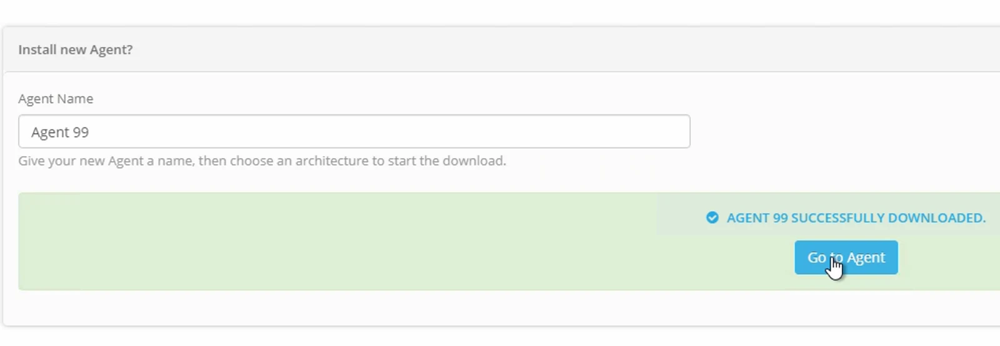

> *An Agent needs to be installed and connected before you can create a Datastore.*

## Agent Installation

1.  Log onto the Windows computer where you wish to install the Agent.
2.  Log into your Eightwire Account and navigate to **Agents**
3.  Expand the "Install new Agent?" tab
4.  Name the Agent and choose a download option Windows 64 bit (recommended) or Windows 32 bit

5\. The Agent executable will save to the downloads folder.

6\. Click to launch the executable, click **Run**, select **Yes** to allow the app to make changes.

7\. Choose Installation Type and click **Next>**

8\. Select a location for the Agent to be installed and click **Next>**

> *The default location is C:\\Program Files (86) but the Agent will operate from different drives if you require. If you have more than one Agent installed on the computer ensure that each Agent installation is in its own folder.*

9\.  **Proxy Settings** — these are optional (depending on your infrastructure). Click **Next>**

10\. **Service Settings —** Standard uses the default Local System, Custom allows you to nominate the Service Account and Password. Click **Next>**

11\. When the installation has run, Click **Finish**

12\. Got to the Agent page in Eightwire — click **Go To Agent**

Your Agent has been successfully installed but will be offline until you Authenticate it against the Eightwire cloud services — follow the [Agent Authentication steps here](../authenticate-an-agent/)
