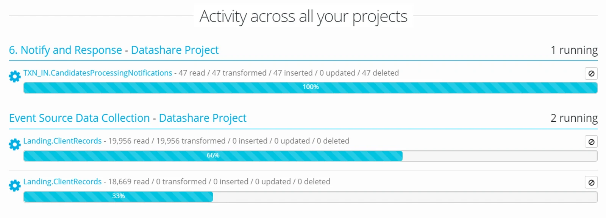
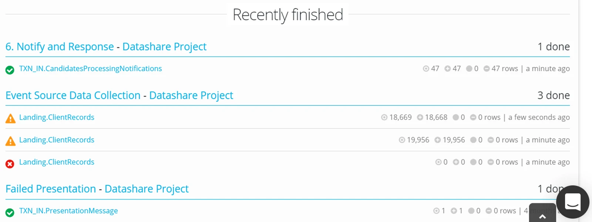
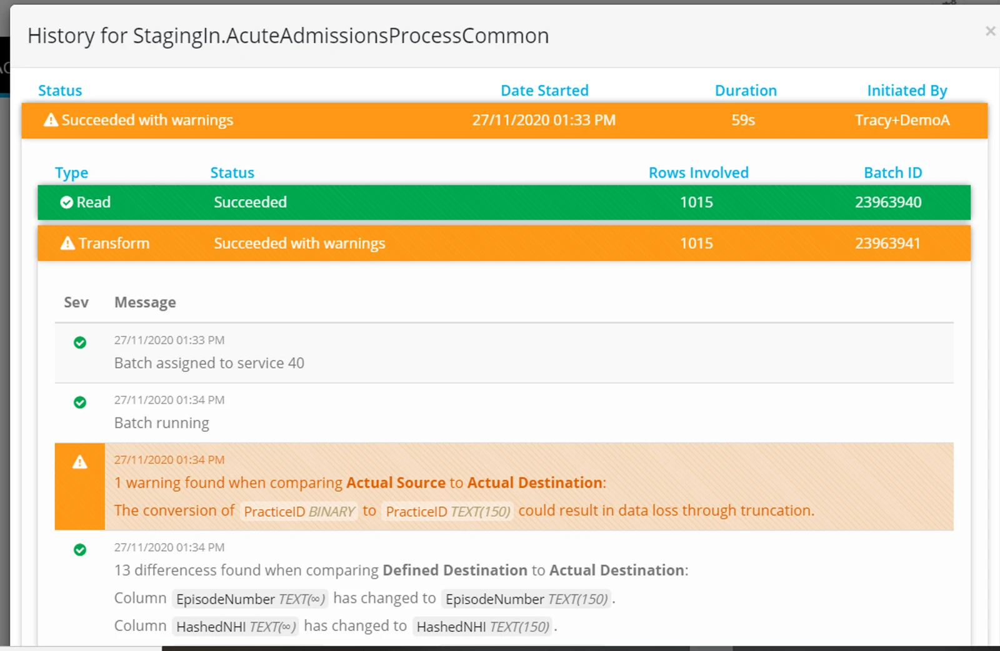

## Project Activity

From within a Project, click Activity in the left hand navigation bar

On the Activity page you can see a process currently being executed.

You can see the history of the last 12 batches for each process by drilling down on the bar.

## Reading the Process Batch Log

In batch activity you will see batch steps summarised according to the process type;

Overwrite

Read, Transform, Delete and Insert

Merge New and Changed Data

Read, Transform, Insert and Update

Merge All Data

Read, Transform, Delete, Insert and Update

Append

Read, Transform, Insert

Incrementally Load Data

Read, Transform and Insert

Double click to drill down to activity warnings or error messages

> *The detail in a warning process activity page is restricted to a maximum number of rows.*

## **See an example of the activity page drill down here...**

<iframe src="https://www.youtube.com/embed/9w1Xk14vPJw" title="Eightwire: Monitor Process Activity" loading="lazy" allowfullscreen=""></iframe>

> *The Batch Log information for a failed process is the summarised event log — for detailed information or a download of batch history — please contact support@eight-wire.com and quote the ProcessID and BatchID's*
