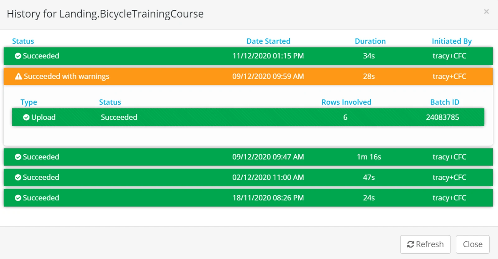
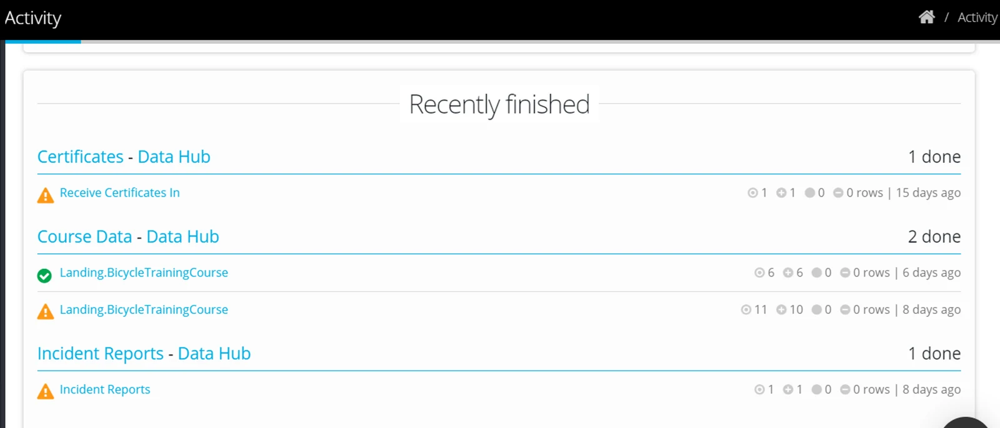
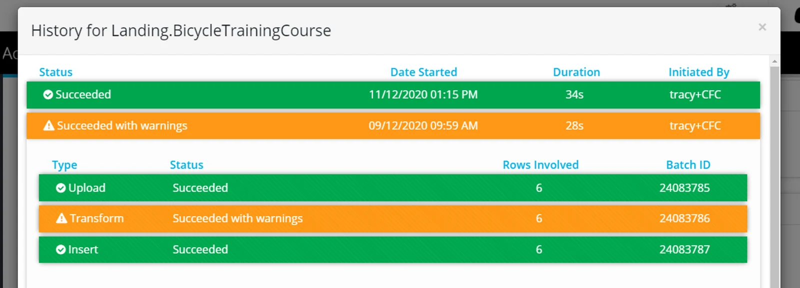
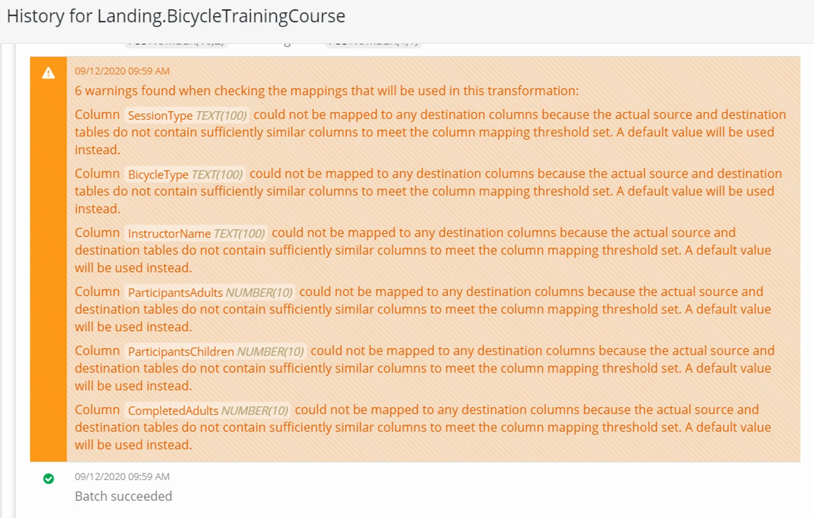

## Source Account

For the Tile Account submitting the Data — the Activity Page will show a history

-   Date Loaded
-   Rows Uploaded
-   User that uploaded
-   Colour coded (Successful, Warning, Failed)

> *The Activity cannot be drilled down or detail involving the loading of data in the Destination Account.*

> *A data submission that does not meet minimum requirements in terms of file type or structure will not be uploaded - or show in the activity page.*

## Destination Account

For the full license Account receiving the data, the Activity page will show the history with full detail of the batch

-   Date Loaded
-   User that Uploaded
-   Rows Uploaded
-   Colour coded (Successful, Warning, Failed)

-   Detail behind Warning or Failed message.

> *Use Process thresholds to enforce conditions for a process to succeed or fail.*

Congratulations!

Now you have your data sharing set up.
