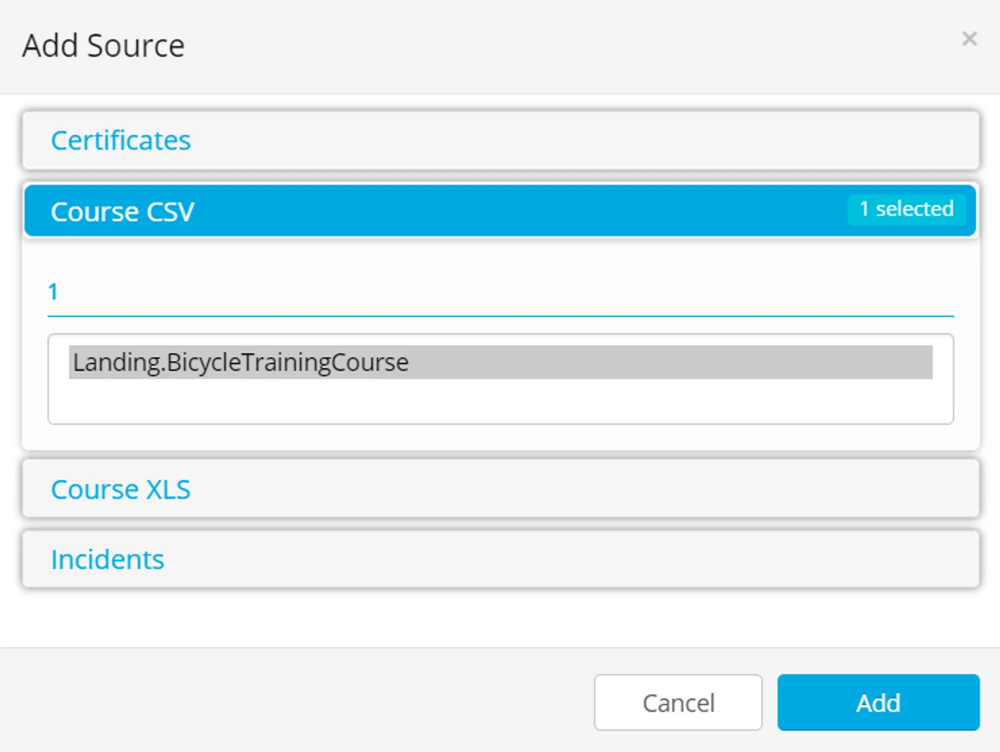
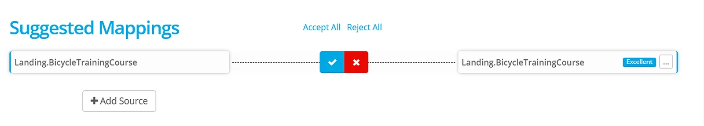
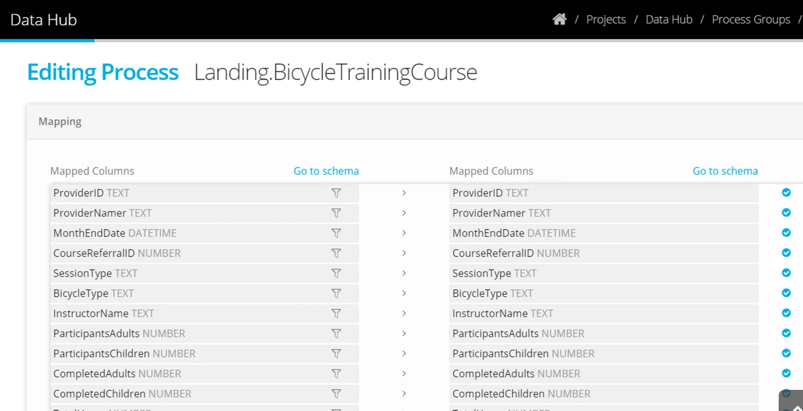
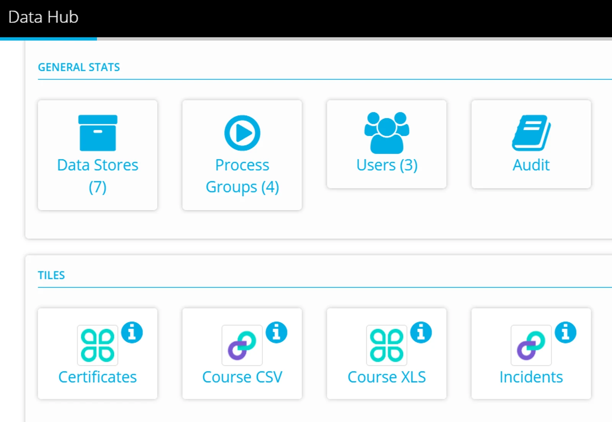

Navigate to Project > Process Groups

Click **+New** to add a new Process Group

Select the Process Group Type

Click **+Add Source** and select your Tile Datastore

Highlight the source object and click **Add**

For CSV and Excel Tile the source objects available are any objects in the Destination datastore you selected in the Tile datastore Connection tab.

The process will suggest the appropriate Destination — it will be the object in the Destination with the same name as the source.

Click to **Accept** the process.

The mapping will be applied automatically.

Run a test process by using the Tile that is shown in your Project Dashboard.

Drag a file into the tile and check that the process executes successfully (on the Activity Page).

Once you are satisfied with the process transferring the submitted data - then next step is to [share the Tile](../share-a-tile-datastore/) to your data providers.
