> *Before working with an event schedule, define your Project dataflow — build and manually run all the required processes.*

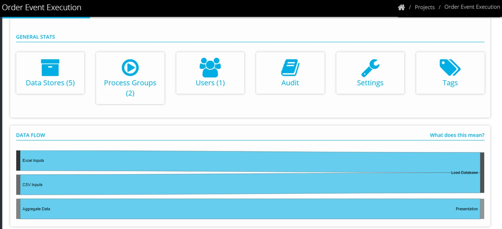

## Define the initial event Time Schedule

> *Before you create an execution event schedule, you need to define when the first event needs to begin, by creating a time schedule in one of the process groups in your project.*

Locate the Process Group (containing the first process that needs to execute).

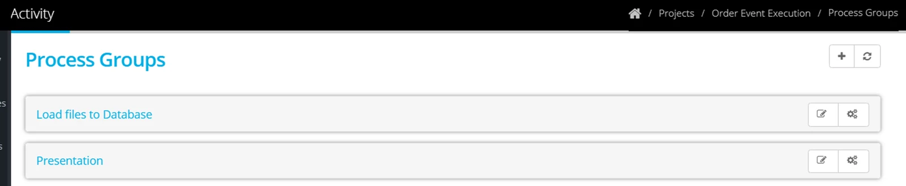

Click on the Process Group to expand, and click **Edit Schedules**

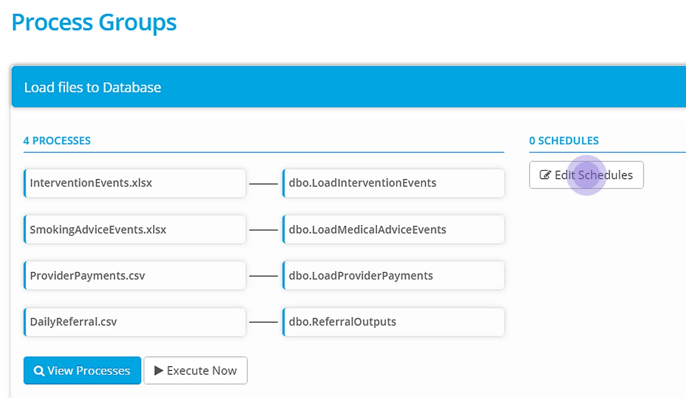

Select **+** **New** to create a time schedule

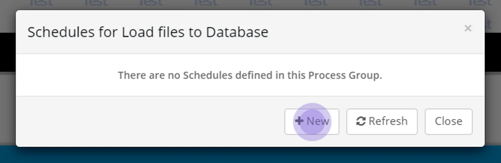

Complete the options Start Time and Date. To make recurring, tick 'Repeat'

Select a start time and the number of times it needs to occur (if it is recurring more than once in a day), and a finish time.

Select the occurrence — days of the week or the day of the month, that the schedule should be active for.

Click **Save**

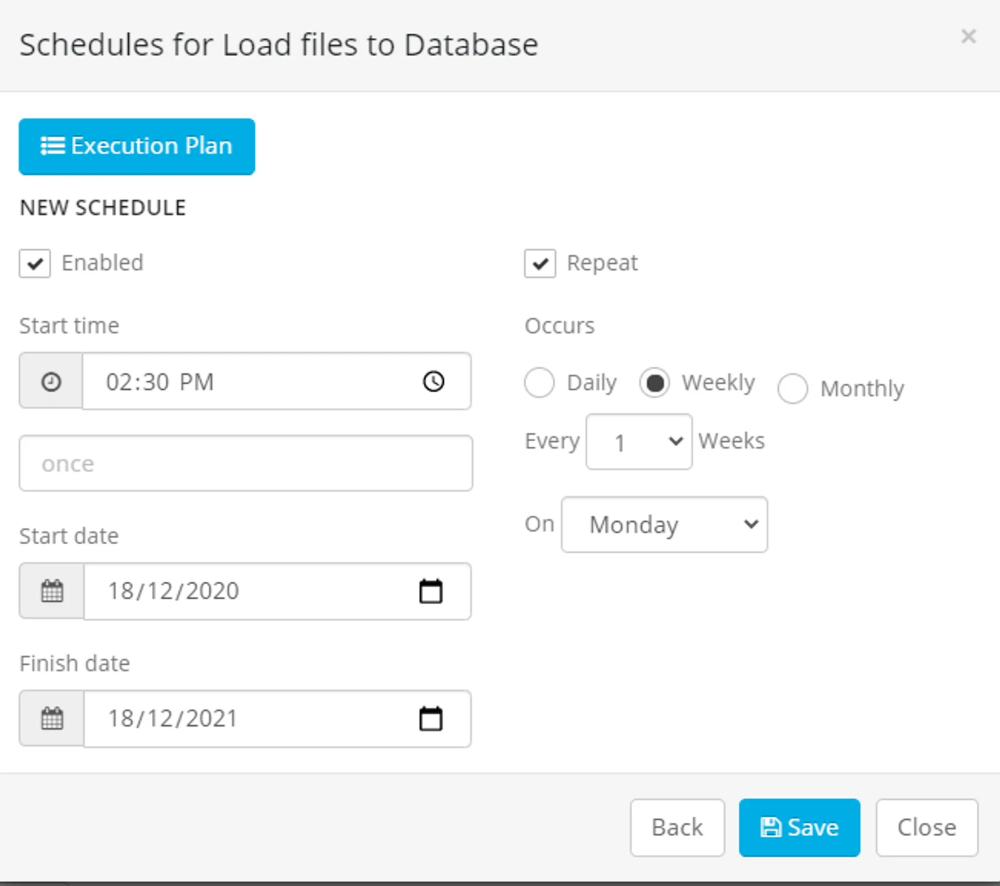

> *Uncheck the box 'Enabled', if you want to pause the schedule at any time.*

## Define the execution event schedule

Edit the time schedule to attach an execution schedule

Click **Edit Schedules**

Click to select the the time schedule you have created.

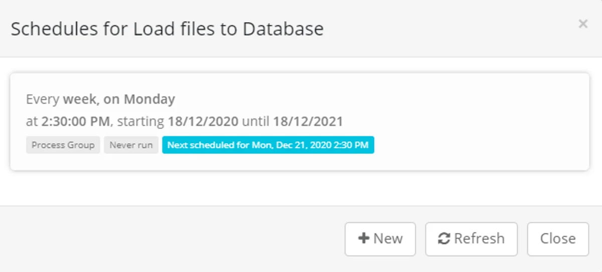

Click **Execution Plan**

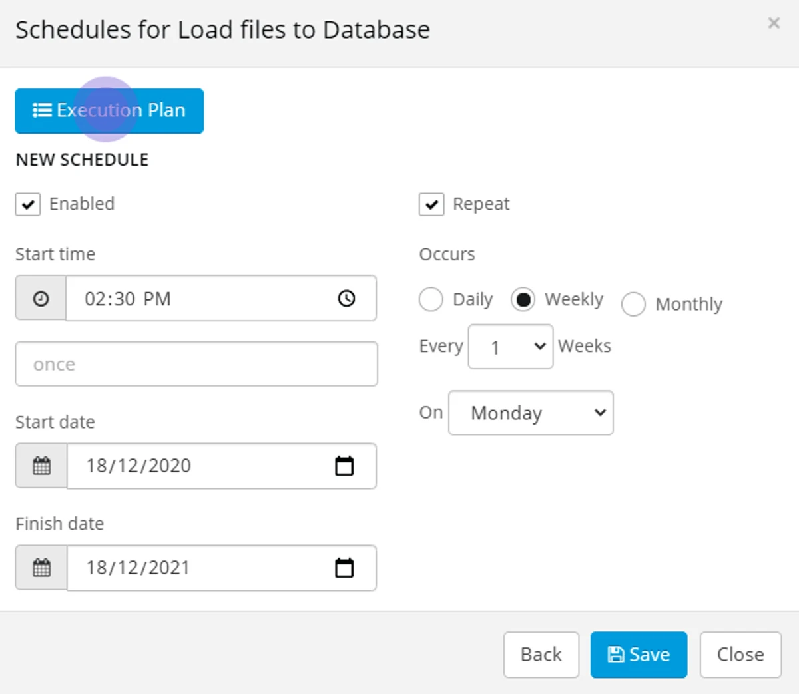

Click the + button to add a new execution event.

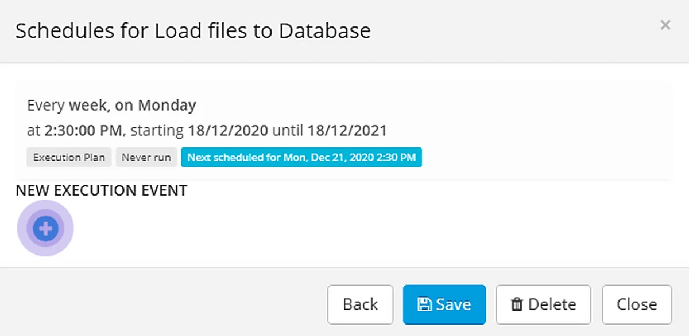

Click on the Process Group dropdown to select a Process Group.

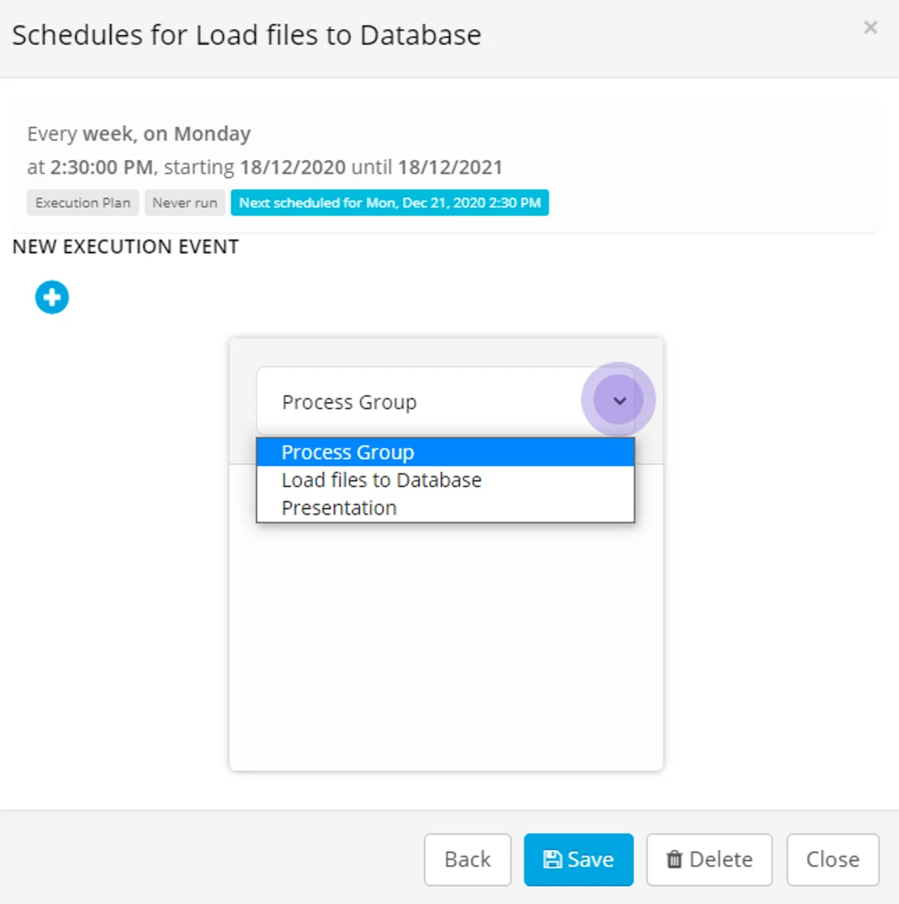

The processes that exist in the group will be displayed — click on the first event to be executed.

Click on the **+** button to add processes to the sequence.

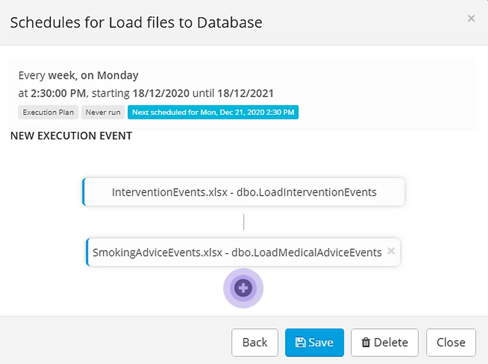

The processes in the group that are still to be scheduled are highlighted.

Use the Process Group dropdown to add further processes to the execution plan.

Click **Save** when you have finished the building the event sequence.

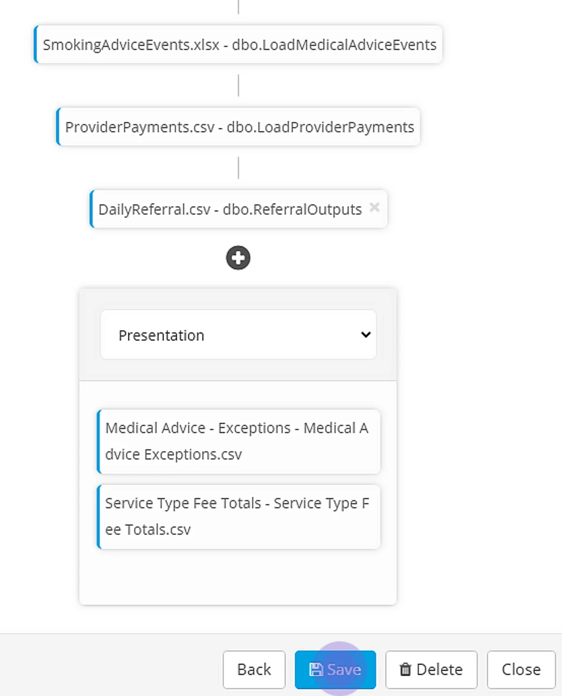

The entire sequence can be seen on the Process Group page — click on the **blue arrow** to expand the display.

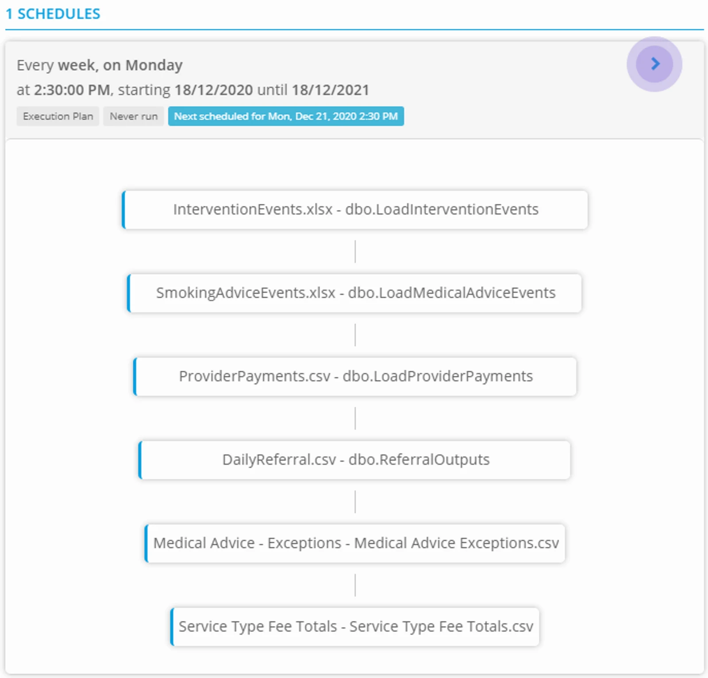

The event schedule is in place and will begin execution at the scheduled time.

## Edit an Execution Schedule

From a Process Group - click Edit Schedules

Click in the schedule box

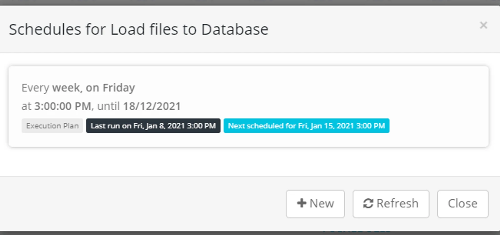

Click **Execution Plan**

Delete any process from the bottom of the sequence (click on the x) to edit the order.

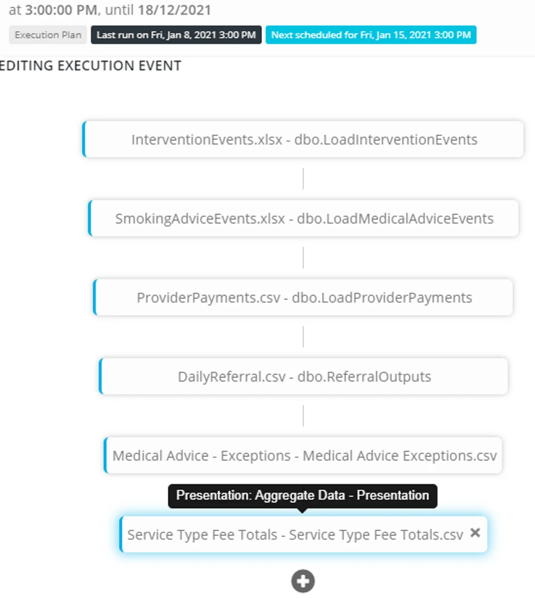

Amend the order as required and click **Save**

The processes will be seen in the Activity Page as they execute.

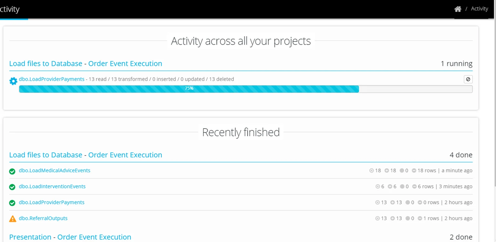

## Execution Schedules using external Datastores

A party sharing a datastore may, at any time, pause or delete a share.

This may have an impact on your Project - if you use that datastore in a schedules execution sequence.

-   In the case that the share is Paused by the other party - you will receive an Eightwire notification. Processes that are paused will not execute until the share has been resumed.

-   In the case that the share is Deleted by the other party - you will receive an Eightwire notification. The process will be deleted from your Process Group - and if the execution schedule is impacted Execution Plan will be highlighted in red.

Simply edit the execution events to correct the sequence accordingly.

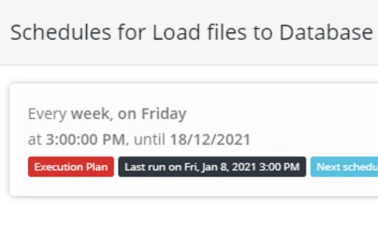

## FAQ's for working with Event Schedules

-   Any event, regardless of the process result (Succeed or Fail), will generate the next event in the sequence. Remember to check the Activity Page or use Project Settings to notify where a process may have failed.
-   Once you attach an execution event to a Schedule, all the processes in the groups must be in the sequence for them to execute.For example, if a Process Group has 5 processes in it and only 3 are attached to an executionevent sequence - then the remaining 2 will not execute.
-   When creating more than one time schedule for a sequence, be aware that the same process triggered at the same time will fail - make sure that the expected process times do not overlap.
-   The Process Group buttons **Execute Now** - will run all the processes in the group regardless of the order of execution events in a schedule.
-   To test an execution sequence - set the time schedule to trigger the events - there is no way to manually trigger an execution schedule.
-   At any time you can disable or edit an execution schedule or time schedule.

Once your schedule is in place, you may wish to monitor executed batches - [check process activity.](../monitor-process-activity/)
