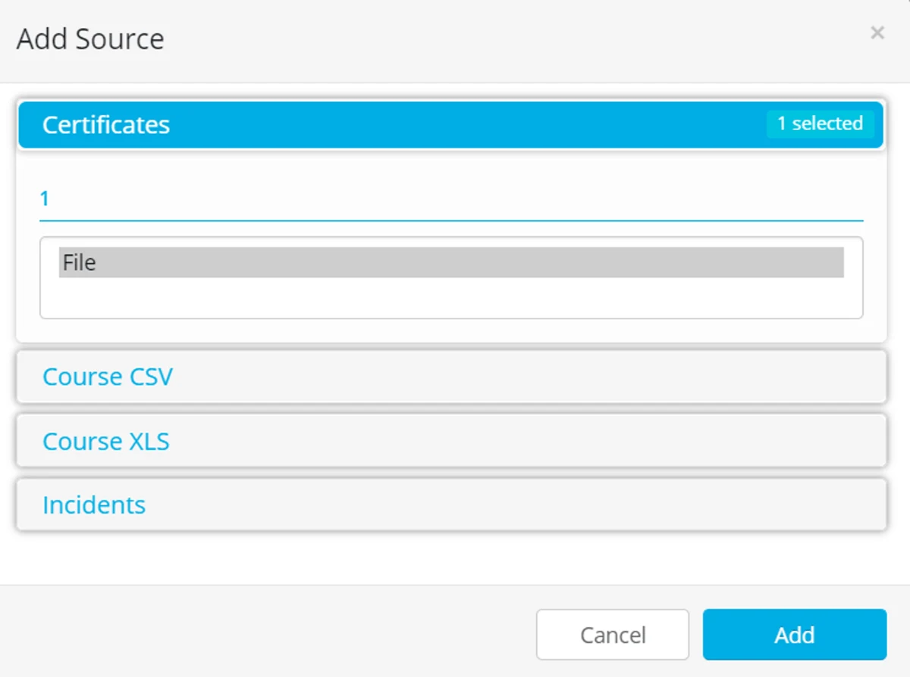
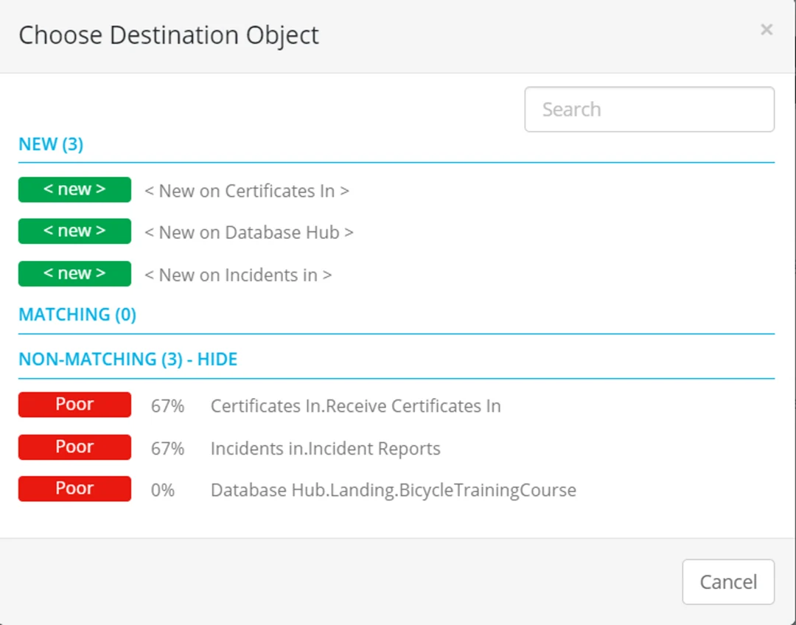
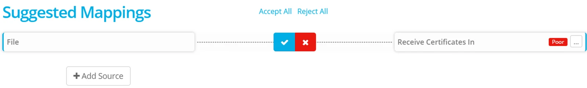
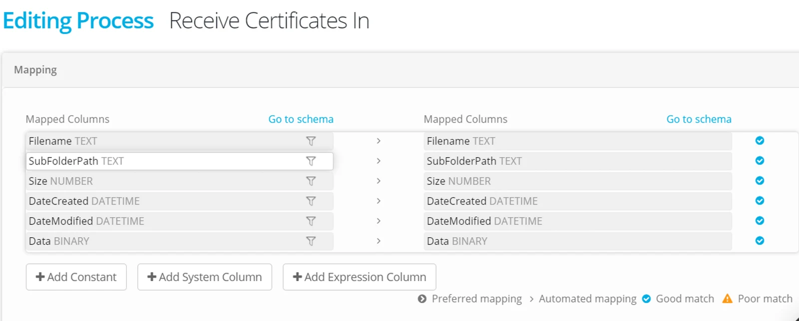
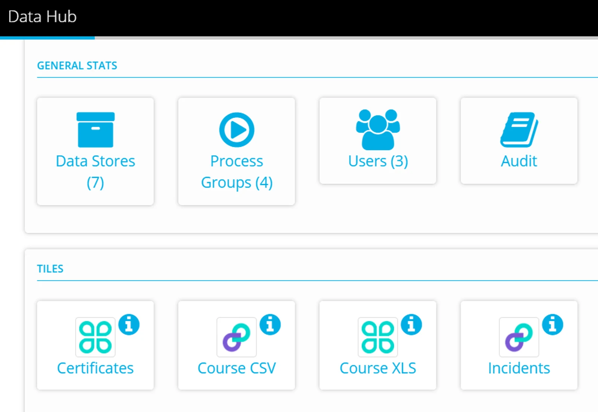

Navigate to Project > Process Groups

Click **+New** to add a new Process Group

Select the Process Group Type

Click **+Add Source** and select your Tile Datastore

Highlight the source object and click **Add**

For Generic Tile the source object available will be called 'File'

The process will make a suggestion from the available Destination Datastores — select a Folder Datastore

Click on the ellipsis to navigate and select an existing Datastore folder, or create a new Folder in the Datastore.

Click **Accept All** or the **blue tick** to create the Process.

The mapping will be applied automatically and is for a binary file (showing default properties as columns).

Run a test process by using the Tile that is shown in your Project Dashboard.

Drag a file into the tile and check that the process executes successfully (on the Activity Page).

Nice work! — you have mapped the Tile to its destination, all that remains is to [share the Tile with your Data Providers](../share-a-tile-datastore/)
