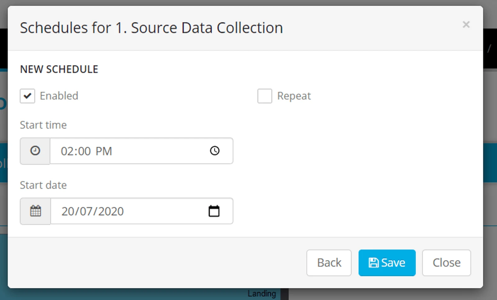
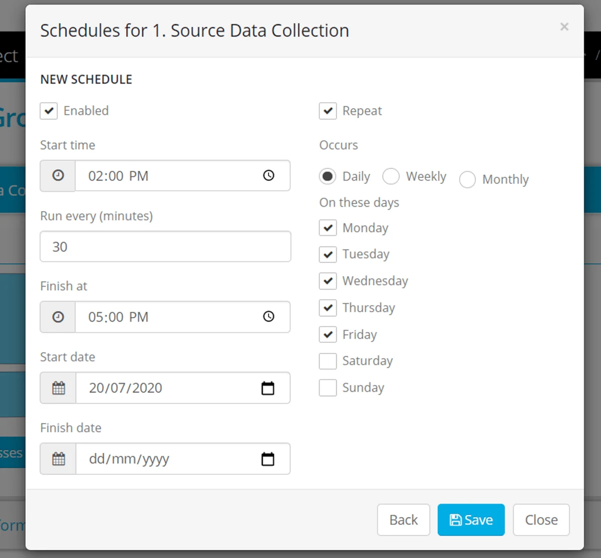
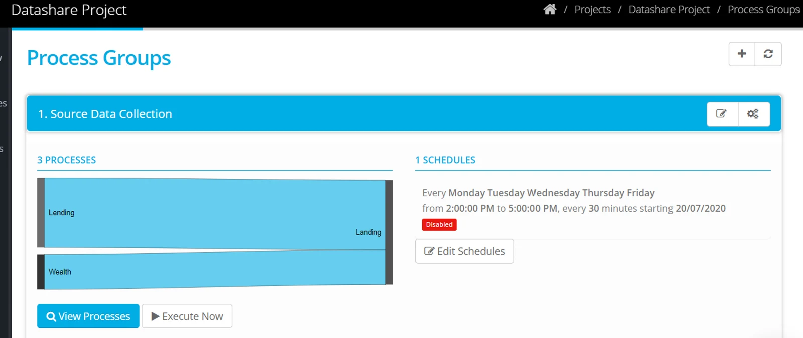

## Set up a Time Schedule

Locate the Process Group in the list and click on the bar to expand,

1.  Click **Edit Schedules**
2.  To create a new time schedule select **New** or click on an existing schedule to edit or delete
3.  Complete the options Start Time and Date. To make recurring, tick 'Repeat'

4\. Select a Start time and Finish Time and a frequency between those times.

Select the occurrence - days of the week or the day of the month, that the schedule should be active for.

The example shown only runs during week days, every 30 minutes, between 2pm and 5pm. There is no end date to the schedule.

5\. Click **Save**

6\. Uncheck the box 'Enabled', if you want to pause the schedule at any time.

> *The timings in the scheduler are determined by the time zone you have defined for your Account.*

Once your schedule is in place, you may wish to monitor executed batches - [check process activity.](../monitor-process-activity/)
