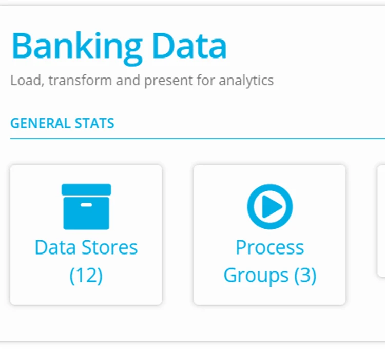
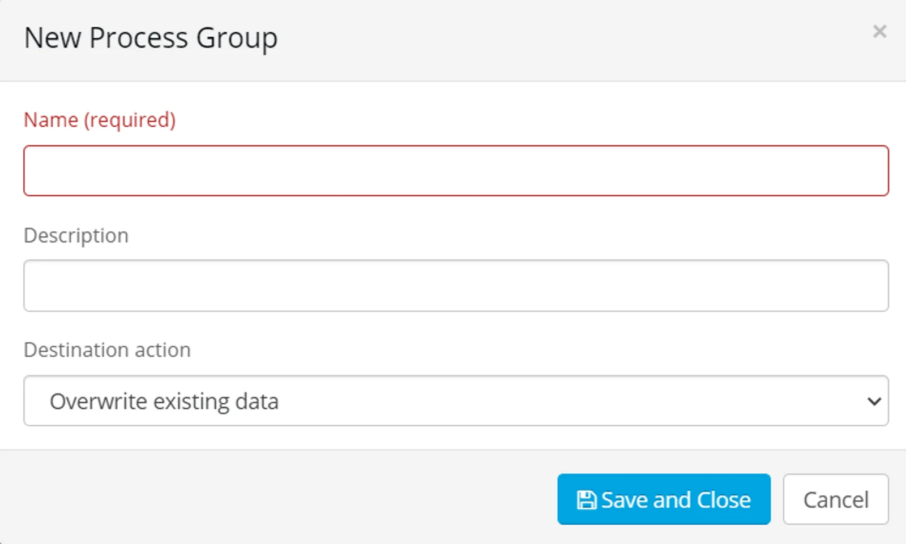
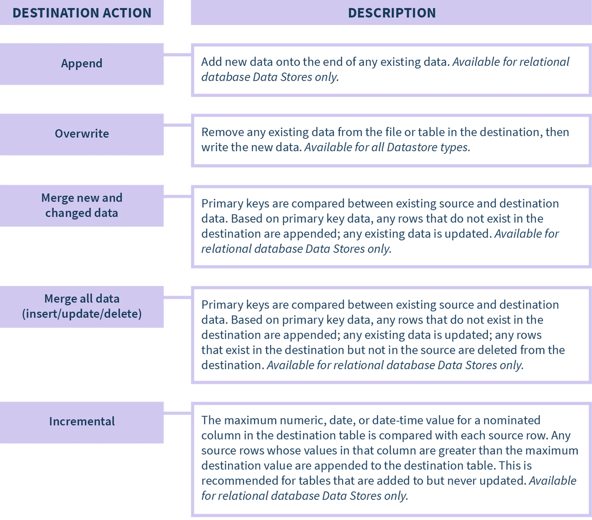

## Create a Process Group

Go to the **Process Group** from the Project page

Click **+New** to add a new Process Group

Enter the name and (optional description) for your Process Group.

Choose the destination action (Process Group Type) for the processes within the group.

Click **Save and Close**

**Process Group Type**

This type is how you determine the way data is written to the destination object.

If the destination object is a relational database - you have all the types available whereas if you are writing to a file, you have a subset of types available.

For the full list of destination actions by connector type please refer to [Connectors](https://wiki.eight-wire.com/connector-types)

‍**Destination Actions**

The key tasks a Connector performs are reading and writing. Reading is usually straightforward, but writing can be complex, depending on the platform and on the other data being written at the same time.

Ready to create processes? Go to this page to see how: [Create, Map, and Filter a Process](../create-map-and-filter-a-process/)
