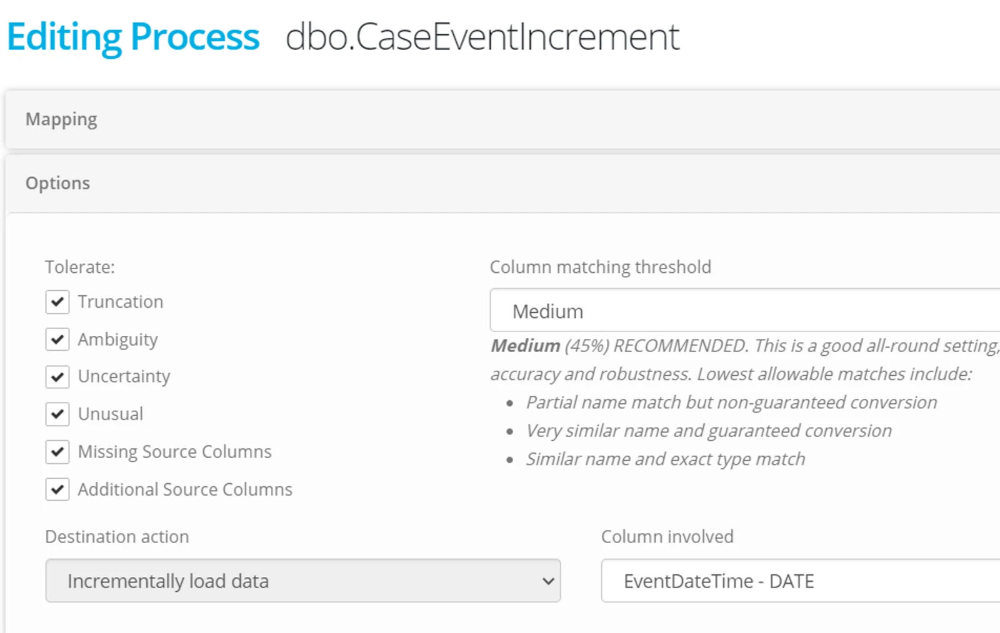

When editing a process, click on **Options** to configure process thresholds and toleration or to specify important columns in an incremental or merge process.

## Destination Action Column Selection

For a Process Type Incrementally Load data, edit a process and select an option under 'Destination Action' and 'Column Involved'.

## Column Matching Threshold

When Eightwire first creates a Process for you, it automatically maps the source and destination columns. This 'smart mapping' uses a ranking system to calculate the best possibleset of column mappings from the possible permutations. If the source and destination tables have identical columns and data types the mapping is easy. However, if the data types areslightly different Eight-wire will use the mappings that give the most accurate data conversions. If the column names are slightly different, Eightwire will start using a progressive fuzzy-matching approach to determining the best set of column mappings. Eventually, if the difference between source and destination is too great, Conductor will not be able to come up with an acceptable mapping for these tables. In that case, you can manually map the columns by clicking on the source and destination column in the process.

The Column Mapping Threshold (acceptability threshold) is configurable, ranging from high (identical columns only will be mapped) to low (any compatible mapping will beconsidered). Generally, a medium threshold gives a good balance between flexibility and accuracy.

The available options are:

**Minimum**

**‍**(1%) is the minimum threshold for ensuring some sort of match between columns. If the source data type can be converted to the destination data type, even with truncation or uncertainty, a match can be achieved regardless of name mismatches. This is the most robust, but least accurate of all options.

**Low**

**‍**(35%) is a good option if your data changes frequently but you want slightly more matching accuracy than "Minimum" would provide. Lowest allowable matches include:

-   No name match, but an exact data type match
-   A similar name and guaranteed conversion
-   A very similar name but non-guaranteed conversion

**Medium**

**‍**(45%) RECOMMENDED. This is a good all-round setting, allowing a reasonable level of both accuracy and robustness. Lowest allowable matches include:

-   Partial name match but non-guaranteed conversion
-   Very similar name and guaranteed conversion
-   Similar name and exact type match

**High**

**‍**(65%) is a good option if your data changes rarely but you still want to handle minor changes automatically. Lowest allowable matches include:

-   Case in-sensitive name match but non-guaranteed conversion
-   Partial name match and guaranteed conversion
-   Very similar name and exact data type match

**Max**

**‍**(80%) is a good option if your data rarely or never changes and you want to abort a load if anything other than the most minor changes are found. Lowest allowable matches include:

-   Case-sensitive name match but non-guaranteed conversion

> *Automatically mapped columns cannot be unmapped within a process.  In the case that you do not want data written to a column - then alter the destination datastore and mark the column as* ***Do Not Use*** *to remove the mapping.*

## Toleration

Process Options are used to determine the degree of toleration of data exceptions within a process batch (transfer of data). Untick to remove a toleration condition.

**Truncation**

**‍**When enabled, Eight-wire will allow oversize data to be shortened to fit into a smaller destination column. I. that case the process will succeed and a warning will be given if there is the possibility of truncation.

**Ambiguity**

**‍**When enabled, Eight-wire will allow ambiguous column mapping. For example, if a CSV contains two columns with the same name, Eight-wire will map them in the order it finds them. This may result indata arriving in the wrong destination columns, but the transfer will run without breaking.

**Uncertainty**

**‍**When enabled, Eight-wire will allow conversion of one data type to another where the conversion is not always guaranteed to succeed. For example, converting text to date will succeed if the text column contains a date, but if it contains anything else it will fail. This may be required where the source data type cannot be determined or where the source database has been poorly designed.

**Unusual**

**‍**When enabled, Eight-wire will allow some of the more unusual (but valid) data conversions. For example, number to date – which can legitimately be interpreted as a 'Julian date', but in mostcircumstances would be more likely to be an invalid conversion.

**Missing Source Columns**

**‍**When enabled, Eightwire will allow the data transfer to continue even if one or more of the source columns it expected was missing from the data repository. This can result in missing data at the destination, but in some situations, this may be preferable to having the data transfer fail instead.

**Missing Destination Columns**

**‍**When enabled, Eightwire will allow a data transfer to continue even if one or more of the destination columns it expected was missing from the data repository.

> *Note: Eightwire will always tolerate additional columns in a data transfer. If new columns are added to both the source and destination repositories but Eightwire has not been updated, this data transfer will detect the new columns, automatically map them (if they are compatible), and transfer the extra data.*

More options working with processes are in the following pages;

-   Create [Process Expressions](../create-process-expressions/)
-   Work with [System Expressions and Constants](../use-process-constants-and-system-expressions/)
-   Test a Process by [manually executing](../execute-a-process/)
-   Apply [a time based schedule](../process-group-time-schedule/) to your Process Groups
-   Apply [an event based schedule](../process-event-execution-schedule/) to your Process Groups
