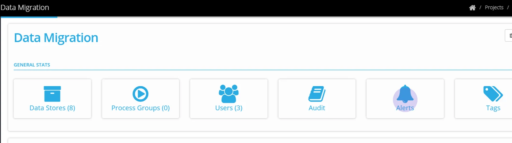
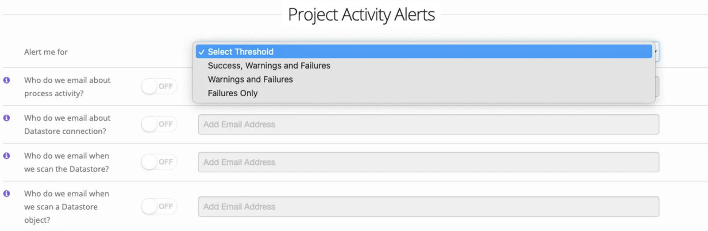
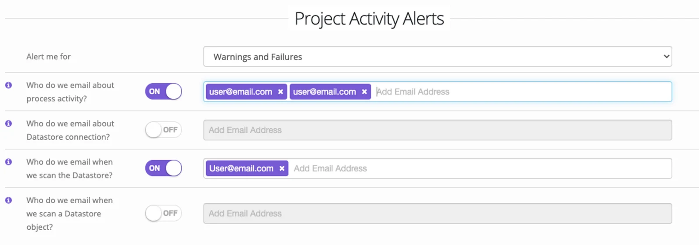
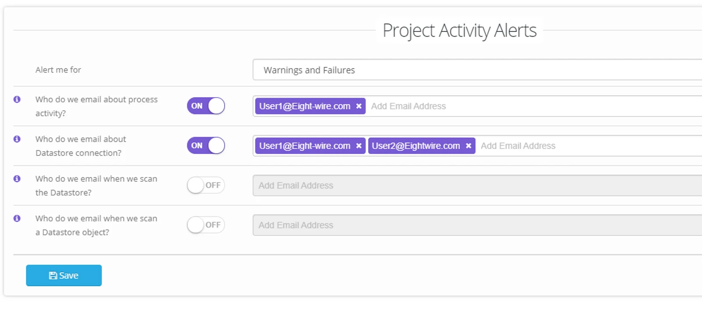

Navigate to **Project Alerts** from the Quick Access menu on the **Project** dashboard.

Select an event threshold to apply to the selected Alert options;

For an Alert option, toggle to ON and enter any email addresses for notifications.

Choose as many of the alert options as you require;

-   **Process Activity** The outcome of a data transfer is notified here.

-   **Datastore Connection** The connectivity to the Datastore generates an email (Test Datastore)

-   **Datastore Scan** The automatic scan of objects in your Datastore generates an email (Scan Datastore).

-   **Datastore Object Scan** The results of a deep scan of the objects (Browse Datastore) generates an email.  

In the example shown – any warnings or failed process within the Project or any Datastore that cant be connected will generate a separate email.

Automated emails will give a summary description of a failure or that warnings have been generated.

You can use the relevant Batch and ProcessID shown in the email to check the detail of the Project Activity by clicking on the link in the email.

Let us know at support@eight-wire.com if you need help interpreting the warning or error message.

To apply Agent connectivity notifications - check out the page [Account Alerts](../account-alerts/).
