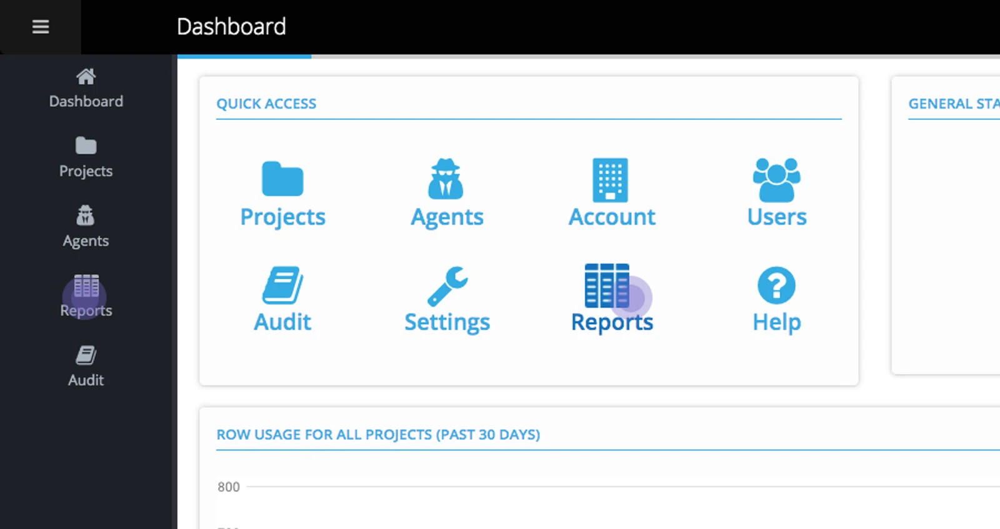
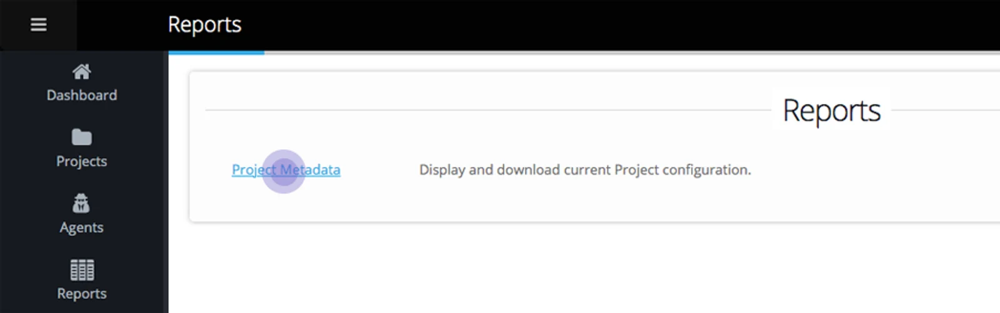
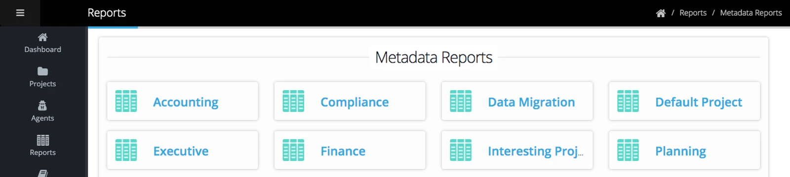
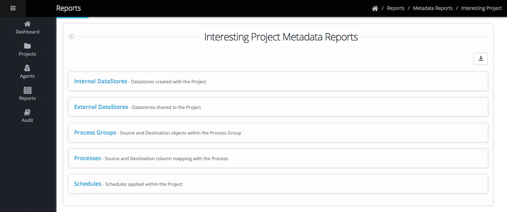
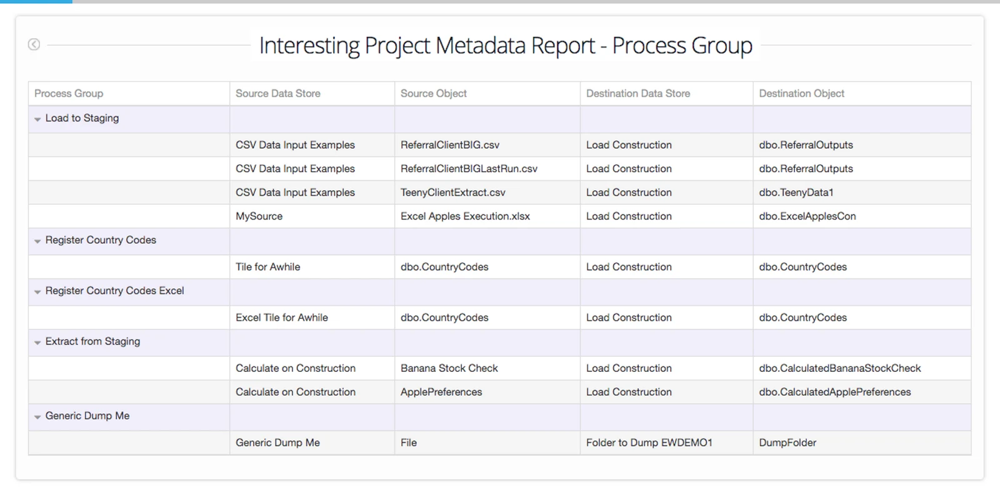

## **Metadata report content includes:**

**Internal Datastores**

All Datastores created within a Project and the objects within the Datastore.

If the Datastore has been shared and the share has been accepted, the recipient Account Name is displayed. The 'Shared To' file will display 'Unknown' until a share has been accepted.

**External Datastores**

Displays any datastores accepted and linked into the Project from an external Account.

**Process Group** Displays for each Process Group — the source Datastore and object name and the destination datastore and object name.

**Process** Shows the column mapping of a source and destination object. It includes the name of any expressions or constants and the details of any filters applied to the process. Any tagged columns are shown.

**Schedule** Any Process Group or Execution schedule is detailed — with the source to a destination object and relevant timings and order.

## **To navigate to the Report**

From the Account Dashboard or from the left pane, select the **Reports** icon.

Select '**Project Metadata**'

**All metadata reports are organized by project** — the Projects you are Administrator for (or all if you're an Account Administrator) are displayed on the Metadata Reports page.

Click on a project to open the metadata reports for that project.

The reports available are Internal Datastores, External Datastores, Process Groups, Processes, and Schedules.

Click on a Report Section to drill down to detail.

Within the report, click on an arrow to expand a level.

> Click *on the download icon and select a download format (Excel or JSON) to export the enitre report for your selected project.*
