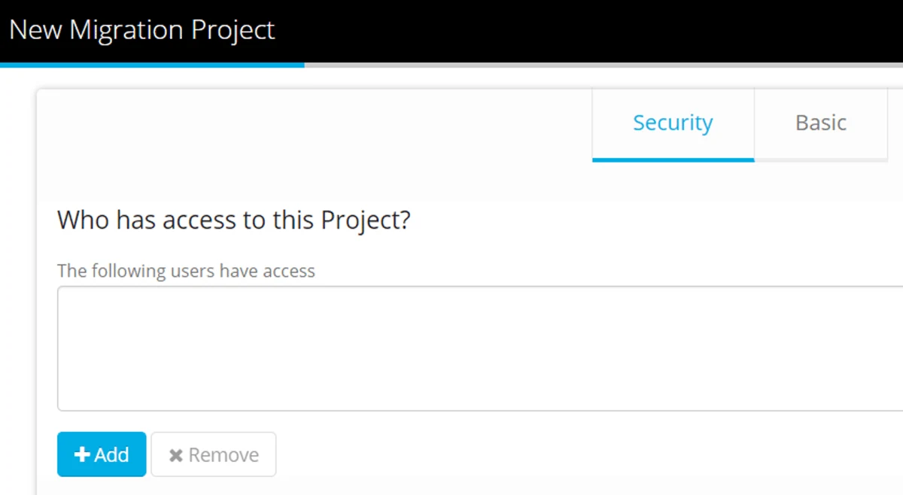
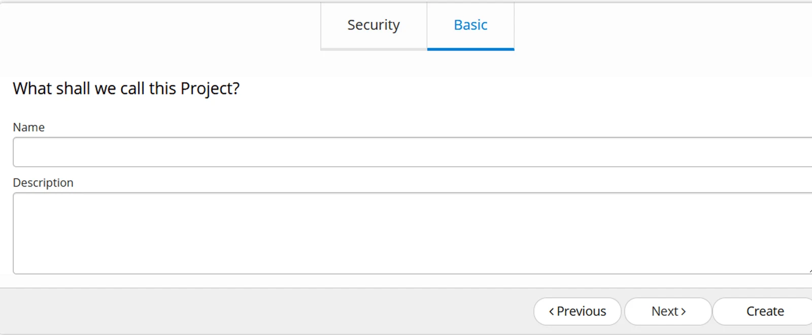
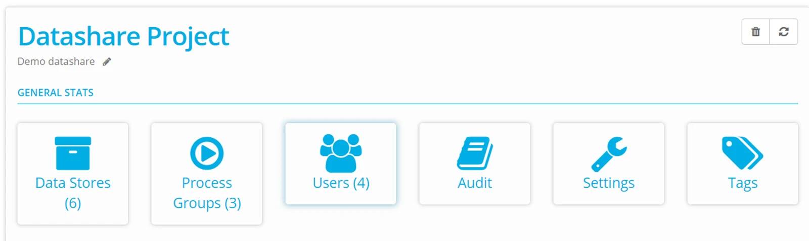

## Create a Project

Navigate from the Dashboard to Projects and click +New

On the Security Tab, click +Add to select Users and assign a Project Role.

Click Next to go to the Basic Tab

Name the Project.

Provide an optional description (You can edit these fields at any time)

Click Create

## Project Dashboard

**Datastores** — create your datastores, display any external datastores.

**Process Groups** — define data transfer definitions.

**Users** — assign Account users to a Project.

**Audit** — report all activity in the Project.

**Settings** — set up Project level notifications - for example failed batch notifications.

**Tags** — define tags that can be applied to any object/column in your Project, giving them additional meaning.

> *A Datastore is unique to a Project — to use it in another Project within your Account, share it, or duplicate it.*

Now that your Project is ready to work with, check out the next steps: [Create a Datastore](../create-and-connect/) or [Assign Project User](../assign-project-users/)
